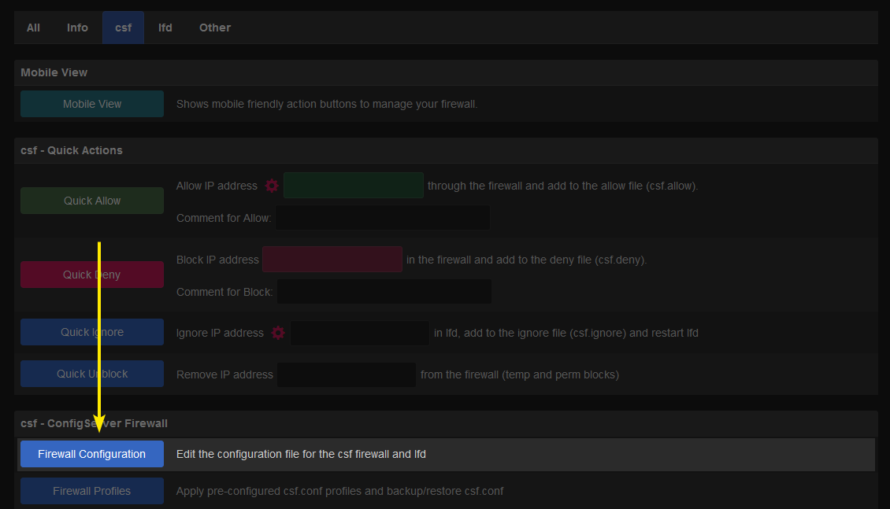
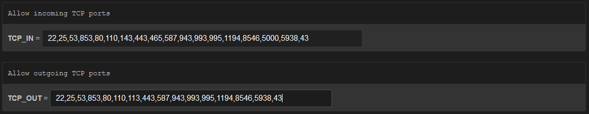

<div align="center">

🕙 `Last Sync: 12/06/2025 12:12 UTC`

</div>

<div align="center">
<h6>♾️ Continuation of development for Config Server Firewall (CSF) ♾️</h1>
</div>

<div align="center">


<!-- prettier-ignore-start -->
[![Version][github-version-img]][github-version-uri]
[![Downloads][github-downloads-img]][github-downloads-uri]
[![Size][github-size-img]][github-size-img]
[![Last Commit][github-commit-img]][github-commit-img]
[![Contributors][contribs-all-img]](#contributors-)

[](https://docs.configserver.dev)
<!-- prettier-ignore-end -->

<div align="center">

[](https://discord.configserver.dev)[](https://discord.configserver.dev)

</div>


<br />
<br />

</div>

<br />

<div align="center">

<br />

<p float="left">
  
   
</p>

<p float="left">
  
   
</p>

<p float="left">
  
   
</p>

</div>

<br />

---

<br />

- [Summary](#summary)
- [⚠️ Beware of Fake Repositories \& Website Scams ⚠️](#️-beware-of-fake-repositories--website-scams-️)
- [Features](#features)
  - [Firewall \& Network Security](#firewall--network-security)
  - [Login \& User Monitoring](#login--user-monitoring)
  - [Alerts \& Notifications](#alerts--notifications)
  - [Intrusion Detection \& Exploit Protection](#intrusion-detection--exploit-protection)
  - [Management \& Control](#management--control)
- [Documentation](#documentation)
  - [📕 Main Chapters](#-main-chapters)
  - [📗 Cheatsheets](#-cheatsheets)
- [Install](#install)
  - [Requirements](#requirements)
  - [Install](#install-1)
    - [Step 1: Dependencies](#step-1-dependencies)
    - [Step 2: Download](#step-2-download)
      - [Download Direct](#download-direct)
      - [Download Get.sh](#download-getsh)
    - [Step 3: Run Pre-install Tests](#step-3-run-pre-install-tests)
    - [Step 4: Install](#step-4-install)
    - [Step 5: Disable Testing Mode](#step-5-disable-testing-mode)
    - [Step 6: Enable and Start Services](#step-6-enable-and-start-services)
- [IP Sets / Blocklist](#ip-sets--blocklist)
  - [Official Blocklists](#official-blocklists)
    - [Risk Assessments](#risk-assessments)
    - [Main Lists](#main-lists)
    - [Privacy Lists](#privacy-lists)
    - [Spam Lists](#spam-lists)
    - [Internet Service Providers](#internet-service-providers)
    - [Geographical Databases](#geographical-databases)
      - [General](#general)
      - [Continents](#continents)
      - [Countries](#countries)
    - [Transmission (BitTorrent Client)](#transmission-bittorrent-client)
  - [3rd-party Blocklists](#3rd-party-blocklists)
- [Notes](#notes)
  - [CSF to Iptable Commands](#csf-to-iptable-commands)
    - [Default Policy](#default-policy)
    - [Clear Iptables / Open Firewall](#clear-iptables--open-firewall)
    - [List Rules](#list-rules)
    - [List Chains](#list-chains)
    - [Unblock Port](#unblock-port)
    - [Allow OpenVPN](#allow-openvpn)
- [References for More Help](#references-for-more-help)
- [Questions \& Answers](#questions--answers)
- [Contributors ✨](#contributors-)

<br />

---

<br />

## Summary

ConfigServer Security & Firewall, also known as CSF, is a Stateful Packet Inspection (SPI) firewall and Login/Intrusion Detection and Security application for Linux servers which started back in 2005. CSF works as a front-end to iptables or nftables, configuring your server’s firewall rules to lock down public access to services while allowing only approved connections.

This provides better security for your server while giving you an advanced, easy-to-use interface for managing firewall settings. With CSF in place, you can safely permit activities such as logging in via FTP or SSH, checking email, and loading websites, while unauthorized access attempts are blocked.

<br />

> [!NOTE] 
> In August 2025, the original developer, Way to the Web Ltd, unfortunately discontinued development of ConfigServer Firewall. This repository has since became a fork of the original application, continuing its development by adding new features and providing ongoing bug fixes.

<br />

---

<br />

## ⚠️ Beware of Fake Repositories & Website Scams ⚠️

There are a few Github users who have been forking our repository and producing **fake websites** which claim to sell a *"commercial"* version of **ConfigServer Security and Firewall (CSF)**.

These are **not legitimate**.

ConfigServer Security and Firewall is completely **open-source and free** — we will **never charge you** for the product.

To ensure you have the official repository and domain, you should only use the links below, and ensure you are visiting our `.dev` domain / TLD:

- [https://configserver.dev](https://docs.configserver.dev)
- [https://github.com/Aetherinox/csf-firewall](https://github.com/Aetherinox/csf-firewall)

<br />

---

<br />

## Features

Interested in ConfigServer Security & Firewall? Check out a partial list of the included features below:

<br />

### Firewall & Network Security

- Easy-to-use SPI firewall powered by iptables/nftables
- Pre-configured for cPanel and DirectAdmin (standard ports open by default)
- Auto-detects non-standard SSH ports during installation
- Works with multiple network interfaces
- Supports IPv6 via ip6tables
- Block traffic on unused server IPs to reduce attack surface
- Country-based access control (allow/deny by ISO Country Code)
- Protection against:
    - SYN floods
    - Ping of Death
    - Port scans
    - Connection flooding (per IP/per port detection)
- Permanent or temporary IP blocking (with TTL support)
- Integration with blocklists like DShield and Spamhaus DROP
- BOGON packet protection

<br />

### Login & User Monitoring

- Login Failure Daemon (LFD): detects repeated login failures (brute force protection)
- Monitors authentication for:
    - SSH (OpenSSH)
    - FTP (Pure-ftpd, vsftpd, Proftpd)
    - Mail (Courier IMAP, Dovecot, Kerio, Exim SMTP AUTH, POP3/IMAP)
    - Web (cPanel/WHM, Webmail, htpasswd-protected pages)
    - ModSecurity (v1 & v2)
    - Suhosin
    - Custom services via regex and log file matching
- POP3/IMAP login tracking (limit logins per hour)
- Distributed attack detection (across multiple servers)
- LFD clustering – share blocks/whitelists across a server group
- Temporary IP allows (with TTL)

<br />

### Alerts & Notifications

- SSH and su login notifications
- Root access notifications (WHM)
- Alerts for:
    - High server load average
    - Excessive email sending per hour (spamming detection)
    - Suspicious processes running
    - Abnormal file activity in /tmp and similar directories
    - Excessive user processes or resource usage
    - Account changes (password updates, shell changes, etc.)

<br />

### Intrusion Detection & Exploit Protection

- Intrusion Detection System (IDS) – monitors system/application binaries
- Suspicious process and file reporting
- Exploit checks
- Directory and file integrity monitoring
- ModSecurity log reporting
- Messenger Service – optionally redirect blocked users to a custom page explaining why access is denied

<br />

### Management & Control

- Integrated UI for major control panels:
    - [cPanel](https://cpanel.net/), [DirectAdmin](https://directadmin.com/), [InterWorx](https://interworx.com/), [CWP](https://control-webpanel.com/), [VestaCP](https://vestacp.com/), [CyberPanel](https://cyberpanel.net/), [Webmin](https://webmin.com/)
- cPanel reseller access (per-reseller firewall controls: Allow, Deny, Unblock, Search)
- Integrated with CloudFlare Firewall
- Upgrade firewall directly from control panel or shell
- Quick start mode for servers with large allow/deny lists
- Easy Dynamic DNS support (auto-allow your changing home IP)
- System statistics & graphs (CPU, load, memory, etc.)
- ipset support for handling large IP lists efficiently
- Integrated support for cse within the UI

<br />

---

<br />

## Documentation

This README only covers basic installation of CSF. In order to keep all information in one place, all other guides are located in our [official documentation](https://docs.configserver.dev). We have provided some useful links below.

<br />

<div align="center">

[](https://docs.configserver.dev)

</div>

<br />

### 📕 Main Chapters

Review the following chapters to learn more about setting up CSF and making use of its included features:

<br />

| Chapter | Description | View Docs |
| --- | --- | --- |
| Enable Web Interface | How to enable and set up CSF web interface | [View](https://aetherinox.github.io/csf-firewall/install/webui/) |
| Configuration | Configuring CSF for the first time | [View](https://aetherinox.github.io/csf-firewall/usage/configuration/) |
| Enable IPSETs | Manage large blocklists without performance impacts | [View](https://aetherinox.github.io/csf-firewall/usage/ipset/) |
| Blocklists | Deny access to abusive IPs with 3rd party blocklists | [View](https://aetherinox.github.io/csf-firewall/usage/blocklists/) |
| GeoIP Blocks | Block access to geographical locations | [View](https://aetherinox.github.io/csf-firewall/usage/geoip/) |
| Traefik Integration | CSF behind Traefik Reverse Proxy | [View](https://aetherinox.github.io/csf-firewall/install/traefik/) |
| Authentik Integration | Secure CSF behind Authentik for authentication | [View](https://aetherinox.github.io/csf-firewall/install/authentik/) |
| Uninstall | Uninstall CSF from your server | [View](https://aetherinox.github.io/csf-firewall/install/uninstall/) | 

<br />

### 📗 Cheatsheets

These are quick-guides which explain very specific features in detail.

<br />

| Chapter | Description | View Docs |
| --- | --- | --- |
| Folder Structure | Explains every file and folder within CSF and its purpose | [View](https://aetherinox.github.io/csf-firewall/usage/cheatsheet/structure/) |
| Commands | Detailed overview of the commands that come with CSF | [View](https://aetherinox.github.io/csf-firewall/usage/cheatsheet/commands/) |
| Sample Configs | Default and example config files / templates for CSF | [View](https://aetherinox.github.io/csf-firewall/usage/cheatsheet/conf/) |

<br />

---

<br />

## Install

This section will explain how to install ConfigServer Firewall in very simple terms, without a lot of extra detail. We also provide a full and detailed [Installation Guide](https://aetherinox.github.io/csf-firewall/install/dependencies/) within our official documentation. These docs go into much more detail than our README. However, if you're looking for a quick setup, read below:

<br />

### Requirements

Installing CSF on your server requires the following:

- Any `RHEL` or `Debian` based Linux distro
- Root access or user account with `sudo` privileges.
- `Perl` installed on your server.

<br />

### Install

Use these instructions if you wish to manually install CSF on your server. 

<br />

#### Step 1: Dependencies

To install the latest version of CSF manually, run the following commands:

<br />

  - For **Debian/Ubuntu**:

    ```shell
    sudo apt-get update && sudo apt-get install -y \
      ipset \
      libcrypt-ssleay-perl \
      libio-socket-inet6-perl \
      libio-socket-ssl-perl \
      libnet-libidn-perl \
      libsocket6-perl \
      perl \
      wget
    ```

<br />

  - For **CentOS/RHEL**:

    ```shell
    sudo yum makecache && sudo yum install -y \
      ipset \
      perl \
      perl-IO-Socket-INET6 \
      perl-IO-Socket-SSL.noarch \
      perl-libwww-perl \
      perl-Net-LibIDN2 \
      perl-Net-SSLeay \
      perl-Socket6 \
      wget
    ```

<br />
<br />
<br />

#### Step 2: Download

To download and install CSF, you have two options. Both options give you the latest version of our CSF archive. 

1. [Download .zip using wget or curl](#download-direct)
2. [Download .zip using get.sh script](#download-getsh)

<br />

##### Download Direct

To download the latest CSF release, run one of the commands:

```shell
# Using wget
wget https://download.configserver.dev/csf.zip

# Using curl
curl -O https://download.configserver.dev/csf.zip
```

<br />

##### Download Get.sh

To download the latest version of CSF using our [get.sh](https://get.configserver.dev) script, run one of the commands below. This will simply give you the zip file in the folder you run the command from.

```shell
# Using wget
bash <(wget -qO - https://get.configserver.dev)

# Using curl
bash <(curl -sL https://get.configserver.dev)
```

<br />
<br />
<br />

The CSF archive should be on your server; extract it to a subfolder called `./csf`:

```shell
# .zip filename
unzip -oq "csf.zip" -d "csf"

# .tgz filename
tar -xzf "csf.tgz" -C "csf"
```

<br />
<br />
<br />

#### Step 3: Run Pre-install Tests

Before enabling and configuring CSF, it is crucial to test whether it is compatible with your server. Run the following command to initiate the test. 

If the test completes successfully, you will see `RESULT: csf should function on this server`. If there are any problems, the test will provide information on how to resolve them.

```shell
sudo perl csf/csftest.pl
```

<br />
<br />
<br />

#### Step 4: Install

After completing [Step 3: Run Pre-install Tests](#step-3-run-pre-install-tests), Navigate to the extracted directory:

```shell
cd csf
```

<br />

Run the installation script. After installation, you must [Disable Testing Mode](#step-5-disable-testing-mode).

```shell
sudo sh install.sh
```

<br />
<br />
<br />

#### Step 5: Disable Testing Mode

In order for the LFD service to be started, you must disable `TESTING` mode. Open your csf config file at `/etc/csf/csf.conf` and change `TESTING = "1"` to `0`.

```shell
TESTING = "0"
```

<br />
<br />
<br />

#### Step 6: Enable and Start Services

After doing all of the above, confirm that CSF and LFD are now running on your server. First, we will enable CSF with the following command:

```shell
sudo csf --enable
```

<br />

Then start the service:

```shell
sudo systemctl start csf
sudo systemctl start lfd
sudo csf -ra
```

<br />

Confirm that the CSF service is up and running:

```shell
sudo systemctl status csf
```

<br />

You should see:

```shell
● csf.service - ConfigServer Security & Firewall - csf
    Loaded: loaded (/usr/lib/systemd/system/csf.service; enabled; preset: enabled)
    Active: active (exited) since Sun 2025-09-21 01:35:45 UTC; 4s ago
    Process: 449564 ExecStart=/usr/sbin/csf --initup (code=exited, status=0/SUCCESS)
  Main PID: 449564 (code=exited, status=0/SUCCESS)
        CPU: 621ms
```

<br />

Now check the LFD service for the same status:

```shell
sudo systemctl status lfd
```

<br />

You should see:

```shell
● lfd.service - ConfigServer Security & Firewall - lfd
    Loaded: loaded (/usr/lib/systemd/system/lfd.service; enabled; preset: enabled)
    Active: active (running) since Sun 2025-09-21 01:44:00 UTC; 53min ago
    Process: 335736 ExecStart=/usr/sbin/lfd (code=exited, status=0/SUCCESS)
  Main PID: 335770 (lfd - sleeping)
      Tasks: 1 (limit: 4546)
    Memory: 39.2M (peak: 63.3M)
        CPU: 15.090s
    CGroup: /system.slice/lfd.service
            └─335770 "lfd - sleeping"
```

<br />

At this point, CSF and LFD should be up and running, with minimal configuration. We highly recommend going to our official documentation for a more in-depth tutorial on how to install and configure CSF. These docs are available in our [Install Chapter](https://aetherinox.github.io/csf-firewall/install/dependencies/).

<br />

---

<br />

## IP Sets / Blocklist

CSF supports the use of blocklists to help protect your server from malicious IP addresses and unwanted network traffic. Blocklists are essentially collections of IPs or networks that are known to be associated with spammers, hackers, botnets, or other abusive behavior. When CSF is configured to use blocklists, it can automatically deny or restrict connections from these IPs, reducing the risk of compromise, brute-force attacks, and other forms of network abuse. By proactively filtering traffic, blocklists help maintain server security and improve overall system reliability.

Blocklists can come from a variety of third-party vendors, each maintaining their own lists based on threat intelligence and community reporting. Examples of well-known blocklist providers include Spamhaus, DShield, TOR Exit Node lists, BOGON networks, Project Honey Pot, and MaxMind’s anonymous proxies, among others. These lists are continuously updated and can be integrated into CSF to provide real-time protection against emerging threats.

In addition to third-party lists, CSF offers its own official blocklist and IPSET service, maintained in the Official CSF Repository
. Users can choose to use the CSF official blocklist alone or combine it with other vendors’ lists for more comprehensive coverage. Using multiple blocklists in conjunction ensures a layered defense, helping administrators mitigate attacks and maintain control over who can access their server while minimizing false positives.

By leveraging blocklists, CSF empowers users to proactively defend their infrastructure, reduce malicious traffic, and maintain a more secure hosting environment without manual monitoring of each incoming IP.

<br />

### Official Blocklists

CSF hosts our own set of blocklists which are are automatically updated every `12 hours`. You may add these sets to your ConfigServer Firewall `/etc/csf/csf.blocklists` with the following new lines:

```
CSF_MASTER|43200|400000|https://raw.githubusercontent.com/Aetherinox/csf-firewall/main/blocklists/master.ipset
CSF_HIGHRISK|43200|0|https://raw.githubusercontent.com/Aetherinox/csf-firewall/main/blocklists/highrisk.ipset
```

<br />
<br />

#### Risk Assessments

The lists in this README use `⚝` and `★` icons to indicate risk levels. More stars mean higher risk. Lists marked as **High** or **Critical** should be added to your CSF blocklist to secure your server. Lower-risk lists are optional and can be added at your discretion.

Our automated CI generates this risk assessment each day.

<br />

| Rating      | Risk            | Description                                      |
| ----------- | --------------- | ------------------------------------------------ |
| `⚝⚝⚝⚝⚝`   | No Risk         | IPs pose no real threat, but possibly suspected  |
| `★⚝⚝⚝⚝`   | Low Risk        | IPs pose minimal threat                          |
| `★★⚝⚝⚝`   | Moderate Risk   | IPs may cause issues; monitor carefully          |
| `★★★⚝⚝`   | Elevated Risk   | IPs are risky; consider blocking                 |
| `★★★★⚝`   | High Risk       | IPs are dangerous; likely to cause harm          |
| `★★★★★`   | Critical Risk   | IPs are highly dangerous; block immediately      |

<br />
<br />

#### Main Lists

These are the primary IPSETs that most people will be interested in. They contain a large number of IP addresses that have been reported recently for abusive behavior. These statistics are gathered from multiple sources, such as [AbuseIPDB](https://abuseipdb.com/) and [IPThreat](https://ipthreat.net/). IPs on this list have a 100% confidence level, meaning you should encounter no false positives from any of the IPs included.  

IP addresses in these lists have been flagged for engaging in activities such as:

- SSH Bruteforcing
- Port Scanning
- DDoS Attacks
- IoT Targeting
- Phishing

<br />

For most users, the blocklists `master.ipset` and `highrisk.ipset` are all you need. They contain a massive collection of IP addresses, all with a 100% confidence level, meaning you should encounter none or minimal false positives.

<br />

| Set Name | Description | Severity | View |
| --- | --- | --- | --- |
| `master.ipset` | <sub>Abusive IP addresses which have been reported for port scanning and SSH brute-forcing. HIGHLY recommended. <br> <sub><sup>Includes [AbuseIPDB](https://www.abuseipdb.com/), [IPThreat](https://ipthreat.net/), [CinsScore](https://cinsscore.com), [GreensNow](https://blocklist.greensnow.co/greensnow.txt)</sup></sub> | ★★★★★ | [view](https://blocklist.configserver.dev/master.ipset) |
| `highrisk.ipset` | <sub>IPs with highest risk to your network and have a possibility that the activity which comes from them are going to be fraudulent.</sub> | ★★★★★ | [view](https://blocklist.configserver.dev/highrisk.ipset) |

<br />
<br />

#### Privacy Lists

These blocklists help you control which third-party services can access your server, allowing you to block bad actors or unwanted service providers.

<br />

| Set                                 | Description                                                                                                                                                                                                                                                                                                                                                                                                                                                   | Severity    | View                                                                         |
|-------------------------------------|---------------------------------------------------------------------------------------------------------------------------------------------------------------------------------------------------------------------------------------------------------------------------------------------------------------------------------------------------------------------------------------------------------------------------------------------------------------|-------------|------------------------------------------------------------------------------|
| `privacy_general.ipset`             | Servers which scan ports for data collection and research purposes. <br> <sub><sup>List includes [Censys](https://censys.io), [Shodan](https://shodan.io/), [Project25499](https://blogproject25499.wordpress.com/), [InternetArchive](https://archive.org/), [Cyber Resilience](https://cyberresilience.io), [Internet Measurement](https://internet-measurement.com), [probe.onyphe.net](https://onyphe.net), [Security Trails](https://securitytrails.com) | ★★★★⚝     | [view](https://blocklist.configserver.dev/privacy_general.ipset)</sup></sub> |
| `privacy_ahrefs.ipset`              | Ahrefs SEO and services                                                                                                                                                                                                                                                                                                                                                                                                                                       | ★★⚝⚝⚝     | [view](https://blocklist.configserver.dev/privacy_ahrefs.ipset)              |
| `privacy_amazon_aws.ipset`          | Amazon AWS                                                                                                                                                                                                                                                                                                                                                                                                                                                    | ★★⚝⚝⚝     | [view](https://blocklist.configserver.dev/privacy_amazon_aws.ipset)          |
| `privacy_amazon_ec2.ipset`          | Amazon EC2                                                                                                                                                                                                                                                                                                                                                                                                                                                    | ★★⚝⚝⚝     | [view](https://blocklist.configserver.dev/privacy_amazon_ec2.ipset)          |
| `privacy_applebot.ipset`            | Apple Bots                                                                                                                                                                                                                                                                                                                                                                                                                                                    | ★★★⚝⚝     | [view](https://blocklist.configserver.dev/privacy_applebot.ipset)            |
| `privacy_bing.ipset`                | Microsoft Bind and Bing Crawlers / Bots                                                                                                                                                                                                                                                                                                                                                                                                                       | ★★⚝⚝⚝     | [view](https://blocklist.configserver.dev/privacy_bing.ipset)                |
| `privacy_bunnycdn.ipset`            | Bunny CDN                                                                                                                                                                                                                                                                                                                                                                                                                                                     | ★★⚝⚝⚝     | [view](https://blocklist.configserver.dev/privacy_bunnycdn.ipset)            |
| `privacy_cloudflarecdn.ipset`       | Cloudflare CDN                                                                                                                                                                                                                                                                                                                                                                                                                                                | ★★⚝⚝⚝     | [view](https://blocklist.configserver.dev/privacy_cloudflarecdn.ipset)       |
| `privacy_cloudfront.ipset`          | Cloudfront DNS                                                                                                                                                                                                                                                                                                                                                                                                                                                | ★⚝⚝⚝⚝     | [view](https://blocklist.configserver.dev/privacy_cloudfront.ipset)          |
| `privacy_duckduckgo.ipset`          | DuckDuckGo Web Crawlers / Bots                                                                                                                                                                                                                                                                                                                                                                                                                                | ★★⚝⚝⚝     | [view](https://blocklist.configserver.dev/privacy_duckduckgo.ipset)          |
| `privacy_facebook.ipset`            | Facebook Bots & Trackers                                                                                                                                                                                                                                                                                                                                                                                                                                      | ★★★⚝⚝     | [view](https://blocklist.configserver.dev/privacy_facebook.ipset)            |
| `privacy_fastly.ipset`              | Fastly CDN                                                                                                                                                                                                                                                                                                                                                                                                                                                    | ★⚝⚝⚝⚝     | [view](https://blocklist.configserver.dev/privacy_fastly.ipset)              |
| `privacy_google.ipset`              | Google Crawlers                                                                                                                                                                                                                                                                                                                                                                                                                                               | ★★⚝⚝⚝     | [view](https://blocklist.configserver.dev/privacy_google.ipset)              |
| `privacy_pingdom.ipset`             | Pingdom Monitoring Service                                                                                                                                                                                                                                                                                                                                                                                                                                    | ★★⚝⚝⚝     | [view](https://blocklist.configserver.dev/privacy_pingdom.ipset)             |
| `privacy_rssapi.ipset`              | RSS API Reader                                                                                                                                                                                                                                                                                                                                                                                                                                                | ★★⚝⚝⚝     | [view](https://blocklist.configserver.dev/privacy_rssapi.ipset)              |
| `privacy_stripe_api.ipset`          | Stripe Payment Gateway API                                                                                                                                                                                                                                                                                                                                                                                                                                    | ★★⚝⚝⚝     | [view](https://blocklist.configserver.dev/privacy_stripe_api.ipset)          |
| `privacy_stripe_armada_gator.ipset` | Stripe Armada Gator                                                                                                                                                                                                                                                                                                                                                                                                                                           | ★★⚝⚝⚝     | [view](https://blocklist.configserver.dev/privacy_stripe_armada_gator.ipset) |
| `privacy_stripe_webhooks.ipset`     | Stripe Webhook Service                                                                                                                                                                                                                                                                                                                                                                                                                                        | ★★⚝⚝⚝     | [view](https://blocklist.configserver.dev/privacy_stripe_webhooks.ipset)     |
| `privacy_telegram.ipset`            | Telegram Trackers and Crawlers                                                                                                                                                                                                                                                                                                                                                                                                                                | ★★★⚝⚝     | [view](https://blocklist.configserver.dev/privacy_telegram.ipset)            |
| `privacy_uptimerobot.ipset`         | Uptime Robot Monitoring Service                                                                                                                                                                                                                                                                                                                                                                                                                               | ★⚝⚝⚝⚝     | [view](https://blocklist.configserver.dev/privacy_uptimerobot.ipset)         |
| `privacy_webpagetest.ipset`         | Webpage Test Services                                                                                                                                                                                                                                                                                                                                                                                                                                         | ★★⚝⚝⚝     | [view](https://blocklist.configserver.dev/privacy_webpagetest.ipset)         |

<br />
<br />

#### Spam Lists

These blocklists help prevent known spam sources from accessing your server. They include IPs identified by services like Spamhaus as well as spammers targeting forums and other online platforms.

<br />

| Set                   | Description                                                | Severity   | View                                                           |
|-----------------------|------------------------------------------------------------|------------|----------------------------------------------------------------|
| `spam_forums.ipset`   | <sub>List of known forum / blog spammers and bots</sub>    | ★★★⚝⚝    | [view](https://blocklist.configserver.dev/spam_forums.ipset)   |
| `spam_spamhaus.ipset` | <sub>Bad actor IP addresses registered with Spamhaus</sub> | ★★★★⚝    | [view](https://blocklist.configserver.dev/spam_spamhaus.ipset) |


<br />
<br />

#### Internet Service Providers

These blocklists allow you to filter traffic based on Internet Service Providers (ISPs). They can be used to block or restrict access from specific networks or providers.

| Set                                          | Description                           | Severity   | View                                                                                  |
|----------------------------------------------|---------------------------------------|------------|---------------------------------------------------------------------------------------|
| `isp_aol.ipset`                              | AOL Internet Service Provider IPs     | ★⚝⚝⚝⚝    | [view](https://blocklist.configserver.dev/isp_aol.ipset)                              |
| `isp_att.ipset`                              | AT&T Internet Service Provider IPs    | ★⚝⚝⚝⚝    | [view](https://blocklist.configserver.dev/isp_att.ipset)                              |
| `isp_cablevision.ipset`                      | Cablevision / Optimum ISP IPs         | ★⚝⚝⚝⚝    | [view](https://blocklist.configserver.dev/isp_cablevision.ipset)                      |
| `isp_charter_spectrum_timewarnercable.ipset` | Charter/Spectrum/TWC ISP IPs          | ★⚝⚝⚝⚝    | [view](https://blocklist.configserver.dev/isp_charter_spectrum_timewarnercable.ipset) |
| `isp_comcast.ipset`                          | Comcast / Xfinity ISP IPs             | ★⚝⚝⚝⚝    | [view](https://blocklist.configserver.dev/isp_comcast.ipset)                          |
| `isp_cox_communications.ipset`               | Cox Communications ISP IPs            | ★⚝⚝⚝⚝    | [view](https://blocklist.configserver.dev/isp_cox_communications.ipset)               |
| `isp_embarq.ipset`                           | Embarq / CenturyLink ISP IPs          | ★⚝⚝⚝⚝    | [view](https://blocklist.configserver.dev/isp_embarq.ipset)                           |
| `isp_frontier_communications.ipset`          | Frontier Communications ISP IPs       | ★⚝⚝⚝⚝    | [view](https://blocklist.configserver.dev/isp_frontier_communications.ipset)          |
| `isp_qwest.ipset`                            | Qwest / CenturyLink ISP IPs           | ★⚝⚝⚝⚝    | [view](https://blocklist.configserver.dev/isp_qwest.ipset)                            |
| `isp_spacex_starlink.ipset`                  | SpaceX Starlink satellite ISP IPs     | ★⚝⚝⚝⚝    | [view](https://blocklist.configserver.dev/isp_spacex_starlink.ipset)                  |
| `isp_sprint.ipset`                           | Sprint ISP IPs                        | ★⚝⚝⚝⚝    | [view](https://blocklist.configserver.dev/isp_sprint.ipset)                           |
| `isp_suddenlink_altice_optimum.ipset`        | Suddenlink / Altice / Optimum ISP IPs | ★⚝⚝⚝⚝    | [view](https://blocklist.configserver.dev/isp_suddenlink_altice_optimum.ipset)        |
| `isp_verizon.ipset`                          | Verizon ISP IPs                       | ★⚝⚝⚝⚝    | [view](https://blocklist.configserver.dev/isp_verizon.ipset)                          |


<br />
<br />

#### Geographical Databases

These blocklists let you control which geographical locations can access your server. They can be used as either a whitelist or a blacklist and include both **continents** and **countries**.  

All data is sourced directly from the GeoLite2 Database.

<br />

##### General

| Set | Description | Severity | View |
| --- | --- | --- | --- |
| `GeoLite2 Database` | <sub>Lists IPs by continent and country from GeoLite2 database. Contains both IPv4 and IPv6 subnets</sub> | ★★★★★ | [view](https://dev.maxmind.com/geoip/geolite2-free-geolocation-data/) |
| `Ip2Location Database` | <sub>Coming soon</sub> | ★★★★★ | [view](https://lite.ip2location.com/database-download) |

<br />

##### Continents

These blocklists let you control which geographical locations can access your server. They can be used as either a whitelist or a blacklist and include both **continents** and **countries**.  

All data is sourced directly from the GeoLite2 Database.

| Set                             | Description                      | Risk     | View                                                                     |
|---------------------------------|----------------------------------|----------|--------------------------------------------------------------------------|
| `continent_africa.ipset`        | All IPs located in Africa        | ★★★⚝⚝  | [view](https://blocklist.configserver.dev/continent_africa.ipset)        |
| `continent_antartica.ipset`     | All IPs located in Antarctica    | ⚝⚝⚝⚝⚝  | [view](https://blocklist.configserver.dev/continent_antartica.ipset)     |
| `continent_asia.ipset`          | All IPs located in Asia          | ★★★★⚝  | [view](https://blocklist.configserver.dev/continent_asia.ipset)          |
| `continent_europe.ipset`        | All IPs located in Europe        | ★★★⚝⚝  | [view](https://blocklist.configserver.dev/continent_europe.ipset)        |
| `continent_north_america.ipset` | All IPs located in North America | ★★★★⚝  | [view](https://blocklist.configserver.dev/continent_north_america.ipset) |
| `continent_oceania.ipset`       | All IPs located in Oceania       | ★⚝⚝⚝⚝  | [view](https://blocklist.configserver.dev/continent_oceania.ipset)       |
| `continent_south_america.ipset` | All IPs located in South America | ★★⚝⚝⚝  | [view](https://blocklist.configserver.dev/continent_south_america.ipset) |


<br />

##### Countries

These blocklists let you control which geographical locations can access your server. They can be used as either a whitelist or a blacklist and include both **continents** and **countries**.  

All data is sourced directly from the GeoLite2 Database.

| Set                                                          | Description                                  | Severity   | View                                                                                                  |
|--------------------------------------------------------------|----------------------------------------------|------------|-------------------------------------------------------------------------------------------------------|
| `country_afghanistan.ipset`                                  | Afghanistan                                  | ★★★★⚝    | [view](https://blocklist.configserver.dev/country_afghanistan.ipset)                                  |
| `country_aland_islands.ipset`                                | Aland Islands                                | ⚝⚝⚝⚝⚝    | [view](https://blocklist.configserver.dev/country_aland_islands.ipset)                                |
| `country_albania.ipset`                                      | Albania                                      | ★★⚝⚝⚝    | [view](https://blocklist.configserver.dev/country_albania.ipset)                                      |
| `country_algeria.ipset`                                      | Algeria                                      | ★★★⚝⚝    | [view](https://blocklist.configserver.dev/country_algeria.ipset)                                      |
| `country_american_samoa.ipset`                               | American Samoa                               | ⚝⚝⚝⚝⚝    | [view](https://blocklist.configserver.dev/country_american_samoa.ipset)                               |
| `country_andorra.ipset`                                      | Andorra                                      | ⚝⚝⚝⚝⚝    | [view](https://blocklist.configserver.dev/country_andorra.ipset)                                      |
| `country_angola.ipset`                                       | Angola                                       | ★★★⚝⚝    | [view](https://blocklist.configserver.dev/country_angola.ipset)                                       |
| `country_anguilla.ipset`                                     | Anguilla                                     | ⚝⚝⚝⚝⚝    | [view](https://blocklist.configserver.dev/country_anguilla.ipset)                                     |
| `country_antarctica.ipset`                                   | Antarctica                                   | ⚝⚝⚝⚝⚝    | [view](https://blocklist.configserver.dev/country_antarctica.ipset)                                   |
| `country_antigua_barbuda.ipset`                              | Antigua and Barbuda                          | ★★⚝⚝⚝    | [view](https://blocklist.configserver.dev/country_antigua_barbuda.ipset)                              |
| `country_argentina.ipset`                                    | Argentina                                    | ★★★⚝⚝    | [view](https://blocklist.configserver.dev/country_argentina.ipset)                                    |
| `country_armenia.ipset`                                      | Armenia                                      | ★★⚝⚝⚝    | [view](https://blocklist.configserver.dev/country_armenia.ipset)                                      |
| `country_aruba.ipset`                                        | Aruba                                        | ⚝⚝⚝⚝⚝    | [view](https://blocklist.configserver.dev/country_aruba.ipset)                                        |
| `country_australia.ipset`                                    | Australia                                    | ★★★⚝⚝    | [view](https://blocklist.configserver.dev/country_australia.ipset)                                    |
| `country_austria.ipset`                                      | Austria                                      | ★★⚝⚝⚝    | [view](https://blocklist.configserver.dev/country_austria.ipset)                                      |
| `country_azerbaijan.ipset`                                   | Azerbaijan                                   | ★★⚝⚝⚝    | [view](https://blocklist.configserver.dev/country_azerbaijan.ipset)                                   |
| `country_bahamas.ipset`                                      | The Bahamas                                  | ★★⚝⚝⚝    | [view](https://blocklist.configserver.dev/country_bahamas.ipset)                                      |
| `country_bahrain.ipset`                                      | Bahrain                                      | ★★⚝⚝⚝    | [view](https://blocklist.configserver.dev/country_bahrain.ipset)                                      |
| `country_bangladesh.ipset`                                   | Bangladesh                                   | ★★★★⚝    | [view](https://blocklist.configserver.dev/country_bangladesh.ipset)                                   |
| `country_barbados.ipset`                                     | Barbados                                     | ★★⚝⚝⚝    | [view](https://blocklist.configserver.dev/country_barbados.ipset)                                     |
| `country_belarus.ipset`                                      | Belarus                                      | ★★★⚝⚝    | [view](https://blocklist.configserver.dev/country_belarus.ipset)                                      |
| `country_belgium.ipset`                                      | Belgium                                      | ★★⚝⚝⚝    | [view](https://blocklist.configserver.dev/country_belgium.ipset)                                      |
| `country_belize.ipset`                                       | Belize                                       | ★★⚝⚝⚝    | [view](https://blocklist.configserver.dev/country_belize.ipset)                                       |
| `country_benin.ipset`                                        | Benin                                        | ★★★⚝⚝    | [view](https://blocklist.configserver.dev/country_benin.ipset)                                        |
| `country_bermuda.ipset`                                      | Bermuda                                      | ⚝⚝⚝⚝⚝    | [view](https://blocklist.configserver.dev/country_bermuda.ipset)                                      |
| `country_bhutan.ipset`                                       | Bhutan                                       | ⚝⚝⚝⚝⚝    | [view](https://blocklist.configserver.dev/country_bhutan.ipset)                                       |
| `country_bolivia.ipset`                                      | Bolivia                                      | ★★⚝⚝⚝    | [view](https://blocklist.configserver.dev/country_bolivia.ipset)                                      |
| `country_bonaire_sint_eustatius_saba.ipset`                  | Bonaire, Sint Eustatius, and Saba            | ⚝⚝⚝⚝⚝    | [view](https://blocklist.configserver.dev/country_bonaire_sint_eustatius_saba.ipset)                  |
| `country_bosnia_herzegovina.ipset`                           | Bosnia and Herzegovina                       | ★★★⚝⚝    | [view](https://blocklist.configserver.dev/country_bosnia_herzegovina.ipset)                           |
| `country_botswana.ipset`                                     | Botswana                                     | ★★⚝⚝⚝    | [view](https://blocklist.configserver.dev/country_botswana.ipset)                                     |
| `country_bouvet_island.ipset`                                | Bouvet Island                                | ⚝⚝⚝⚝⚝    | [view](https://blocklist.configserver.dev/country_bouvet_island.ipset)                                |
| `country_brazil.ipset`                                       | Brazil                                       | ★★★★⚝    | [view](https://blocklist.configserver.dev/country_brazil.ipset)                                       |
| `country_british_indian_ocean_territory.ipset`               | British Indian Ocean Territory               | ⚝⚝⚝⚝⚝    | [view](https://blocklist.configserver.dev/country_british_indian_ocean_territory.ipset)               |
| `country_british_virgin_islands.ipset`                       | British Virgin Islands                       | ★★⚝⚝⚝    | [view](https://blocklist.configserver.dev/country_british_virgin_islands.ipset)                       |
| `country_brunei_darussalam.ipset`                            | Brunei                                       | ★★⚝⚝⚝    | [view](https://blocklist.configserver.dev/country_brunei_darussalam.ipset)                            |
| `country_bulgaria.ipset`                                     | Bulgaria                                     | ★★⚝⚝⚝    | [view](https://blocklist.configserver.dev/country_bulgaria.ipset)                                     |
| `country_burkina_faso.ipset`                                 | Burkina Faso                                 | ★★★⚝⚝    | [view](https://blocklist.configserver.dev/country_burkina_faso.ipset)                                 |
| `country_burundi.ipset`                                      | Burundi                                      | ★★★⚝⚝    | [view](https://blocklist.configserver.dev/country_burundi.ipset)                                      |
| `country_cambodia.ipset`                                     | Cambodia                                     | ★★★⚝⚝    | [view](https://blocklist.configserver.dev/country_cambodia.ipset)                                     |
| `country_cameroon.ipset`                                     | Cameroon                                     | ★★★⚝⚝    | [view](https://blocklist.configserver.dev/country_cameroon.ipset)                                     |
| `country_canada.ipset`                                       | Canada                                       | ★★⚝⚝⚝    | [view](https://blocklist.configserver.dev/country_canada.ipset)                                       |
| `country_cape_verde.ipset`                                   | Cape Verde                                   | ★★⚝⚝⚝    | [view](https://blocklist.configserver.dev/country_cape_verde.ipset)                                   |
| `country_cayman_islands.ipset`                               | Cayman Islands                               | ★★⚝⚝⚝    | [view](https://blocklist.configserver.dev/country_cayman_islands.ipset)                               |
| `country_cc.ipset`                                           | Cocos (Keeling) Islands                      | ⚝⚝⚝⚝⚝    | [view](https://blocklist.configserver.dev/country_cc.ipset)                                           |
| `country_central_african_republic.ipset`                     | Central African Republic                     | ★★★★⚝    | [view](https://blocklist.configserver.dev/country_central_african_republic.ipset)                     |
| `country_chad.ipset`                                         | Chad                                         | ★★★★⚝    | [view](https://blocklist.configserver.dev/country_chad.ipset)                                         |
| `country_chile.ipset`                                        | Chile                                        | ★★⚝⚝⚝    | [view](https://blocklist.configserver.dev/country_chile.ipset)                                        |
| `country_china.ipset`                                        | China                                        | ★★★★★    | [view](https://blocklist.configserver.dev/country_china.ipset)                                        |
| `country_christmas_island.ipset`                             | Christmas Island                             | ⚝⚝⚝⚝⚝    | [view](https://blocklist.configserver.dev/country_christmas_island.ipset)                             |
| `country_colombia.ipset`                                     | Colombia                                     | ★★★⚝⚝    | [view](https://blocklist.configserver.dev/country_colombia.ipset)                                     |
| `country_comoros.ipset`                                      | Comoros                                      | ★★⚝⚝⚝    | [view](https://blocklist.configserver.dev/country_comoros.ipset)                                      |
| `country_congo.ipset`                                        | Congo                                        | ★★★★⚝    | [view](https://blocklist.configserver.dev/country_congo.ipset)                                        |
| `country_cook_islands.ipset`                                 | Cook Islands                                 | ⚝⚝⚝⚝⚝    | [view](https://blocklist.configserver.dev/country_cook_islands.ipset)                                 |
| `country_costa_rica.ipset`                                   | Costa Rica                                   | ★★⚝⚝⚝    | [view](https://blocklist.configserver.dev/country_costa_rica.ipset)                                   |
| `country_cote_divoire.ipset`                                 | Côte d'Ivoire                                | ★★★⚝⚝    | [view](https://blocklist.configserver.dev/country_cote_divoire.ipset)                                 |
| `country_croatia.ipset`                                      | Croatia                                      | ★★⚝⚝⚝    | [view](https://blocklist.configserver.dev/country_croatia.ipset)                                      |
| `country_cuba.ipset`                                         | Cuba                                         | ★★★⚝⚝    | [view](https://blocklist.configserver.dev/country_cuba.ipset)                                         |
| `country_curacao.ipset`                                      | Curaçao                                      | ★★⚝⚝⚝    | [view](https://blocklist.configserver.dev/country_curacao.ipset)                                      |
| `country_cyprus.ipset`                                       | Cyprus                                       | ★★⚝⚝⚝    | [view](https://blocklist.configserver.dev/country_cyprus.ipset)                                       |
| `country_czech_republic.ipset`                               | Czech Republic                               | ★★⚝⚝⚝    | [view](https://blocklist.configserver.dev/country_czech_republic.ipset)                               |
| `country_democratic_republic_congo.ipset`                    | Democratic Republic of the Congo             | ★★★★★    | [view](https://blocklist.configserver.dev/country_democratic_republic_congo.ipset)                    |
| `country_denmark.ipset`                                      | Denmark                                      | ★★⚝⚝⚝    | [view](https://blocklist.configserver.dev/country_denmark.ipset)                                      |
| `country_djibouti.ipset`                                     | Djibouti                                     | ★★★⚝⚝    | [view](https://blocklist.configserver.dev/country_djibouti.ipset)                                     |
| `country_dominica.ipset`                                     | Dominica                                     | ⚝⚝⚝⚝⚝    | [view](https://blocklist.configserver.dev/country_dominica.ipset)                                     |
| `country_dominican_republic.ipset`                           | Dominican Republic                           | ★★⚝⚝⚝    | [view](https://blocklist.configserver.dev/country_dominican_republic.ipset)                           |
| `country_ecuador.ipset`                                      | Ecuador                                      | ★★★⚝⚝    | [view](https://blocklist.configserver.dev/country_ecuador.ipset)                                      |
| `country_egypt.ipset`                                        | Egypt                                        | ★★★★⚝    | [view](https://blocklist.configserver.dev/country_egypt.ipset)                                        |
| `country_el_salvador.ipset`                                  | El Salvador                                  | ★★★⚝⚝    | [view](https://blocklist.configserver.dev/country_el_salvador.ipset)                                  |
| `country_equatorial_guinea.ipset`                            | Equatorial Guinea                            | ★★★⚝⚝    | [view](https://blocklist.configserver.dev/country_equatorial_guinea.ipset)                            |
| `country_eritrea.ipset`                                      | Eritrea                                      | ★★★⚝⚝    | [view](https://blocklist.configserver.dev/country_eritrea.ipset)                                      |
| `country_estonia.ipset`                                      | Estonia                                      | ★★⚝⚝⚝    | [view](https://blocklist.configserver.dev/country_estonia.ipset)                                      |
| `country_eswatini.ipset`                                     | Eswatini                                     | ★★⚝⚝⚝    | [view](https://blocklist.configserver.dev/country_eswatini.ipset)                                     |
| `country_ethiopia.ipset`                                     | Ethiopia                                     | ★★★⚝⚝    | [view](https://blocklist.configserver.dev/country_ethiopia.ipset)                                     |
| `country_europe.ipset`                                       | Europe                                       | ★★⚝⚝⚝    | [view](https://blocklist.configserver.dev/country_europe.ipset)                                       |
| `country_falkland_islands_malvinas.ipset`                    | Falkland Islands (Malvinas)                  | ⚝⚝⚝⚝⚝    | [view](https://blocklist.configserver.dev/country_falkland_islands_malvinas.ipset)                    |
| `country_faroe_islands.ipset`                                | Faroe Islands                                | ⚝⚝⚝⚝⚝    | [view](https://blocklist.configserver.dev/country_faroe_islands.ipset)                                |
| `country_fiji.ipset`                                         | Fiji                                         | ★★⚝⚝⚝    | [view](https://blocklist.configserver.dev/country_fiji.ipset)                                         |
| `country_finland.ipset`                                      | Finland                                      | ★★⚝⚝⚝    | [view](https://blocklist.configserver.dev/country_finland.ipset)                                      |
| `country_france.ipset`                                       | France                                       | ★★⚝⚝⚝    | [view](https://blocklist.configserver.dev/country_france.ipset)                                       |
| `country_french_guiana.ipset`                                | French Guiana                                | ★★⚝⚝⚝    | [view](https://blocklist.configserver.dev/country_french_guiana.ipset)                                |
| `country_french_polynesia.ipset`                             | French Polynesia                             | ⚝⚝⚝⚝⚝    | [view](https://blocklist.configserver.dev/country_french_polynesia.ipset)                             |
| `country_french_southern_territories.ipset`                  | French Southern Territories                  | ⚝⚝⚝⚝⚝    | [view](https://blocklist.configserver.dev/country_french_southern_territories.ipset)                  |
| `country_gabon.ipset`                                        | Gabon                                        | ★★★⚝⚝    | [view](https://blocklist.configserver.dev/country_gabon.ipset)                                        |
| `country_gambia.ipset`                                       | Gambia                                       | ★★★⚝⚝    | [view](https://blocklist.configserver.dev/country_gambia.ipset)                                       |
| `country_georgia.ipset`                                      | Georgia                                      | ★★⚝⚝⚝    | [view](https://blocklist.configserver.dev/country_georgia.ipset)                                      |
| `country_germany.ipset`                                      | Germany                                      | ★★⚝⚝⚝    | [view](https://blocklist.configserver.dev/country_germany.ipset)                                      |
| `country_ghana.ipset`                                        | Ghana                                        | ★★★⚝⚝    | [view](https://blocklist.configserver.dev/country_ghana.ipset)                                        |
| `country_gibraltar.ipset`                                    | Gibraltar                                    | ★★⚝⚝⚝    | [view](https://blocklist.configserver.dev/country_gibraltar.ipset)                                    |
| `country_great_britain.ipset`                                | Great Britain                                | ★★⚝⚝⚝    | [view](https://blocklist.configserver.dev/country_great_britain.ipset)                                |
| `country_greece.ipset`                                       | Greece                                       | ★★⚝⚝⚝    | [view](https://blocklist.configserver.dev/country_greece.ipset)                                       |
| `country_greenland.ipset`                                    | Greenland                                    | ⚝⚝⚝⚝⚝    | [view](https://blocklist.configserver.dev/country_greenland.ipset)                                    |
| `country_grenada.ipset`                                      | Grenada                                      | ⚝⚝⚝⚝⚝    | [view](https://blocklist.configserver.dev/country_grenada.ipset)                                      |
| `country_guadeloupe.ipset`                                   | Guadeloupe                                   | ★★⚝⚝⚝    | [view](https://blocklist.configserver.dev/country_guadeloupe.ipset)                                   |
| `country_guam.ipset`                                         | Guam                                         | ★★⚝⚝⚝    | [view](https://blocklist.configserver.dev/country_guam.ipset)                                         |
| `country_guatemala.ipset`                                    | Guatemala                                    | ★★★⚝⚝    | [view](https://blocklist.configserver.dev/country_guatemala.ipset)                                    |
| `country_guernsey.ipset`                                     | Guernsey                                     | ★★⚝⚝⚝    | [view](https://blocklist.configserver.dev/country_guernsey.ipset)                                     |
| `country_guineabissau.ipset`                                 | Guinea-Bissau                                | ★★★⚝⚝    | [view](https://blocklist.configserver.dev/country_guineabissau.ipset)                                 |
| `country_guinea.ipset`                                       | Guinea                                       | ★★★⚝⚝    | [view](https://blocklist.configserver.dev/country_guinea.ipset)                                       |
| `country_guyana.ipset`                                       | Guyana                                       | ★★⚝⚝⚝    | [view](https://blocklist.configserver.dev/country_guyana.ipset)                                       |
| `country_haiti.ipset`                                        | Haiti                                        | ★★★★⚝    | [view](https://blocklist.configserver.dev/country_haiti.ipset)                                        |
| `country_heard_island_and_mcdonald_islands.ipset`            | Heard Island and McDonald Islands            | ⚝⚝⚝⚝⚝    | [view](https://blocklist.configserver.dev/country_heard_island_and_mcdonald_islands.ipset)            |
| `country_honduras.ipset`                                     | Honduras                                     | ★★★⚝⚝    | [view](https://blocklist.configserver.dev/country_honduras.ipset)                                     |
| `country_hong_kong.ipset`                                    | Hong Kong                                    | ★★★★⚝    | [view](https://blocklist.configserver.dev/country_hong_kong.ipset)                                    |
| `country_hungary.ipset`                                      | Hungary                                      | ★★⚝⚝⚝    | [view](https://blocklist.configserver.dev/country_hungary.ipset)                                      |
| `country_iceland.ipset`                                      | Iceland                                      | ★★⚝⚝⚝    | [view](https://blocklist.configserver.dev/country_iceland.ipset)                                      |
| `country_india.ipset`                                        | India                                        | ★★★★⚝    | [view](https://blocklist.configserver.dev/country_india.ipset)                                        |
| `country_indonesia.ipset`                                    | Indonesia                                    | ★★★★⚝    | [view](https://blocklist.configserver.dev/country_indonesia.ipset)                                    |
| `country_iran.ipset`                                         | Iran                                         | ★★★★⚝    | [view](https://blocklist.configserver.dev/country_iran.ipset)                                         |
| `country_iraq.ipset`                                         | Iraq                                         | ★★★★⚝    | [view](https://blocklist.configserver.dev/country_iraq.ipset)                                         |
| `country_ireland.ipset`                                      | Ireland                                      | ★★⚝⚝⚝    | [view](https://blocklist.configserver.dev/country_ireland.ipset)                                      |
| `country_isle_of_man.ipset`                                  | Isle of Man                                  | ★★⚝⚝⚝    | [view](https://blocklist.configserver.dev/country_isle_of_man.ipset)                                  |
| `country_israel.ipset`                                       | Israel                                       | ★★★⚝⚝    | [view](https://blocklist.configserver.dev/country_israel.ipset)                                       |
| `country_italy.ipset`                                        | Italy                                        | ★★⚝⚝⚝    | [view](https://blocklist.configserver.dev/country_italy.ipset)                                        |
| `country_jamaica.ipset`                                      | Jamaica                                      | ★★★⚝⚝    | [view](https://blocklist.configserver.dev/country_jamaica.ipset)                                      |
| `country_japan.ipset`                                        | Japan                                        | ★★⚝⚝⚝    | [view](https://blocklist.configserver.dev/country_japan.ipset)                                        |
| `country_jersey.ipset`                                       | Jersey                                       | ★★⚝⚝⚝    | [view](https://blocklist.configserver.dev/country_jersey.ipset)                                       |
| `country_jordan.ipset`                                       | Jordan                                       | ★★★⚝⚝    | [view](https://blocklist.configserver.dev/country_jordan.ipset)                                       |
| `country_kazakhstan.ipset`                                   | Kazakhstan                                   | ★★★⚝⚝    | [view](https://blocklist.configserver.dev/country_kazakhstan.ipset)                                   |
| `country_kenya.ipset`                                        | Kenya                                        | ★★★⚝⚝    | [view](https://blocklist.configserver.dev/country_kenya.ipset)                                        |
| `country_kiribati.ipset`                                     | Kiribati                                     | ⚝⚝⚝⚝⚝    | [view](https://blocklist.configserver.dev/country_kiribati.ipset)                                     |
| `country_kosovo.ipset`                                       | Kosovo                                       | ★★⚝⚝⚝    | [view](https://blocklist.configserver.dev/country_kosovo.ipset)                                       |
| `country_kuwait.ipset`                                       | Kuwait                                       | ★★⚝⚝⚝    | [view](https://blocklist.configserver.dev/country_kuwait.ipset)                                       |
| `country_kyrgyzstan.ipset`                                   | Kyrgyzstan                                   | ★★★⚝⚝    | [view](https://blocklist.configserver.dev/country_kyrgyzstan.ipset)                                   |
| `country_laos.ipset`                                         | Laos                                         | ★★★⚝⚝    | [view](https://blocklist.configserver.dev/country_laos.ipset)                                         |
| `country_latvia.ipset`                                       | Latvia                                       | ★★⚝⚝⚝    | [view](https://blocklist.configserver.dev/country_latvia.ipset)                                       |
| `country_lebanon.ipset`                                      | Lebanon                                      | ★★★⚝⚝    | [view](https://blocklist.configserver.dev/country_lebanon.ipset)                                      |
| `country_lesotho.ipset`                                      | Lesotho                                      | ★★⚝⚝⚝    | [view](https://blocklist.configserver.dev/country_lesotho.ipset)                                      |
| `country_liberia.ipset`                                      | Liberia                                      | ★★★⚝⚝    | [view](https://blocklist.configserver.dev/country_liberia.ipset)                                      |
| `country_libya.ipset`                                        | Libya                                        | ★★★★⚝    | [view](https://blocklist.configserver.dev/country_libya.ipset)                                        |
| `country_liechtenstein.ipset`                                | Liechtenstein                                | ⚝⚝⚝⚝⚝    | [view](https://blocklist.configserver.dev/country_liechtenstein.ipset)                                |
| `country_lithuania.ipset`                                    | Lithuania                                    | ★★⚝⚝⚝    | [view](https://blocklist.configserver.dev/country_lithuania.ipset)                                    |
| `country_luxembourg.ipset`                                   | Luxembourg                                   | ★★⚝⚝⚝    | [view](https://blocklist.configserver.dev/country_luxembourg.ipset)                                   |
| `country_macedonia_republic.ipset`                           | Macedonia                                    | ★★⚝⚝⚝    | [view](https://blocklist.configserver.dev/country_macedonia_republic.ipset)                           |
| `country_madagascar.ipset`                                   | Madagascar                                   | ★★⚝⚝⚝    | [view](https://blocklist.configserver.dev/country_madagascar.ipset)                                   |
| `country_malawi.ipset`                                       | Malawi                                       | ★★⚝⚝⚝    | [view](https://blocklist.configserver.dev/country_malawi.ipset)                                       |
| `country_malaysia.ipset`                                     | Malaysia                                     | ★★★⚝⚝    | [view](https://blocklist.configserver.dev/country_malaysia.ipset)                                     |
| `country_maldives.ipset`                                     | Maldives                                     | ★★⚝⚝⚝    | [view](https://blocklist.configserver.dev/country_maldives.ipset)                                     |
| `country_mali.ipset`                                         | Mali                                         | ★★★★⚝    | [view](https://blocklist.configserver.dev/country_mali.ipset)                                         |
| `country_malta.ipset`                                        | Malta                                        | ★★⚝⚝⚝    | [view](https://blocklist.configserver.dev/country_malta.ipset)                                        |
| `country_marshall_islands.ipset`                             | Marshall Islands                             | ⚝⚝⚝⚝⚝    | [view](https://blocklist.configserver.dev/country_marshall_islands.ipset)                             |
| `country_martinique.ipset`                                   | Martinique                                   | ★★⚝⚝⚝    | [view](https://blocklist.configserver.dev/country_martinique.ipset)                                   |
| `country_mauritania.ipset`                                   | Mauritania                                   | ★★★⚝⚝    | [view](https://blocklist.configserver.dev/country_mauritania.ipset)                                   |
| `country_mauritius.ipset`                                    | Mauritius                                    | ★★⚝⚝⚝    | [view](https://blocklist.configserver.dev/country_mauritius.ipset)                                    |
| `country_mayotte.ipset`                                      | Mayotte                                      | ★★⚝⚝⚝    | [view](https://blocklist.configserver.dev/country_mayotte.ipset)                                      |
| `country_mexico.ipset`                                       | Mexico                                       | ★★★★⚝    | [view](https://blocklist.configserver.dev/country_mexico.ipset)                                       |
| `country_micronesia.ipset`                                   | Micronesia                                   | ⚝⚝⚝⚝⚝    | [view](https://blocklist.configserver.dev/country_micronesia.ipset)                                   |
| `country_monaco.ipset`                                       | Monaco                                       | ★★⚝⚝⚝    | [view](https://blocklist.configserver.dev/country_monaco.ipset)                                       |
| `country_mongolia.ipset`                                     | Mongolia                                     | ★★⚝⚝⚝    | [view](https://blocklist.configserver.dev/country_mongolia.ipset)                                     |
| `country_montenegro.ipset`                                   | Montenegro                                   | ★★⚝⚝⚝    | [view](https://blocklist.configserver.dev/country_montenegro.ipset)                                   |
| `country_montserrat.ipset`                                   | Montserrat                                   | ⚝⚝⚝⚝⚝    | [view](https://blocklist.configserver.dev/country_montserrat.ipset)                                   |
| `country_morocco.ipset`                                      | Morocco                                      | ★★★⚝⚝    | [view](https://blocklist.configserver.dev/country_morocco.ipset)                                      |
| `country_mozambique.ipset`                                   | Mozambique                                   | ★★★⚝⚝    | [view](https://blocklist.configserver.dev/country_mozambique.ipset)                                   |
| `country_myanmar.ipset`                                      | Myanmar                                      | ★★★⚝⚝    | [view](https://blocklist.configserver.dev/country_myanmar.ipset)                                      |
| `country_namibia.ipset`                                      | Namibia                                      | ★★⚝⚝⚝    | [view](https://blocklist.configserver.dev/country_namibia.ipset)                                      |
| `country_nauru.ipset`                                        | Nauru                                        | ⚝⚝⚝⚝⚝    | [view](https://blocklist.configserver.dev/country_nauru.ipset)                                        |
| `country_nepal.ipset`                                        | Nepal                                        | ★★⚝⚝⚝    | [view](https://blocklist.configserver.dev/country_nepal.ipset)                                        |
| `country_netherlands.ipset`                                  | Netherlands                                  | ★★⚝⚝⚝    | [view](https://blocklist.configserver.dev/country_netherlands.ipset)                                  |
| `country_new_caledonia.ipset`                                | New Caledonia                                | ★★⚝⚝⚝    | [view](https://blocklist.configserver.dev/country_new_caledonia.ipset)                                |
| `country_new_zealand.ipset`                                  | New Zealand                                  | ★★⚝⚝⚝    | [view](https://blocklist.configserver.dev/country_new_zealand.ipset)                                  |
| `country_nicaragua.ipset`                                    | Nicaragua                                    | ★★★⚝⚝    | [view](https://blocklist.configserver.dev/country_nicaragua.ipset)                                    |
| `country_nigeria.ipset`                                      | Nigeria                                      | ★★★★★    | [view](https://blocklist.configserver.dev/country_nigeria.ipset)                                      |
| `country_niger.ipset`                                        | Niger                                        | ★★★⚝⚝    | [view](https://blocklist.configserver.dev/country_niger.ipset)                                        |
| `country_niue.ipset`                                         | Niue                                         | ⚝⚝⚝⚝⚝    | [view](https://blocklist.configserver.dev/country_niue.ipset)                                         |
| `country_norfolk_island.ipset`                               | Norfolk Island                               | ⚝⚝⚝⚝⚝    | [view](https://blocklist.configserver.dev/country_norfolk_island.ipset)                               |
| `country_northern_mariana_islands.ipset`                     | Northern Mariana Islands                     | ⚝⚝⚝⚝⚝    | [view](https://blocklist.configserver.dev/country_northern_mariana_islands.ipset)                     |
| `country_north_korea.ipset`                                  | North Korea                                  | ★★★★★    | [view](https://blocklist.configserver.dev/country_north_korea.ipset)                                  |
| `country_norway.ipset`                                       | Norway                                       | ★★⚝⚝⚝    | [view](https://blocklist.configserver.dev/country_norway.ipset)                                       |
| `country_oman.ipset`                                         | Oman                                         | ★★⚝⚝⚝    | [view](https://blocklist.configserver.dev/country_oman.ipset)                                         |
| `country_pakistan.ipset`                                     | Pakistan                                     | ★★★★★    | [view](https://blocklist.configserver.dev/country_pakistan.ipset)                                     |
| `country_palau.ipset`                                        | Palau                                        | ⚝⚝⚝⚝⚝    | [view](https://blocklist.configserver.dev/country_palau.ipset)                                        |
| `country_palestine.ipset`                                    | Palestine                                    | ★★★★⚝    | [view](https://blocklist.configserver.dev/country_palestine.ipset)                                    |
| `country_panama.ipset`                                       | Panama                                       | ★★★⚝⚝    | [view](https://blocklist.configserver.dev/country_panama.ipset)                                       |
| `country_papua_new_guinea.ipset`                             | Papua New Guinea                             | ★★★⚝⚝    | [view](https://blocklist.configserver.dev/country_papua_new_guinea.ipset)                             |
| `country_paraguay.ipset`                                     | Paraguay                                     | ★★★⚝⚝    | [view](https://blocklist.configserver.dev/country_paraguay.ipset)                                     |
| `country_peru.ipset`                                         | Peru                                         | ★★★⚝⚝    | [view](https://blocklist.configserver.dev/country_peru.ipset)                                         |
| `country_philippines.ipset`                                  | Philippines                                  | ★★★★⚝    | [view](https://blocklist.configserver.dev/country_philippines.ipset)                                  |
| `country_pitcairn.ipset`                                     | Pitcairn Islands                             | ⚝⚝⚝⚝⚝    | [view](https://blocklist.configserver.dev/country_pitcairn.ipset)                                     |
| `country_poland.ipset`                                       | Poland                                       | ★★⚝⚝⚝    | [view](https://blocklist.configserver.dev/country_poland.ipset)                                       |
| `country_portugal.ipset`                                     | Portugal                                     | ★★⚝⚝⚝    | [view](https://blocklist.configserver.dev/country_portugal.ipset)                                     |
| `country_puerto_rico.ipset`                                  | Puerto Rico                                  | ★★★⚝⚝    | [view](https://blocklist.configserver.dev/country_puerto_rico.ipset)                                  |
| `country_qatar.ipset`                                        | Qatar                                        | ★★⚝⚝⚝    | [view](https://blocklist.configserver.dev/country_qatar.ipset)                                        |
| `country_republic_moldova.ipset`                             | Moldova                                      | ★★⚝⚝⚝    | [view](https://blocklist.configserver.dev/country_republic_moldova.ipset)                             |
| `country_reunion.ipset`                                      | Réunion                                      | ★★⚝⚝⚝    | [view](https://blocklist.configserver.dev/country_reunion.ipset)                                      |
| `country_romania.ipset`                                      | Romania                                      | ★★⚝⚝⚝    | [view](https://blocklist.configserver.dev/country_romania.ipset)                                      |
| `country_russia.ipset`                                       | Russia                                       | ★★★★★    | [view](https://blocklist.configserver.dev/country_russia.ipset)                                       |
| `country_rwanda.ipset`                                       | Rwanda                                       | ★★★⚝⚝    | [view](https://blocklist.configserver.dev/country_rwanda.ipset)                                       |
| `country_saint_barthelemy.ipset`                             | Saint Barthélemy                             | ⚝⚝⚝⚝⚝    | [view](https://blocklist.configserver.dev/country_saint_barthelemy.ipset)                             |
| `country_saint_helena.ipset`                                 | Saint Helena                                 | ⚝⚝⚝⚝⚝    | [view](https://blocklist.configserver.dev/country_saint_helena.ipset)                                 |
| `country_saint_kitts_nevis.ipset`                            | Saint Kitts and Nevis                        | ⚝⚝⚝⚝⚝    | [view](https://blocklist.configserver.dev/country_saint_kitts_nevis.ipset)                            |
| `country_saint_lucia.ipset`                                  | Saint Lucia                                  | ⚝⚝⚝⚝⚝    | [view](https://blocklist.configserver.dev/country_saint_lucia.ipset)                                  |
| `country_saint_martin_north.ipset`                           | Saint Martin (North)                         | ⚝⚝⚝⚝⚝    | [view](https://blocklist.configserver.dev/country_saint_martin_north.ipset)                           |
| `country_saint_pierre_miquelon.ipset`                        | Saint Pierre and Miquelon                    | ⚝⚝⚝⚝⚝    | [view](https://blocklist.configserver.dev/country_saint_pierre_miquelon.ipset)                        |
| `country_saint_vincent_grenadines.ipset`                     | Saint Vincent and the Grenadines             | ⚝⚝⚝⚝⚝    | [view](https://blocklist.configserver.dev/country_saint_vincent_grenadines.ipset)                     |
| `country_samoa.ipset`                                        | Samoa                                        | ⚝⚝⚝⚝⚝    | [view](https://blocklist.configserver.dev/country_samoa.ipset)                                        |
| `country_san_marino.ipset`                                   | San Marino                                   | ⚝⚝⚝⚝⚝    | [view](https://blocklist.configserver.dev/country_san_marino.ipset)                                   |
| `country_sao_tome_principe.ipset`                            | São Tomé and Príncipe                        | ★★⚝⚝⚝    | [view](https://blocklist.configserver.dev/country_sao_tome_principe.ipset)                            |
| `country_saudi_arabia.ipset`                                 | Saudi Arabia                                 | ★★★★⚝    | [view](https://blocklist.configserver.dev/country_saudi_arabia.ipset)                                 |
| `country_senegal.ipset`                                      | Senegal                                      | ★★★⚝⚝    | [view](https://blocklist.configserver.dev/country_senegal.ipset)                                      |
| `country_serbia.ipset`                                       | Serbia                                       | ★★⚝⚝⚝    | [view](https://blocklist.configserver.dev/country_serbia.ipset)                                       |
| `country_seychelles.ipset`                                   | Seychelles                                   | ★★⚝⚝⚝    | [view](https://blocklist.configserver.dev/country_seychelles.ipset)                                   |
| `country_sierra_leone.ipset`                                 | Sierra Leone                                 | ★★★⚝⚝    | [view](https://blocklist.configserver.dev/country_sierra_leone.ipset)                                 |
| `country_singapore.ipset`                                    | Singapore                                    | ★★⚝⚝⚝    | [view](https://blocklist.configserver.dev/country_singapore.ipset)                                    |
| `country_sint_maarten_south.ipset`                           | Sint Maarten (South)                         | ⚝⚝⚝⚝⚝    | [view](https://blocklist.configserver.dev/country_sint_maarten_south.ipset)                           |
| `country_slovakia.ipset`                                     | Slovakia                                     | ★★⚝⚝⚝    | [view](https://blocklist.configserver.dev/country_slovakia.ipset)                                     |
| `country_slovenia.ipset`                                     | Slovenia                                     | ★★⚝⚝⚝    | [view](https://blocklist.configserver.dev/country_slovenia.ipset)                                     |
| `country_solomon_islands.ipset`                              | Solomon Islands                              | ⚝⚝⚝⚝⚝    | [view](https://blocklist.configserver.dev/country_solomon_islands.ipset)                              |
| `country_somalia.ipset`                                      | Somalia                                      | ★★★★★    | [view](https://blocklist.configserver.dev/country_somalia.ipset)                                      |
| `country_south_africa.ipset`                                 | South Africa                                 | ★★★⚝⚝    | [view](https://blocklist.configserver.dev/country_south_africa.ipset)                                 |
| `country_south_georgia_and_the_south_sandwich_islands.ipset` | South Georgia and the South Sandwich Islands | ⚝⚝⚝⚝⚝    | [view](https://blocklist.configserver.dev/country_south_georgia_and_the_south_sandwich_islands.ipset) |
| `country_south_korea.ipset`                                  | South Korea                                  | ★★⚝⚝⚝    | [view](https://blocklist.configserver.dev/country_south_korea.ipset)                                  |
| `country_south_sudan.ipset`                                  | South Sudan                                  | ★★★★⚝    | [view](https://blocklist.configserver.dev/country_south_sudan.ipset)                                  |
| `country_spain.ipset`                                        | Spain                                        | ★★⚝⚝⚝    | [view](https://blocklist.configserver.dev/country_spain.ipset)                                        |
| `country_sri_lanka.ipset`                                    | Sri Lanka                                    | ★★★⚝⚝    | [view](https://blocklist.configserver.dev/country_sri_lanka.ipset)                                    |
| `country_sudan.ipset`                                        | Sudan                                        | ★★★★⚝    | [view](https://blocklist.configserver.dev/country_sudan.ipset)                                        |
| `country_suriname.ipset`                                     | Suriname                                     | ★★⚝⚝⚝    | [view](https://blocklist.configserver.dev/country_suriname.ipset)                                     |
| `country_svalbard_jan_mayen.ipset`                           | Svalbard and Jan Mayen                       | ⚝⚝⚝⚝⚝    | [view](https://blocklist.configserver.dev/country_svalbard_jan_mayen.ipset)                           |
| `country_sweden.ipset`                                       | Sweden                                       | ★★⚝⚝⚝    | [view](https://blocklist.configserver.dev/country_sweden.ipset)                                       |
| `country_switzerland.ipset`                                  | Switzerland                                  | ★★⚝⚝⚝    | [view](https://blocklist.configserver.dev/country_switzerland.ipset)                                  |
| `country_syria.ipset`                                        | Syria                                        | ★★★★★    | [view](https://blocklist.configserver.dev/country_syria.ipset)                                        |
| `country_taiwan.ipset`                                       | Taiwan                                       | ★★⚝⚝⚝    | [view](https://blocklist.configserver.dev/country_taiwan.ipset)                                       |
| `country_tajikistan.ipset`                                   | Tajikistan                                   | ★★★⚝⚝    | [view](https://blocklist.configserver.dev/country_tajikistan.ipset)                                   |
| `country_tanzania.ipset`                                     | Tanzania                                     | ★★★⚝⚝    | [view](https://blocklist.configserver.dev/country_tanzania.ipset)                                     |
| `country_thailand.ipset`                                     | Thailand                                     | ★★★⚝⚝    | [view](https://blocklist.configserver.dev/country_thailand.ipset)                                     |
| `country_timorleste.ipset`                                   | Timor-Leste                                  | ⚝⚝⚝⚝⚝    | [view](https://blocklist.configserver.dev/country_timorleste.ipset)                                   |
| `country_togo.ipset`                                         | Togo                                         | ★★★⚝⚝    | [view](https://blocklist.configserver.dev/country_togo.ipset)                                         |
| `country_tokelau.ipset`                                      | Tokelau                                      | ⚝⚝⚝⚝⚝    | [view](https://blocklist.configserver.dev/country_tokelau.ipset)                                      |
| `country_tonga.ipset`                                        | Tonga                                        | ⚝⚝⚝⚝⚝    | [view](https://blocklist.configserver.dev/country_tonga.ipset)                                        |
| `country_trinidad_tobago.ipset`                              | Trinidad and Tobago                          | ★★⚝⚝⚝    | [view](https://blocklist.configserver.dev/country_trinidad_tobago.ipset)                              |
| `country_tunisia.ipset`                                      | Tunisia                                      | ★★★⚝⚝    | [view](https://blocklist.configserver.dev/country_tunisia.ipset)                                      |
| `country_turkey.ipset`                                       | Turkey                                       | ★★★★⚝    | [view](https://blocklist.configserver.dev/country_turkey.ipset)                                       |
| `country_turkmenistan.ipset`                                 | Turkmenistan                                 | ★★★⚝⚝    | [view](https://blocklist.configserver.dev/country_turkmenistan.ipset)                                 |
| `country_turks_caicos_islands.ipset`                         | Turks and Caicos Islands                     | ⚝⚝⚝⚝⚝    | [view](https://blocklist.configserver.dev/country_turks_caicos_islands.ipset)                         |
| `country_tuvalu.ipset`                                       | Tuvalu                                       | ⚝⚝⚝⚝⚝    | [view](https://blocklist.configserver.dev/country_tuvalu.ipset)                                       |
| `country_uganda.ipset`                                       | Uganda                                       | ★★★⚝⚝    | [view](https://blocklist.configserver.dev/country_uganda.ipset)                                       |
| `country_ukraine.ipset`                                      | Ukraine                                      | ★★★★⚝    | [view](https://blocklist.configserver.dev/country_ukraine.ipset)                                      |
| `country_united_arab_emirates.ipset`                         | United Arab Emirates                         | ★★⚝⚝⚝    | [view](https://blocklist.configserver.dev/country_united_arab_emirates.ipset)                         |
| `country_united_states.ipset`                                | United States                                | ★★★★⚝    | [view](https://blocklist.configserver.dev/country_united_states.ipset)                                |
| `country_united_states_minor_outlying_islands.ipset`         | US Minor Outlying Islands                    | ⚝⚝⚝⚝⚝    | [view](https://blocklist.configserver.dev/country_united_states_minor_outlying_islands.ipset)         |
| `country_united_states_virgin_islands.ipset`                 | US Virgin Islands                            | ★★⚝⚝⚝    | [view](https://blocklist.configserver.dev/country_united_states_virgin_islands.ipset)                 |
| `country_uruguay.ipset`                                      | Uruguay                                      | ★★⚝⚝⚝    | [view](https://blocklist.configserver.dev/country_uruguay.ipset)                                      |
| `country_uzbekistan.ipset`                                   | Uzbekistan                                   | ★★★⚝⚝    | [view](https://blocklist.configserver.dev/country_uzbekistan.ipset)                                   |
| `country_vanuatu.ipset`                                      | Vanuatu                                      | ⚝⚝⚝⚝⚝    | [view](https://blocklist.configserver.dev/country_vanuatu.ipset)                                      |
| `country_vatican_city_holy_see.ipset`                        | Vatican City / Holy See                      | ⚝⚝⚝⚝⚝    | [view](https://blocklist.configserver.dev/country_vatican_city_holy_see.ipset)                        |
| `country_venezuela.ipset`                                    | Venezuela                                    | ★★★⚝⚝    | [view](https://blocklist.configserver.dev/country_venezuela.ipset)                                    |
| `country_vietnam.ipset`                                      | Vietnam                                      | ★★★⚝⚝    | [view](https://blocklist.configserver.dev/country_vietnam.ipset)                                      |
| `country_wallis_futuna.ipset`                                | Wallis and Futuna                            | ⚝⚝⚝⚝⚝    | [view](https://blocklist.configserver.dev/country_wallis_futuna.ipset)                                |
| `country_western_sahara.ipset`                               | Western Sahara                               | ★★★⚝⚝    | [view](https://blocklist.configserver.dev/country_western_sahara.ipset)                               |
| `country_yemen.ipset`                                        | Yemen                                        | ★★★★★    | [view](https://blocklist.configserver.dev/country_yemen.ipset)                                        |
| `country_zambia.ipset`                                       | Zambia                                       | ★★⚝⚝⚝    | [view](https://blocklist.configserver.dev/country_zambia.ipset)                                       |
| `country_zimbabwe.ipset`                                     | Zimbabwe                                     | ★★★⚝⚝    | [view](https://blocklist.configserver.dev/country_zimbabwe.ipset)                                     |

<br />
<br />

#### Transmission (BitTorrent Client)

This section includes blocklists which you can import into the [bittorrent client Transmission](https://transmissionbt.com/).

<br />

- In this repo, copy the direct URL to the Transmission blocklist, provided below:
    - https://github.com/Aetherinox/csf-firewall/raw/main/blocklists/transmission/blocklist.gz
- Open your Transmission application; depending on the version you run, do ONE of the follow two choices:
    - Paste the link to **Transmission** › `Settings` › `Peers` › `Blocklist`
    - Paste the link to **Transmission** › `Edit` › `Preferences` › `Privacy` › `Enable Blocklist`

<br />

| Set                  | Description                                                                             | Severity   | View                                                          | Website                             |
|----------------------|-----------------------------------------------------------------------------------------|------------|---------------------------------------------------------------|-------------------------------------|
| `transmission.ipset` | A large blocklist for the BitTorrent client [Transmission](https://transmissionbt.com/) | ★★★★★    | [view](https://blocklist.configserver.dev/transmission.ipset) | [view](https://transmissionbt.com/) |


<br />
<br />
<br />

### 3rd-party Blocklists

There are many vendors that also host their own blocklists. You can find these vendors within the file `/etc/csf/csf.blocklists`. Vendors included are:

- [Spamhaus](http://spamhaus.org/drop/drop.txt)
- [DShield](https://dshield.org/block.txt)
- [TOR Exit Nodes](https://trac.torproject.org/projects/tor/wiki/doc/TorDNSExitList)
- [BOGON](http://team-cymru.org/Services/Bogons/)
- [Project Honey Pot](http://projecthoneypot.org)
- [C.I. Army Malicious IP List](http://ciarmy.com)
- [BruteForceBlocker](http://danger.rulez.sk/index.php/bruteforceblocker/)
- [MaxMind GeoIP Anonymous Proxies](https://maxmind.com/en/anonymous_proxies)
- [Blocklist.de](https://blocklist.de)
- [Stop Forum Spam](http://stopforumspam.com/downloads/)
- [GreenSnow Hack List](https://greensnow.co)

<br />

For more information on blocklists, visit our official documentation and read the [Chapter: Blocklists](https://aetherinox.github.io/csf-firewall/usage/blocklists/). Our documentation includes how to enable blocklists, and more information on what they do.

<br />

---

<br />

## Notes

This section simply outlines notes about ConfigServer Firewall

<br />

### CSF to Iptable Commands

ConfigServer Firewall is a way to manage your existing firewall rules. In order for ConfigServer Firewall to work, your server must have the library `iptables` installed. ConfigServer Firewall is basically a wrapper for iptables, and has the additional option of adding a web UI so that you can visually manage your firewall instead of using commands. Without `iptables`, ConfigServer Firewall is useless.

<br />

If you were to uninstall ConfigServer Firewall from your server; you would still have the ability to do everything CSF can, but you would have to manually run commands on the package iptables. 

<br />

This section gives you the commands that ConfigServer Firewall uses to manage your firewall, and gives you the iptables alternative command if you do not wish to use CSF.

<br />
<br />

#### Default Policy

ConfigServer Firewall and iptables come with three main CHAINS. ConfigServer Firewall will set these three main chains to have the policy `DROP`. 

This `DROP` policy means that no connections are allowed to access any of these chains on your server, meaning nobody can connect to your server; unless you have added rules to allow access by an IP address or port. 

To set the policy of these chains; run:

```shell
sudo iptables -P INPUT DROP
sudo iptables -P FORWARD DROP 
sudo iptables -P OUTPUT DROP
```

<br />

You can select from the list of available policies. 

- `ACCEPT` Accepts packets into or out of your server.
- `DROP` Denies access to a port or server, but makes the connection appear to be to an unoccupied IP address. Scanners may choose not to continue scanning addresses which appear unoccupied.
- `REJECT` Denies access to a port or server, but tells the connecting party that the server and port are really there, but they've been denied access to transmit data or connect.

<br />

As a general rule:
  - Use `ACCEPT` to allow access to a port or IP by a connecting party.
  - Use `DROP` for connections to hosts you don't want people to see.
  - Use `REJECT` when you want the other end to know the port is unreachable.

<br />
<br />

#### Clear Iptables / Open Firewall

To clear every single iptables rule and open your firewall back up, run the following command. Note that this will completely turn off iptables / CSF's blocking abilities. Your server will be open to connections:

```shell
sudo iptables -F
sudo iptables -X
sudo iptables -t nat -F
sudo iptables -t nat -X
sudo iptables -t mangle -F
sudo iptables -t mangle -X
sudo iptables -P INPUT ACCEPT
sudo iptables -P FORWARD ACCEPT
sudo iptables -P OUTPUT ACCEPT
```

<br />
<br />

#### List Rules

To list all of your iptable rules, and the rules that CSF has added to your firewall, run:

```shell
sudo iptables --list --line-numbers -n
```

<br />
<br />

#### List Chains

To list all of the chains in iptables, run:

```shell
sudo iptables -L | grep Chain
```

<br />

A list of the available CHAINS are provided below:

> [!NOTE]
> Out of box, ConfigServer Firewall & Iptables makes use of three chains
>   - `INPUT` Packets coming _from_ the network and going _to_ your server 
>   - `OUTPUT` Packets originating _from_ your server and going _to_ the network.
>   - `FORWARD` Packets forwarded by your server, if/when it acts as a router between different networks such as <sup> `DOCKER` </sup>
> 
> **Additional Chains**
>   - `NAT` This table is consulted when a packet that creates a new connection is encountered. It consists of four built-ins:
>     - `PREROUTING` for altering packets as soon as they come in
>     - `INPUT` for altering packets destined for local sockets
>     - `OUTPUT` for altering locally-generated packets before routing
>     - `POSTROUTING` for altering packets as they are about to go out
>   - `MANGLE` Used for specialized packet alteration.
>   - `DOCKER` Rules that determine whether a packet that is not part of an established connection should be accepted, based on the port forwarding configuration of running containers.
>   - `DOCKER-USER` A placeholder for user-defined rules that will be processed before rules in the <sup> `DOCKER-FORWARD` </sup> and <sup> `DOCKER` </sup> chains.
>   - `DOCKER-FORWARD` The first stage of processing for Docker's networks. Rules that pass packets that are not related to established connections to the other Docker chains, as well as rules to accept packets that are part of established connections.
>   - `DOCKER-ISOLATION-STAGE-1` Rules to isolate Docker networks from each other.
>   - `DOCKER-INGRESS` Rules related to Swarm networking.

<br />
<br />

#### Unblock Port

If you make use of the ConfigServer Firewall WebUI; one of the features available is the ability to whitelist / allow access to certain ports. If you do not wish to use the WebUI, you can unblock these ports in your terminal using `iptables`.

To access unblocking ports in CSF, open your WebUI:

<p align="center"></p>

<br />

Select **Firewall Configuration**, and then scroll down until you see the settings:

- `TCP_IN`
- `TCP_OUT`

<br />

<p align="center"></p>

<br />

To unblock a port using Iptables using the command that CSF would use, you can run the following. For this example, we will unblock port `43` which can be used for the `whois` package:

```shell
sudo iptables -I OUTPUT ! -o lo -m conntrack --ctstate NEW -p tcp --dport 43 -j ACCEPT
```

<br />

Remember to change `--dport 43` to the port you wish to unblock, change `-p tcp` to specify either `TCP` or `UDP`, and change `-D OUTPUT` to specify the chain you want the port to allow access through.

<br />

To re-block port `43` and disallow connections, delete the rule in iptables:

```shell
sudo iptables -D OUTPUT ! -o lo -m conntrack --ctstate NEW -p tcp --dport 43 -j ACCEPT
```

<br />

To view the firewall rule in your iptables, run:

```shell
sudo iptables --list --line-numbers -n
```

<br />

Running this command should output all your table rules. Your new rule will appear as:

```
Chain OUTPUT (policy DROP)
num  target     prot opt source               destination         
1    ACCEPT     tcp  --  0.0.0.0/0            0.0.0.0/0            tcp dpt:43 ctstate NEW
```

<br />
<br />

#### Allow OpenVPN

To allow OpenVPN through CSF / Iptables, run the following command. Replace `tun0` with your channel adapter name.

```shell
TUN_ADAPTER=$(ip -br l | awk '$1 ~ "^tun[0-9]" { print $1}')
sudo iptables -A FORWARD -o ${TUN_ADAPTER} -j ACCEPT
```

<br />

Next, add a `POSTROUTING` rule. If you do not want to use your default adapter name, replace `${ETH_ADAPTER}` with the name. For ours, we will use `eth0`.

```shell
ETH_ADAPTER=$(ip route | grep default | sed -e "s/^.*dev.//" -e "s/.proto.*//")
sudo iptables -t nat -A POSTROUTING -o ${ETH_ADAPTER} -j MASQUERADE
```

<br />

Now we need to add a few rules for the IP block our OpenVPN server will use. In this example, we'll use `10.8.0.0/24`.

```shell
ETH_ADAPTER=$(ip route | grep default | sed -e "s/^.*dev.//" -e "s/.proto.*//")
sudo iptables -t nat -A POSTROUTING -s "10.8.0.0/24" -o ${ETH_ADAPTER} -j MASQUERADE
```

<br />

Next, add the iptable rules for your OpenVPN server's port. Replace `1194` with your OpenVPN port if it is different. Replace `${ETH_ADAPTER}` with your desired ethernet adapter name if you do not wish to use the default defined below.

```shell
ETH_ADAPTER=$(ip route | grep default | sed -e "s/^.*dev.//" -e "s/.proto.*//")
sudo iptables -A INPUT -i ${ETH_ADAPTER} -m state --state NEW -p udp --dport 1194 -j ACCEPT
sudo iptables -A FORWARD -i tun+ -o ${ETH_ADAPTER} -m state --state RELATED,ESTABLISHED -j ACCEPT
sudo iptables -A FORWARD -i ${ETH_ADAPTER} -o tun+ -m state --state RELATED,ESTABLISHED -j ACCEPT
```

<br />

Finally, set the adapter name `tun+` to have access to the `OUTPUT` chain. 

The `+` symbol is a wildcard rule; which means that if you create multiple OpenVPN tunnels, they'll automatically be allowed through the OUTPUT chain, such as `tun1`, `tun2`, etc. If you only want one specific tunnel to be allowed, change `tun+` to `tun0`, or whatever tunnel you want to allow.

```shell
sudo iptables  -A OUTPUT -o tun+ -j ACCEPT
```

<br />

Your OpenVPN server should now be able to allow connections between CSF / Iptables and OpenVPN.

<br />

---

<br />

## References for More Help

If you need additional help apart from this guide to configure CSF; use the following pages for more help:
- Chapter 1: [How to Install and Configure CSF Firewall on Linux](https://tecadmin.net/install-csf-firewall-on-linux/)
- Chapter 2: [How to Enable CSF Firewall Web UI](https://tecadmin.net/how-to-enable-csf-firewall-web-ui/)

<br />

---

<br />

## Questions & Answers

Have a question? See if it's answered here:

<br />

<details>
<summary>I can't get the statistics button to show</summary>

<br />

In order to view statistics in CSF, you must ensure you do the following steps. First, enable the setting within `/etc/csf/csf.conf`:

```bash
ST_ENABLE = "1"
```

<br />

You can confirm the setting by running:

```shell
grep ST_ENABLE /etc/csf/csf.conf

# Should return:
ST_ENABLE = "1"
```

<br />

Next, ensure you have the `ServerStats` perl module installed:

```shell
ls -l /usr/local/csf/lib/ConfigServer/ServerStats.pm

# Should return:
-rw------- 1 root root 138268 Aug 25 08:46 /usr/local/csf/lib/ConfigServer/ServerStats.pm
```

<br />

Finally, ensure you installed the perl module `GD::Graph / GD`:

```shell
# Ubuntu/Debian
sudo apt-get install -y libgd-graph-perl libgd-perl

# CentOS/RHEL
sudo yum install -y perl-GDGraph perl-GD
```

<br />

Then give CSF / LFD a restart:

```shell
sudo csf -ra
```

<br />

You can also run the following command to test the required module. If no errors pop up, then you should be able to run the statistics functionality without issues:

```shell
perl /usr/local/csf/lib/ConfigServer/ServerStats.pm
```

</details>

<br />

<details>
<summary>What other perl modules are required?</summary>

<br />

You can confirm the required perl modules by running in terminal:

```shell
# Core modules (usually installed, but included for completeness)
perl -MCPAN -e 'install strict'
perl -MCPAN -e 'install warnings'
perl -MCPAN -e 'install IO::Socket::INET'
perl -MCPAN -e 'install Socket'
perl -MCPAN -e 'install File::Path'
perl -MCPAN -e 'install File::Basename'
perl -MCPAN -e 'install File::Copy'
perl -MCPAN -e 'install File::Temp'
perl -MCPAN -e 'install Fcntl'
perl -MCPAN -e 'install Time::Local'
perl -MCPAN -e 'install POSIX'
perl -MCPAN -e 'install IPC::Open3'
perl -MCPAN -e 'install Sys::Hostname'
perl -MCPAN -e 'install Cwd'

# ServerStats and web reporting modules
perl -MCPAN -e 'install IO::Socket::SSL'
perl -MCPAN -e 'install LWP::UserAgent'
perl -MCPAN -e 'install HTTP::Request'
perl -MCPAN -e 'install JSON'
perl -MCPAN -e 'install Net::SSLeay'
perl -MCPAN -e 'install Crypt::SSLeay'
perl -MCPAN -e 'install Digest::MD5'
perl -MCPAN -e 'install Digest::SHA'

# Optional / recommended modules for extended CSF features
perl -MCPAN -e 'install Regexp::Common'
perl -MCPAN -e 'install Email::Valid'
perl -MCPAN -e 'install Time::HiRes'
perl -MCPAN -e 'install Mail::Sendmail'
perl -MCPAN -e 'install Net::SMTP'
```

<br />

Or if you’re on a Debian/Ubuntu system:

```shell
apt-get install -y perl libio-socket-ssl-perl libwww-perl libjson-perl libnet-ssleay-perl libcrypt-ssleay-perl
```

<br />

On CentOS/RHEL:

```shell
yum install -y perl perl-IO-Socket-SSL perl-libwww-perl perl-JSON perl-Net-SSLeay perl-Crypt-SSLeay
```

<br />

Or you can install using **CPAN**

```shell
cpan install IO::Socket::SSL LWP::UserAgent JSON Net::SSLeay Crypt::SSLeay Digest::MD5 Digest::SHA Email::Valid
```

</details>

<br />

<details>
<summary>Are you officially taking over development on CSF?</summary>

<br />

_Yes. This repository will continue to release updates to Config Server Firewall, both bug fixes and new functionality._

</details>

<br />

<details>
<summary>What happened to the dark theme?</summary>

<br />

_After the original developer of CSF sadly stopped work on the app; this repository became a fork for the app itself, instead of just delivering themes and addons. It will be integrated into the app after all work is complete._

</details>

<br />

<details>
<summary>Will cPanel continue to support CSF?</summary>

<br />

_I cannot say for certain. Nobody from cPanel has reached out to me. I hope they continue to support it._

</details>

<br />

<details>
<summary>What about documentation?</summary>

<br />

_Docs are available at [https://aetherinox.github.io/csf-firewall/](https://aetherinox.github.io/csf-firewall/). They are a work in progress and consume a lot of time writing. So please be patient while it gets more populated as time goes on._

</details>

<br />

<details>
<summary>I see emojis, is this written with AI?</summary>

<br />

_I'm not a fan of AI. I guess it has a purpose, and if you enjoy using it, that's fine. I have a few select emojis that I use which indicate whether my docs are talking about a folder, file, or to note something of importance. I have written it all by hand._

</details>

<br />

---

<br />

## Contributors ✨

We are always looking for contributors. If you feel that you can provide something useful to Gistr, then we'd love to review your suggestion. Before submitting your contribution, please review the following resources:

- [Pull Request Procedure](.github/PULL_REQUEST_TEMPLATE.md)
- [Contributor Policy](CONTRIBUTING.md)

<br />

Want to help but can't write code?
- Review [active questions by our community](https://github.com/Aetherinox/csf-firewall/labels/help%20wanted) and answer the ones you know.

<br />


<br />

The following people have helped get this project going:

<br />

<div align="center">

<!-- ALL-CONTRIBUTORS-BADGE:START - Do not remove or modify this section -->
[![Contributors][contribs-all-img]](#contributors-)
<!-- ALL-CONTRIBUTORS-BADGE:END -->

<!-- ALL-CONTRIBUTORS-LIST:START - Do not remove or modify this section -->
<!-- prettier-ignore-start -->
<!-- markdownlint-disable -->
<table>
  <tbody>
    <tr>
      <td align="center" valign="top"><a href="https://gitlab.com/Aetherinox"><br /><sub><b>Aetherinox</b></sub></a><br /><a href="https://github.com/Aetherinox/csf-firewall/commits?author=Aetherinox" title="Code">💻</a> <a href="#projectManagement-Aetherinox" title="Project Management">📆</a> <a href="#fundingFinding-Aetherinox" title="Funding Finding">🔍</a></td>
    </tr>
  </tbody>
</table>
</div>
<!-- markdownlint-restore -->
<!-- prettier-ignore-end -->
<!-- ALL-CONTRIBUTORS-LIST:END -->

<br />
<br />

<!-- prettier-ignore-start -->
<!-- markdownlint-disable -->

<!-- BADGE > GENERAL -->
  [general-npmjs-uri]: https://npmjs.com
  [general-nodejs-uri]: https://nodejs.org
  [general-npmtrends-uri]: http://npmtrends.com/csf-firewall

<!-- BADGE > VERSION > GITHUB -->
  [github-version-img]: https://img.shields.io/github/v/tag/Aetherinox/csf-firewall?logo=GitHub&label=Version&color=ba5225
  [github-version-uri]: https://github.com/Aetherinox/csf-firewall/releases

<!-- BADGE > VERSION > NPMJS -->
  [npm-version-img]: https://img.shields.io/npm/v/csf-firewall?logo=npm&label=Version&color=ba5225
  [npm-version-uri]: https://npmjs.com/package/csf-firewall

<!-- BADGE > VERSION > PYPI -->
  [pypi-version-img]: https://img.shields.io/pypi/v/csf-firewall-plugin
  [pypi-version-uri]: https://pypi.org/project/csf-firewall-plugin/

<!-- BADGE > LICENSE > MIT -->
  [license-mit-img]: https://img.shields.io/badge/MIT-FFF?logo=creativecommons&logoColor=FFFFFF&label=License&color=9d29a0
  [license-mit-uri]: https://github.com/Aetherinox/csf-firewall/blob/main/LICENSE

<!-- BADGE > GITHUB > DOWNLOAD COUNT -->
  [github-downloads-img]: https://img.shields.io/github/downloads/Aetherinox/csf-firewall/total?logo=github&logoColor=FFFFFF&label=Downloads&color=376892
  [github-downloads-uri]: https://github.com/Aetherinox/csf-firewall/releases

<!-- BADGE > NPMJS > DOWNLOAD COUNT -->
  [npmjs-downloads-img]: https://img.shields.io/npm/dw/%40aetherinox%2Fcsf-firewall?logo=npm&&label=Downloads&color=376892
  [npmjs-downloads-uri]: https://npmjs.com/package/csf-firewall

<!-- BADGE > GITHUB > DOWNLOAD SIZE -->
  [github-size-img]: https://img.shields.io/github/repo-size/Aetherinox/csf-firewall?logo=github&label=Size&color=59702a
  [github-size-uri]: https://github.com/Aetherinox/csf-firewall/releases

<!-- BADGE > NPMJS > DOWNLOAD SIZE -->
  [npmjs-size-img]: https://img.shields.io/npm/unpacked-size/csf-firewall/latest?logo=npm&label=Size&color=59702a
  [npmjs-size-uri]: https://npmjs.com/package/csf-firewall

<!-- BADGE > CODECOV > COVERAGE -->
  [codecov-coverage-img]: https://img.shields.io/codecov/c/github/Aetherinox/csf-firewall?token=MPAVASGIOG&logo=codecov&logoColor=FFFFFF&label=Coverage&color=354b9e
  [codecov-coverage-uri]: https://codecov.io/github/Aetherinox/csf-firewall

<!-- BADGE > ALL CONTRIBUTORS -->
  [contribs-all-img]: https://img.shields.io/github/all-contributors/Aetherinox/csf-firewall?logo=contributorcovenant&color=de1f6f&label=contributors
  [contribs-all-uri]: https://github.com/all-contributors/all-contributors

<!-- BADGE > GITHUB > BUILD > NPM -->
  [github-build-img]: https://img.shields.io/github/actions/workflow/status/Aetherinox/csf-firewall/npm-release.yml?logo=github&logoColor=FFFFFF&label=Build&color=%23278b30
  [github-build-uri]: https://github.com/Aetherinox/csf-firewall/actions/workflows/npm-release.yml

<!-- BADGE > GITHUB > BUILD > Pypi -->
  [github-build-pypi-img]: https://img.shields.io/github/actions/workflow/status/Aetherinox/csf-firewall/release-pypi.yml?logo=github&logoColor=FFFFFF&label=Build&color=%23278b30
  [github-build-pypi-uri]: https://github.com/Aetherinox/csf-firewall/actions/workflows/pypi-release.yml

<!-- BADGE > GITHUB > TESTS -->
  [github-tests-img]: https://img.shields.io/github/actions/workflow/status/Aetherinox/csf-firewall/npm-tests.yml?logo=github&label=Tests&color=2c6488
  [github-tests-uri]: https://github.com/Aetherinox/csf-firewall/actions/workflows/npm-tests.yml

<!-- BADGE > GITHUB > COMMIT -->
  [github-commit-img]: https://img.shields.io/github/last-commit/Aetherinox/csf-firewall?logo=conventionalcommits&logoColor=FFFFFF&label=Last%20Commit&color=313131
  [github-commit-uri]: https://github.com/Aetherinox/csf-firewall/commits/main/

<!-- prettier-ignore-end -->
<!-- markdownlint-restore -->
