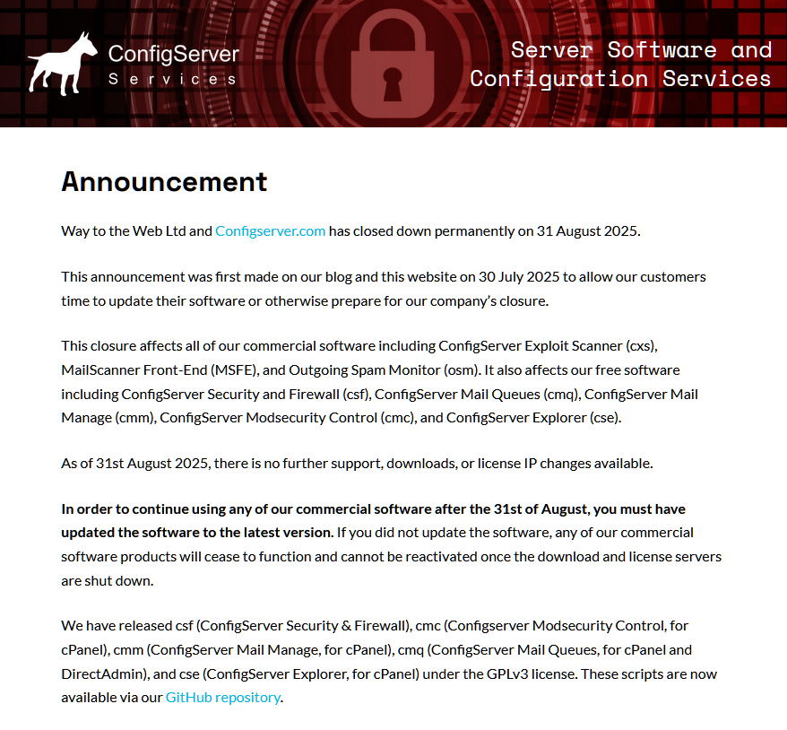

    <h6>Archive of the scripts provided by "Way to the Web Limited" (August 31, 2025)</h6>
    <h1>🔑 Way to the Web Limited Scripts 🔑</h1>

 

This branch serves as an archive for all of the scripts originally developed by **Way to the Web Limited**, prior to the company ceasing operations as of August 31, 2025. 

 

  

 

---

 

### Archive Status

This branch contains the following software for archival purposes:

 

| Application | Abbreviation | Version | Type | Archive Status |
| --- | --- | --- | --- | --- |
| **ConfigServer Security and Firewall** | CSF | v15.00 | Free | ✅ |
| **ConfigServer Mail Queues** | CMQ | v4.00 | Free | ✅ |
| **ConfigServer Mail Manage** | CMM | v3.00 | Free | ✅ |
| **ConfigServer Modsecurity Control** | CMC | v4.00 | Free | ✅ |
| **ConfigServer Explorer** | CSE | v3.00 | Free | ✅ |
| **ConfigServer Exploit Scanner** | CXS | v4.00 | Commercial | ⭕ |
| **MailScanner Front-End** | MSFE | v4.00 | Commercial | ⭕ |
| **Outgoing Spam Monitor** | OSM | v4.00 | Commercial | ⭕ |

 

---

 

## About

On **August 31, 2025**, the company **Way to the Web Limited** announced that they would be closing their doors and ceasing operations. At the time of this public announcement, all free software licensed under [GNU General Public License v3.0](https://gnu.org/licenses/gpl-3.0.en.html) were released on their [official repository](https://github.com/waytotheweb/scripts).

 

The following update was made to their [official website](https://configserver.com/configserver-security-and-firewall/) on August 31, 2025:

 

 

---

 

## Updates

The files contained within this [legacy](https://github.com/Aetherinox/csf-firewall/tree/legacy) branch will remain as-is. However, if you would like to obtain an updated copy of [ConfigServer and Firewall](https://github.com/Aetherinox/csf-firewall/tree/main), you may visit our [main](https://github.com/Aetherinox/csf-firewall/tree/main) branch.

 

---

 

## Legal Notices

Copyright (C) 2006-2025 Jonathan Michaelson

