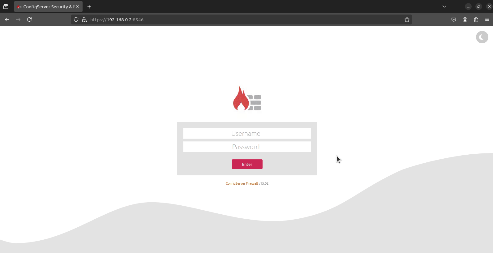
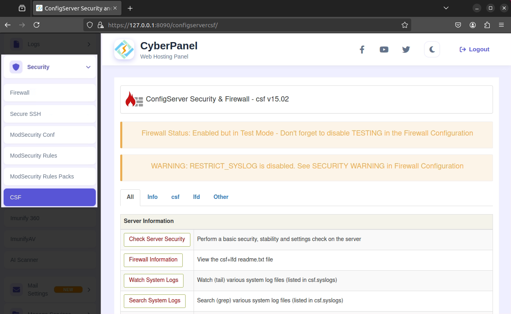
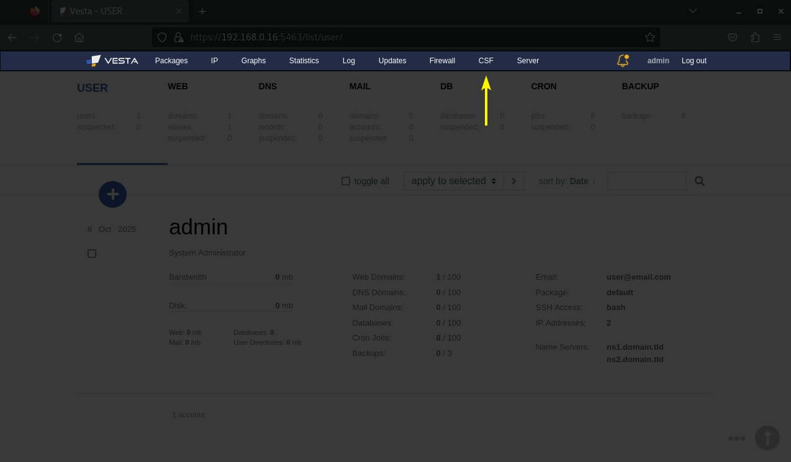
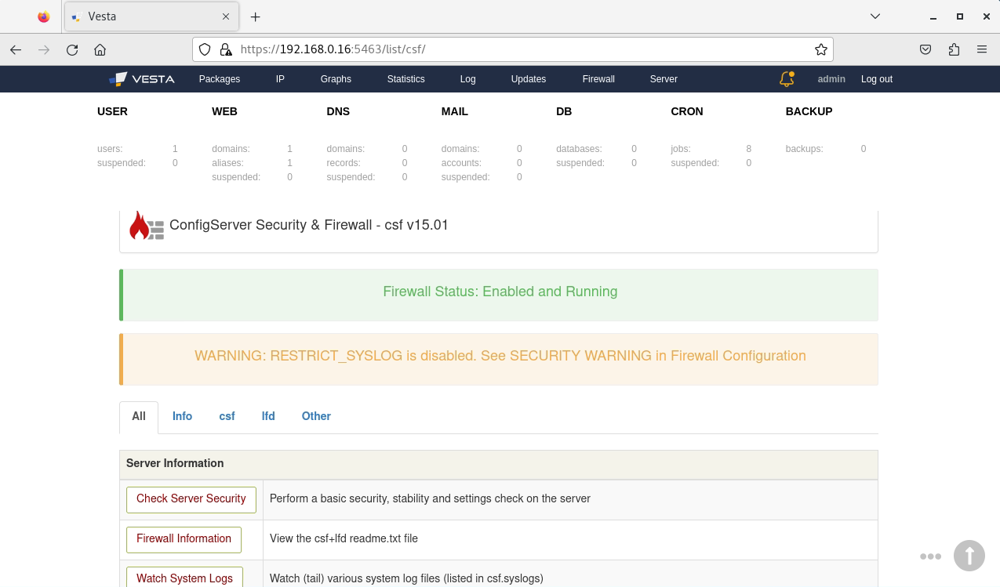
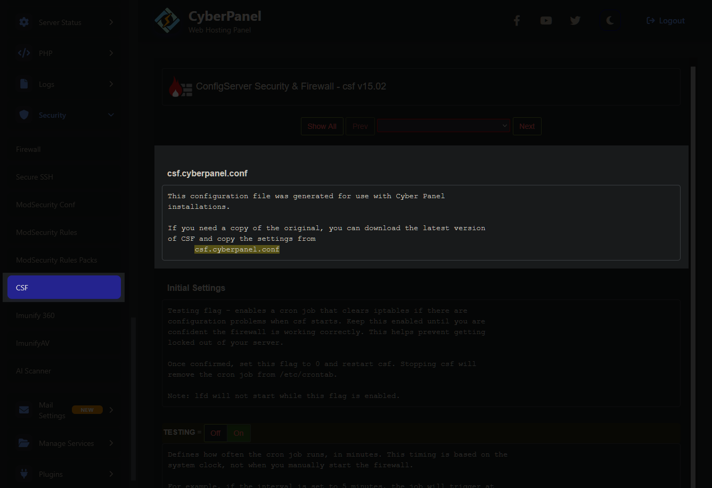

# Release: v15.02

The next release of ConfigServer Security & Firewall (CSF) is here, and I wanted to take a moment to share an update on what’s coming next — including fixes, plans, and our broader direction moving forward. This post will cover integration improvements for both **VestaCP** and **CyberPanel**, as well as a look into the ongoing goals behind CSF’s continued progression.

Our focus remains on transparency, stability, and community involvement. Users deserve to know not only what’s changing, but why. By keeping everyone informed and maintaining compatibility across control panels, we aim to ensure that CSF continues to be the trusted, secure, and reliable firewall solution it has always been.

<!-- more -->

<br />

---

<br />

## Objectives

This repository originally began as the home for a third-party CSF Dark Theme and a collection of helper scripts designed to simplify everyday management tasks. However, following the unfortunate announcement that **Way to the Web** would be closing down, this project evolved into a maintained fork of the ConfigServer Security & Firewall core application itself.  

CSF has long stood as one of the most stable and loved firewall applications available. It has been known for its consistency, reliability, and not fixing what isn’t broken. That legacy is something I respect and want to maintain.

As a long-time user myself, I understand what CSF brings to everyday server management. While I’m fully capable of managing iptables or nftables directly, the convenience of having a clean, functional interface to manage my firewall saves time and effort, and that’s something worth maintaining. 

The goal moving forward is simple: _enhance, not overhaul_

I am focused on delivering thoughtful updates, quality improvements, and useful new features that make CSF better, without compromising its identity or stability. I have no intention of tearing down what makes CSF great. I want to strengthen it, preserve its integrity, and ensure it remains the trusted tool you know and rely on.

<br />

---

<br />

## Community Collaboration

GitHub was chosen as CSF’s new home because it provides the transparency and the openness this project deserves. It lets users follow development in real-time, track changes as they happen, and directly participate in discussions or contributions. This approach keeps everyone in the loop and ensures that CSF evolves with community insight and feedback.

While I’m leading the maintenance and development, CSF isn’t a one-person show. If you see areas for improvement, have ideas for new features, or have experience with Perl and want to contribute; your involvement is always welcome. Collaboration strengthens the project, and community input is what keeps it alive. Coupled with the fact that most of the applications I only use these days are open-source.

Most importantly, CSF will always remain free and open-source. There will never be a shift toward closed-source development or any corporate acquisition. The goal has always been, and will continue to be, to keep CSF accessible, transparent, and powered by the community that relies on it.

<br />

---

<br />

## Changelog

With all of that out of the way, this post is about the upcoming `v15.02` release and what it entails.

<br />

### New Login Page

This update re-introduces the login page that original users of the repository came to enjoy, with the added bonus that there is now a **Theme Selector** in the top-right.

The theme selector changes the login page theme for the moment; however, it will tie into the main web interface in an upcoming version when the **Dark Theme** is re-added.

Only **Generic** installation users will see the login screen, as that has always been the case. Control panels such as cPanel, VestaCP, Interworx, etc., never show a login page because authentication being tied into the control panel itself.

I wanted to keep the login page simple, and not turn it into a commercialized stock layout. It's a simple, revised login page that keeps the original white appearance but adds a dark theme and a simple background.

Users should note that when the dark theme returns to CSF, the white theme will remain. The goal is to preserve the original CSF look and avoid confusing the end-user. We're simply adding a dark theme to the web interface as an alternative option for users who would like it. The white theme will remain untouched aside from some style optimizations.

<figure markdown="span">
    { width="700" }
    <figcaption>CSF › Login</figcaption>
</figure>

<br />

---

<br />

### Alpha Release Channel

The **Alpha Release Channel** provides access to early builds of CSF that include experimental features, performance improvements, or upcoming functionality that has not yet been finalized for stable release.

Alpha releases are highly experimental and not intended for production servers.
These builds may contain incomplete features, untested changes, or critical bugs that could lead to system instability or security issues.

The primary purpose of the alpha channel is to allow users and developers to test new functionality and provide feedback before the features are merged into the stable release channel.

Only use the alpha channel in a controlled testing or development environment.

If you wish to test an alpha release, it is strongly recommended that you do so on a virtual machine (such as Hyper-V, VMWare, or VirtualBox) or on a secondary barebones server that has no critical role in your primary infrastructure or homelab. This ensures that any potential bugs or regressions in the alpha build do not disrupt your production environment.

<br />

#### Enable Alpha Releases

To enable the Alpha channel, edit your `/etc/csf/csf.conf` file and add the following line:

```ini
RELEASE_ALPHA = "1"
```

??? danger "⚠️ **DANGER** ⚠️ Alpha Releases"

    This setting is not included by default to prevent accidental use on production systems.

<br />

#### Download Service Updates

Our [download.configserver.dev]() update service has been enhanced to now include alpha releases. You can view the latest version of an alpha release by opening your browser and going to:

- [https://download.configserver.dev/csf/version.txt?channel=alpha](https://download.configserver.dev/csf/version.txt?channel=alpha)

<br />

When you enable the `csf.conf` setting `RELEASE_ALPHA`, CSF will download new alpha releases from the url:

- [https://download.configserver.dev/csf.tgz?channel=alpha](https://download.configserver.dev/csf.tgz?channel=alpha)

<br />

---

<br />

### Cyberpanel

Recently, it seems that the Cyberpanel team has removed CSF as their default firewall solution. This change is understandable, especially given the transition to new developers and the natural concerns around trust and support.

I will however, continue to maintain CSF for those who prefer it. If you want to use CSF as your firewall instead of the new default, that option remains fully available.

With the release of **v15.02**, all issues affecting Cyberpanel integration have been resolved. The integration is now fully operational again.

Installation and updates work exactly as they did before, and backwards compatibility has been preserved wherever possible to ensure a smooth experience for existing users.

<figure markdown="span">
    { width="700" }
    <figcaption>Cyberpanel › CSF</figcaption>
</figure>

<br />

---

<br />

### VestaCP

With the release of VestaCP `v1.0.x`, the platform transitioned to React, which broke CSF integration. While the `/list/csf` page could still be accessed directly via URL, the VestaCP header would no longer appear.

This issue has been resolved, but there are some important considerations to note.

<br />

#### CSF Submenu in Header

React-based VestaCP templates are now minified `.js` and `.css` files rather than simple PHP and HTML. This change makes it significantly more challenging to modify the header and re-add CSF to the navigation menu, especially given hashed filenames in the build process; which we want to preserve the integrity of.

Rather than rebuilding the templates ourselves which seems like a drastic approach; I have provided instructions for users to manually integrate CSF into the VestaCP menu: [Add CSF to VestaCP Menu](../../install/install.md#add-csf-menu).

Ideally, this would be solved by adding a conditional menu item in the header template, but VestaCP has not seen updates in some time, which brings us to the next point.

<figure markdown="span">
    { width="700" }
    <figcaption>VestaCP › CSF › Header Menu</figcaption>
</figure>

<br />

#### Lack of Updates

Security is the core focus of CSF, and using outdated software can increase your attack surface. Currently, VestaCP has over [20 known vulnerabilities](https://www.cve.org/CVERecord/SearchResults?query=vesta). While I maintain CSF support for VestaCP, users should carefully consider the security implications of running an unsupported version.

Support will continue, but given the lack of active updates from VestaCP, I cannot dedicate excessive resources to maintaining integration with a platform that appears unmaintained right now.

<br />

#### Header Integration

I have re-integrated the header menu into CSF for VestaCP, so you can now jump to other pages from the `/list/csf` page.

<figure markdown="span">
    { width="700" }
    <figcaption>VestaCP › ConfigServer Security & Firewall</figcaption>
</figure>

<br />

---

<br />

### Dark Theme Users

The dark theme will return, but restoring core functionality has been the primary focus. With several integrations previously not working correctly, I prioritized stability and usability first. The dark theme remains on the roadmap and will be reintroduced carefully.  

The footer from the original dark theme has been re-implemented, along with the Light/Dark theme switcher. The corresponding CSS classes are not yet fully applied, as meticulous testing is required to avoid breaking the appearance or functionality of other integrations. This ensures a smooth, stable experience rather than rushing cosmetic changes that break CSF.

The login interface, part of the original dark theme, has been restored.

<br />

---

<br />

### Automatic Download Server

The update servers are now fully back online, restoring the same functionality as the original developer's website. A new help page has also been added to the download service for easier guidance:

```embed
url:            https://download.configserver.dev/help
name:           Download Service › Help
desc:           Shows a list of commands that can be utilized with the CSF download service
image:          https://raw.githubusercontent.com/Aetherinox/csf-firewall/main/docs/images/logos/csf.png
favicon:        https://raw.githubusercontent.com/Aetherinox/csf-firewall/main/docs/images/logos/csf.png
favicon_size:   25
target:         new
accent:         353535E0
```

<br />

Additionally, a few companies have reached out to offer services like reputation identity, which CSF previously supported. These integrations are being reviewed and implemented carefully, with security and privacy as the top priorities, which means no data collection, no extra open ports, and no compromises on safety.

<br />

We have also added an official **Help** interface which shows examples of how to use the Download Service. You can view more information about it here:

- [https://download.configserver.dev/help](https://download.configserver.dev/help)

<br />

---

<br />

### Pre/Post Script Integration

Pre/post script integration is now fully supported in CSF. Any existing scripts you use with CSF will continue to function without changes, but the decision to use one of the two designated directories is left up to the end-user.

<br />

- When CSF is installed for the first time, two starter files :aetherx-axd-file: `/usr/local/csf/bin/csfpre.sh` and :aetherx-axd-file: `/usr/local/csf/bin/csfpost.sh` are automatically created on your system (only if they don’t already exist). These serve as base loader scripts, giving you a foundation to add your own custom logic later on.
    - You must create your own pre/post loader folders :aetherx-axd-folder: `/usr/local/include/csf/pre.d/` and :aetherx-axd-folder: `/usr/local/include/csf/post.d/`
- If you already have existing pre/post loader files in place, CSF will respect your current setup and skip creating the starter versions — allowing you to continue using your existing scripts without interruption.

<br />

Full documentation and usage instructions can be found here:

```embed
url:            https://docs.configserver.dev/usage/prepost/
name:           Docs › Pre & Post
desc:           CSF includes dedicated directories where you can place custom Bash scripts to run at specific stages of the firewall’s startup process. 
image:          https://raw.githubusercontent.com/Aetherinox/csf-firewall/main/docs/images/logos/csf.png
favicon:        https://raw.githubusercontent.com/Aetherinox/csf-firewall/main/docs/images/logos/csf.png
favicon_size:   25
target:         new
accent:         353535E0
```

<br />

With the updated logic, you can now place your pre and post shell scripts in multiple locations for greater flexibility:

#### :aetherx-axd-file: <!-- md:option csfpre.sh -->

- `/usr/local/csf/bin/csfpre.sh`
- `/etc/csf/csfpre.sh`

#### :aetherx-axd-file: <!-- md:option csfpost.sh -->

- `/usr/local/csf/bin/csfpost.sh`
- `/etc/csf/csfpost.sh`

<br />

Previously, CSF would only check one location for each script. With this improvement, you can use both locations simultaneously, allowing you to separate scripts as needed for organizational or operational purposes.

The original behavior for loading your custom shell scripts has been fully preserved. This means you don’t need to make any changes after upgrading to v15.01. Any existing scripts will continue to work exactly as they did before.

<br />

---

<br />

### Updated install.sh Script

The `install.sh` installation script has been updated. The core functionality of the script will remain the same, and any existing automation you may have in place which uses this file will require no changes. These updates just re-write the code, add better output, add support for both relative / absolute calls to the script, and ensure POSIX compliance.

- installer script now gives more detailed information to the user.
- supports absolute or relative execution / calls from any directory
- add flags `--dryrun`, `--detect`, `--help`, `--version`
- POSIX compliant
- No base functionality changes, requires no changes by users with automated scripts; same run command

<br />

#### Example Output

The following shows the output provided by the `install.sh` script:

<br />

=== ":aetherx-axs-1: Output Example 1"

    ```console
    $ sudo sh src/install.sh 

    # #
    #  ConfigServer Security & Firewall › Installer
    #  version: 15.02
    # #

    OK                  Starting installer CyberPanel › install.cyberpanel.sh 
    ```

=== ":aetherx-axs-2: Output Example 2"

    ```console
    $ sudo sh src/install.sh --help

    ConfigServer Security & Firewall
    Robust linux iptables/nftables firewall
    version: 15.02
    install.sh [ --detect | --dryrun |  --version | --help ]

    Flags:                                         
          -D,  --detect             returns installer script that will run; does not install csf <default> false
          -d,  --dryrun             simulates installation, does not install csf <default> false
          -v,  --version            current version of this utilty <current> 15.02
          -h,  --help               show this help menu
    ```

<br />

---

<br />

### Config File Changes

`v15.02` introduces newly re-written configuration files. It does not change the way a user's existing configuration file loads, and a user is not required to use the newly revised configs. Most of the changes are simply cosmetic. If you want to keep your existing configuration file, you may do so without any negative results. You can simply use the newer config as an example.

<br />

#### Added Headers

Every configuration file now features a header displayed at the top of the **Firewall Configuration** page. This header shows which configuration file was generated during the initial CSF installation. It addresses user confusion reported on various forums regarding how config files are processed and helps users quickly identify the active config file within the file system.

<figure markdown="span">
    { width="700" }
    <figcaption>CSF › Configuration File</figcaption>
</figure>

<br />

#### Enhanced Comments

The comments within each configuration file have been thoroughly revised. Descriptions above each setting are now more informative, providing explanations, common port examples, and additional context for specific features, without becoming overly verbose. This makes it easier for users to understand each setting and how it affects their firewall.

<br />

---

<br />

## Summary

This update builds upon existing functionality while preserving the stability and behavior users rely on. The goal is to deliver a seamless transition; keeping automation and workflows intact, while improving integration support and resolving previously broken functionality.

As always, community feedback is encouraged. If you have feature suggestions or ideas that could enhance the user experience, feel free to open a ticket on the official GitHub repository:

```embed
url:            https://github.com/Aetherinox/csf-firewall/issues/new
name:           Github › Submit Issue
desc:           Submit a bug or new feature request.
image:          https://i.pinimg.com/564x/5c/2b/c5/5c2bc53db08acad9c2c1162e5cfd87ba.jpg
favicon:        https://i.pinimg.com/564x/5c/2b/c5/5c2bc53db08acad9c2c1162e5cfd87ba.jpg
favicon_size:   25
target:         new
accent:         353535E0
```

<br />

---

<br />

## Full Changelog

The full changelog is available [here](../../about/changelog.md).

<br />
<br />