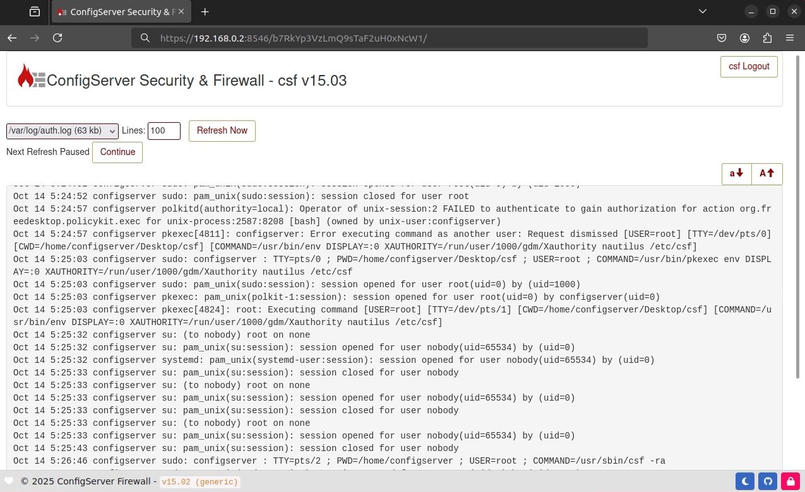

# Release: v15.03

This update includes several minor improvements without adding major new features. It also fixes an issue in the Webmin control panel, restoring the **Configuration** and **Help** menus that were missing from the header in [v15.02](release-15.02.md).

<!-- more -->

<br />

---

<br />

## Changelog

A list of the most important changes are listed below.

<br />

### Fix Webmin Header Icons

`v15.02` introduced a minor bug to Webmin which removed the top-left header icons:

- <svg xmlns="http://www.w3.org/2000/svg" viewBox="0 0 512 512" fill="#FFF" width="16px" height="16px"><defs><style>.fa-secondary{opacity:.4}</style></defs><path class="fa-primary" d="M489.6 191.2c6.9-6.2 9.6-15.9 6.4-24.6c-4.4-11.9-9.7-23.3-15.8-34.3l-4.7-8.1c-6.6-11-14-21.4-22.1-31.2c-5.9-7.2-15.7-9.6-24.5-6.8L389.1 98.8c-10 3.2-20.8 1.1-29.7-4.6c-4.9-3.1-9.9-6.1-15.1-8.7c-9.3-4.8-16.5-13.2-18.8-23.4l-8.9-40.7c-2-9.1-9-16.3-18.2-17.8C284.7 1.2 270.5 0 256 0s-28.7 1.2-42.5 3.5c-9.2 1.5-16.2 8.7-18.2 17.8l-8.9 40.7c-2.2 10.2-9.5 18.6-18.8 23.4c-5.2 2.7-10.2 5.6-15.1 8.7c-8.8 5.7-19.7 7.7-29.7 4.6L83.1 86.1c-8.8-2.8-18.6-.3-24.5 6.8c-8.1 9.8-15.5 20.2-22.1 31.2l-4.7 8.1c-6.1 11-11.4 22.4-15.8 34.3c-3.2 8.7-.5 18.4 6.4 24.6l30.9 28.1c7.7 7.1 11.4 17.5 10.9 27.9c-.1 2.9-.2 5.8-.2 8.8s.1 5.9 .2 8.8c.5 10.5-3.1 20.9-10.9 27.9L22.4 320.8c-6.9 6.2-9.6 15.9-6.4 24.6c4.4 11.9 9.7 23.3 15.8 34.3l4.7 8.1c6.6 11 14 21.4 22.1 31.2c5.9 7.2 15.7 9.6 24.5 6.8l39.7-12.6c10-3.2 20.8-1.1 29.7 4.6c4.9 3.1 9.9 6.1 15.1 8.7c9.3 4.8 16.5 13.2 18.8 23.4l8.9 40.7c2 9.1 9 16.3 18.2 17.8c13.8 2.3 28 3.5 42.5 3.5s28.7-1.2 42.5-3.5c9.2-1.5 16.2-8.7 18.2-17.8l8.9-40.7c2.2-10.2 9.4-18.6 18.8-23.4c5.2-2.7 10.2-5.6 15.1-8.7c8.8-5.7 19.7-7.7 29.7-4.6l39.7 12.6c8.8 2.8 18.6 .3 24.5-6.8c8.1-9.8 15.5-20.2 22.1-31.2l4.7-8.1c6.1-11 11.3-22.4 15.8-34.3c3.2-8.7 .5-18.4-6.4-24.6l-30.9-28.1c-7.7-7.1-11.4-17.5-10.9-27.9c.1-2.9 .2-5.8 .2-8.8s-.1-5.9-.2-8.8c-.5-10.5 3.1-20.9 10.9-27.9l30.9-28.1zM256 160a96 96 0 1 1 0 192 96 96 0 1 1 0-192z"></path><path class="fa-secondary" d="M192 256a64 64 0 1 1 128 0 64 64 0 1 1 -128 0z"></path></svg> Module Config
- <svg xmlns="http://www.w3.org/2000/svg" viewBox="0 0 512 512" fill="#FFF" width="16px" height="16px"><path d="M256 512A256 256 0 1 0 256 0a256 256 0 1 0 0 512zM169.8 165.3c7.9-22.3 29.1-37.3 52.8-37.3h58.3c34.9 0 63.1 28.3 63.1 63.1c0 22.6-12.1 43.5-31.7 54.8L280 264.4c-.2 13-10.9 23.6-24 23.6c-13.3 0-24-10.7-24-24V250.5c0-8.6 4.6-16.5 12.1-20.8l44.3-25.4c4.7-2.7 7.6-7.7 7.6-13.1c0-8.4-6.8-15.1-15.1-15.1H222.6c-3.4 0-6.4 2.1-7.5 5.3l-.4 1.2c-4.4 12.5-18.2 19-30.6 14.6s-19-18.2-14.6-30.6l.4-1.2zM224 352a32 32 0 1 1 64 0 32 32 0 1 1 -64 0z"></path></svg> Help

<br />

The Webmin control panel dynamically injects header icons using a specific tag that must be present in the CSF interface.

```html
print "<div class='well well-sm'>csf: v$myv</div>";
```

<br />

These tags were accidentally removed during the footer redesign and were not migrated as intended. As of v15.03, the header icons have been restored and will appear correctly after updating.

<br />

<figure markdown="span">
    { width="700" }
    <figcaption>CSF › Webmin › Header Icons</figcaption>
</figure>

<br />

---

<br />

### Updated Csfajaxtail

This update provides a re-written `src/csfajaxtail.js` javascript library. This file is responsible for logging and grep features seen on pages such as:

- Watch System Logs
- View iptables logs

<br />

The re-write includes performance optimizations, and a status indicator when the end-user pauses logging.

<br />

---

<br />

### Blog Comments

A commenting system has been integrated at the bottom of each blog page, powered by [Giscus](https://giscus.app/).  
This feature allows users to leave comments, ask questions, or provide feedback regarding changes made in a release.  

All comments are synchronized with [GitHub Discussions](https://docs.github.com/en/discussions), allowing you to sign in using your GitHub account to participate.  

We’ve also ensured that privacy settings are enabled for this integration — no metadata is collected or stored.

<br />

---

<br />

### FontMinus FontPlus Minimums

The font minimums have been changed from `12px` to `10px`. This allows for slightly more characters on a single line in order to prevent word-wrap as much
as possible when viewing your logs.

To change the font-size, click the icons <svg xmlns="http://www.w3.org/2000/svg" width="24" height="24" viewBox="0 0 24 24" fill="none" stroke="#FFF" stroke-width="2" stroke-linecap="round" stroke-linejoin="round" class="lucide-arrow-up"><path d="m5 12 7-7 7 7"></path><path d="M12 19V5"></path></svg> and <svg xmlns="http://www.w3.org/2000/svg" width="24" height="24" viewBox="0 0 24 24" fill="none" stroke="#FFF" stroke-width="2" stroke-linecap="round" stroke-linejoin="round" class="lucide-arrow-down"><path d="M12 5v14"></path><path d="m19 12-7 7-7-7"></path></svg>.

<figure markdown="span">
    { width="700" }
    <figcaption>CSF › Decrease Minimum Font Size</figcaption>
</figure>

<br />

---

<br />

## Full Changelog

The full changelog is available [here](../../about/changelog.md).

<br />
<br />