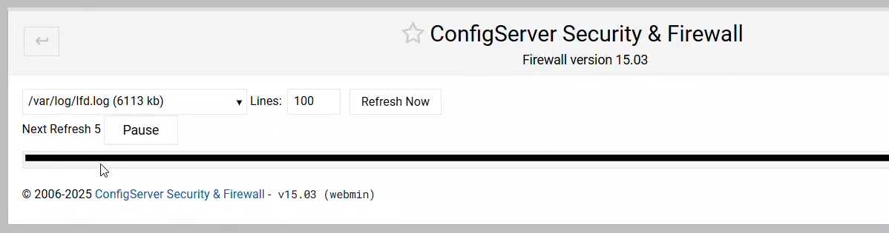

# Release: v15.04

This update addresses a textbox height bug for the Webmin control panel which affects the **log** viewing pages. Two new settings have also been added to the CSF config file `/etc/csf/csf.conf` which affects logging.

The full changelog is available [here](../../about/changelog.md).

<!-- more -->

<br />

---

<br />

## Changelog

A list of the most important changes are listed below.

<br />

### Fix Webmin Log Textbox Height

Release [v15.03](https://docs.configserver.dev/blog/2025/release-v1503/) introduced a complete rewrite of the `csfajaxtail.js` file, which handles log viewing within CSF. However, this update inadvertently caused a display issue where log textboxes were rendered only a few pixels tall.

Version `v15.04` resolves this issue and adds support for vertical resizing of log windows.

<br />

<figure markdown="span">
    { width="700" }
    <figcaption>Webmin › CSF › Log Height Bug</figcaption>
</figure>

<br />

---

<br />

### New Settings

We have introduced two new settings that are available within your `/etc/csf/csf.conf` config file:

<br />

#### UI_LOGS_REFRESH_TIME

This setting controls how frequently CSF automatically refreshes the displayed logs. The value represents the number of seconds between each refresh cycle. Lower values update the logs more often, while higher values reduce update frequency to conserve resources.

``` perl
# #
#   Number of seconds between automatic log refreshes.
#   Controls how frequently the log display updates.
# #

UI_LOGS_REFRESH_TIME = "6"
```

<br />
<br />

#### UI_LOGS_START_PAUSED

This setting allows you to define if automatic log refreshing on page load starts off running ++0++ or paused ++1++.

:aetherx-axs-toggle-off: <!-- md:option UI_LOGS_START_PAUSED = "0" -->

:   - A value of ++0++ means that as soon as a log page is loaded, it will automatically start counting down from the value defined in `UI_LOGS_REFRESH_TIME`.

:aetherx-axs-toggle-on: <!-- md:option UI_LOGS_START_PAUSED = "1" -->

:   - A value of ++1++ means that as soon as a log page is loaded, it will start in the **paused** state. To start the automatic refresh functionality and timer, you  need to press the ++"Continue"++ button toward the top of the window.


``` perl
# #
#   Determines whether the log timer starts paused when the page loads.
#   1 = start paused, 0 = start running immediately.
# #

UI_LOGS_START_PAUSED = "0"
```

<br />
<br />