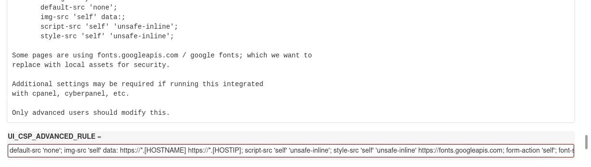

# Release: v15.05

This update fixes an issue where HTML in the **Firewall Configuration** page was not properly escaped, and rewrites the `init.d` script for POSIX compatibility with added functionality.

<!-- more -->

 

---

 

## Changelog

A list of the most important changes are listed below.

 

### Fix HTML Escaping

We have corrected an issue where HTML in the **Firewall Configuration** page was not properly escaped. This ensures that CSP (Content Security Policy) settings are applied correctly and safely when editing configuration files via the web interface.

 

<figure markdown="span">
    { width="700" }
    <figcaption>Bug › Escaped Input</figcaption>
</figure>

 

---

 

### POSIX-Compliant Init Script

The `csf.sh` `init.d` script has been fully rewritten to be **POSIX-compliant**, ensuring compatibility across various Linux distributions and shell environments.

It now supports all standard service commands:

- `start`
- `stop`
- `status`
- `restart`
- `force-reload`
- `reload`
- `restart-all`
- `enable`
- `disable`

The script also includes enhancements for manual execution, allowing it to be run directly from the command-line when needed.

This init script manages the CSF service on systems without `systemd`. During installation, it is copied from `/src/csf.sh` to `/etc/init.d/csf`.

 

---

 

## Full Changelog

The full changelog is available [here](../../about/changelog.md).

 
 