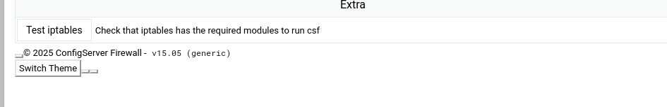
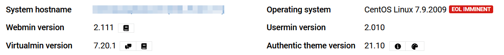
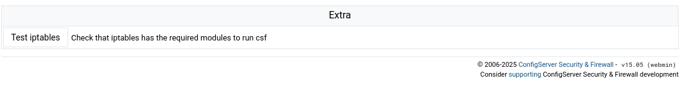

# Release: v15.06

This update fixes a backwards compatibility bug between CSF and older versions of Webmin such as v2.111.

The full changelog is available [here](../../about/changelog.md).

<!-- more -->

 

---

 

## Changelog

A list of the most important changes are listed below.

 

### Fix Webmin Backwards Compatibility

We have corrected a minor interface bug which caused issues with older version of Webmin dating back to v2.111, and the Authentic theme v21.10.

Installations of CSF on older versions of Webmin would exhibit the following symptoms:

- Webmin header would not show the buttons:
    - <svg xmlns="http://www.w3.org/2000/svg" viewBox="0 0 512 512" fill="#FFF" width="16px" height="16px"><defs></defs><path class="fa-primary" d="M489.6 191.2c6.9-6.2 9.6-15.9 6.4-24.6c-4.4-11.9-9.7-23.3-15.8-34.3l-4.7-8.1c-6.6-11-14-21.4-22.1-31.2c-5.9-7.2-15.7-9.6-24.5-6.8L389.1 98.8c-10 3.2-20.8 1.1-29.7-4.6c-4.9-3.1-9.9-6.1-15.1-8.7c-9.3-4.8-16.5-13.2-18.8-23.4l-8.9-40.7c-2-9.1-9-16.3-18.2-17.8C284.7 1.2 270.5 0 256 0s-28.7 1.2-42.5 3.5c-9.2 1.5-16.2 8.7-18.2 17.8l-8.9 40.7c-2.2 10.2-9.5 18.6-18.8 23.4c-5.2 2.7-10.2 5.6-15.1 8.7c-8.8 5.7-19.7 7.7-29.7 4.6L83.1 86.1c-8.8-2.8-18.6-.3-24.5 6.8c-8.1 9.8-15.5 20.2-22.1 31.2l-4.7 8.1c-6.1 11-11.4 22.4-15.8 34.3c-3.2 8.7-.5 18.4 6.4 24.6l30.9 28.1c7.7 7.1 11.4 17.5 10.9 27.9c-.1 2.9-.2 5.8-.2 8.8s.1 5.9 .2 8.8c.5 10.5-3.1 20.9-10.9 27.9L22.4 320.8c-6.9 6.2-9.6 15.9-6.4 24.6c4.4 11.9 9.7 23.3 15.8 34.3l4.7 8.1c6.6 11 14 21.4 22.1 31.2c5.9 7.2 15.7 9.6 24.5 6.8l39.7-12.6c10-3.2 20.8-1.1 29.7 4.6c4.9 3.1 9.9 6.1 15.1 8.7c9.3 4.8 16.5 13.2 18.8 23.4l8.9 40.7c2 9.1 9 16.3 18.2 17.8c13.8 2.3 28 3.5 42.5 3.5s28.7-1.2 42.5-3.5c9.2-1.5 16.2-8.7 18.2-17.8l8.9-40.7c2.2-10.2 9.4-18.6 18.8-23.4c5.2-2.7 10.2-5.6 15.1-8.7c8.8-5.7 19.7-7.7 29.7-4.6l39.7 12.6c8.8 2.8 18.6 .3 24.5-6.8c8.1-9.8 15.5-20.2 22.1-31.2l4.7-8.1c6.1-11 11.3-22.4 15.8-34.3c3.2-8.7 .5-18.4-6.4-24.6l-30.9-28.1c-7.7-7.1-11.4-17.5-10.9-27.9c.1-2.9 .2-5.8 .2-8.8s-.1-5.9-.2-8.8c-.5-10.5 3.1-20.9 10.9-27.9l30.9-28.1zM256 160a96 96 0 1 1 0 192 96 96 0 1 1 0-192z"></path><path class="fa-secondary" d="M192 256a64 64 0 1 1 128 0 64 64 0 1 1 -128 0z"></path></svg> Module Config
    - <svg xmlns="http://www.w3.org/2000/svg" viewBox="0 0 512 512" fill="#FFF" width="16px" height="16px"><path d="M256 512A256 256 0 1 0 256 0a256 256 0 1 0 0 512zM169.8 165.3c7.9-22.3 29.1-37.3 52.8-37.3h58.3c34.9 0 63.1 28.3 63.1 63.1c0 22.6-12.1 43.5-31.7 54.8L280 264.4c-.2 13-10.9 23.6-24 23.6c-13.3 0-24-10.7-24-24V250.5c0-8.6 4.6-16.5 12.1-20.8l44.3-25.4c4.7-2.7 7.6-7.7 7.6-13.1c0-8.4-6.8-15.1-15.1-15.1H222.6c-3.4 0-6.4 2.1-7.5 5.3l-.4 1.2c-4.4 12.5-18.2 19-30.6 14.6s-19-18.2-14.6-30.6l.4-1.2zM224 352a32 32 0 1 1 64 0 32 32 0 1 1 -64 0z"></path></svg> Help

- Webmin footer would attempt to load custom footer for the **generic** installation.
- Installation marked as **generic** installation for all modules of CSF.

 

<figure markdown="span">
    { width="600" }
    <figcaption>Bug exhibited on Webmin v2.111; incorrect theme button, incorrect control panel detected</figcaption>
</figure>

 

<figure markdown="span">
    { width="600" }
    <figcaption>Reported Webmin version affected by bugs</figcaption>
</figure>

 

After resolution, older versions of Webmin should appear identical to newer versions.

 

<figure markdown="span">
    { width="600" }
    <figcaption>Webmin › Fixed Footer</figcaption>
</figure>

 

<figure markdown="span">
    { width="600" }
    <figcaption>Webmin › Fixed Header</figcaption>
</figure>

 
 