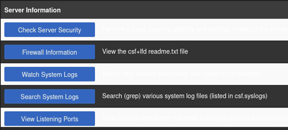
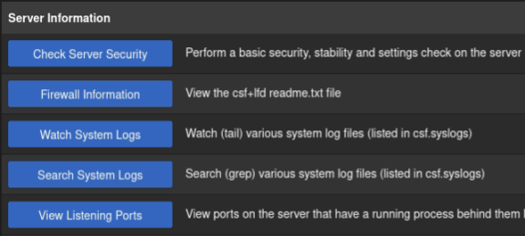
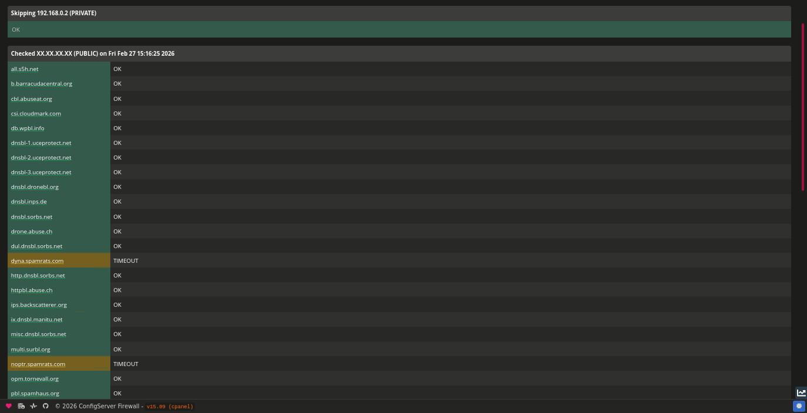

# Release: v15.10

The **v15.10** release includes a collection of minor bug fixes primarily focused on theme-related issues affecting both the revised original white theme and the new dark theme introduced in **v15.09**. 

One fix resolves an issue where the `CF_ENABLE` setting would continue to display the **Cloudflare Integration** buttons in the web interface even when the value was set to `0`. A similar issue was identified and corrected with the statistics buttons, which were appearing regardless of their corresponding configuration setting. 

Additionally, several stylesheet refinements were made to correct text positioning in the home navigation menu buttons, along with fixes for a small number of `<div>` elements that had incorrect CSS classes applied.

This release also introduces support for preserving **custom comments** in your `/etc/csf/csf.conf` file across updates. In previous versions, CSF compared your existing configuration against the default configuration shipped with each release, adding any missing settings as needed. This process resulted in the removal of any existing custom comments. With this update, custom comments are now retained, ensuring your configuration remains fully intact between upgrades.

Finally, a small bug was fixed regarding `Messenger v1` related to reCAPTCHA tokens being truncated depending on the length of bytes. The limit has been increased to `4096 bytes`, which provides approximately 4053 bytes for the token after accounting for the 43 bytes of URL overhead, comfortably accommodating current reCAPTCHA token sizes.

<!-- more -->

<br />

---

<br />

## Changelog

A list of the most important changes are outlined below.

<br />

### Dark Theme

Version `15.09` introduced the **dark theme** to CSF. This release focuses on correcting a number of styling issues
found across several control panels, with the majority affecting cPanel. These changes improve consistency, clarity, 
and overall visual refinement of the dark theme for all users. 

The light theme will continue to be updated if any styling bugs become known, but it will not receive additional major changes, as the 
intention is to preserve the white theme as closely as possible to the original. This means avoiding significant layout or visual
changes to the existing interface.

If a new theme is introduced in the future using the updated template system, the original theme will remain within CSf, which allows 
you to access what you're used to.

<br />

<figure markdown="span">
    { width="300" }
    { width="300" }
    <figcaption>cPanel › Dark Theme › Bug</figcaption>
</figure>

<br />
<br />

### Truncated reCAPTCHA

A bug was fixed regarding the `Messenger` module, which caused reCAPTCHA tokens to become truncated depending on the length of bytes. 

When a user submits a reCAPTCHA challenge, the token is passed as a query parameter in the HTTP request line (e.g., 
`GET /unblk?g-recaptcha-response=<token> HTTP/1.1`). The Messenger service previously imposed a **2048-byte** limit when reading this 
request line, which was sufficient when the code was originally written, as reCAPTCHA v2 tokens were typically around 600-1000 bytes.

However, Google has since increased token sizes, particularly with reCAPTCHA v3. This increase means that tokens can range from 1000 to 
4000+ bytes. When the full request line exceeded 2048 bytes, the token was silently truncated, causing Google's verification endpoint to 
reject it and leaving users unable to complete the process.

The limit has been increased to `4096 bytes`, which provides approximately 4053 bytes for the token after accounting for the 43 bytes of 
URL overhead, comfortably accommodating current reCAPTCHA token sizes. 

Currently, [RFC 7230, Sec 3.1.1](https://datatracker.ietf.org/doc/html/rfc7230#autoid-17) recommends that all HTTP senders and recipients 
support request-line lengths of at least 8000 octets; however, this is a recommendation, not a hard requirement.

Since the Messenger module is not a general purpose HTTP server and only handles a small list of endpoints, we opted for 4096, which is 
enough to comfortably fit current reCAPTCHA token sizes, and ensuring that we keep a tight limit to prevent potential abuse from excessively 
long requests.

<br />
<br />

### Persistent Config Comments

This release also introduces support for preserving **custom comments** in your `/etc/csf/csf.conf` file across updates. 

In previous versions, CSF compared your existing configuration against the default configuration shipped with each release, adding any 
missing settings as needed. This process resulted in the removal of any existing custom user comments.

With this update, custom comments are now retained, ensuring your configuration remains fully intact between upgrades. When writing custom 
comments in your `csf.conf`, you now have two options:

| Character     | Type              | Note                                                  |
| ------------- | ----------------- | ----------------------------------------------------- |
| `#`           | Generic Comment   | Must be placed **above** a setting, not below         |
| `##`          | Sticky Comment    | Can be placed anywhere                                |

<br />

#### Generic Comment

To place a **generic comment** in your `csf.conf`, simply prefix the comment with a single `#` character. All comments must be **above** the 
setting you are wanting to comment. 

When you update your copy of CSF, the comment will remain **above** the setting where it was placed. 

=== ":aetherx-axs-file: Before Update"

    ```ini title="/etc/csf/csf.conf" hl_lines="1"
    # This is a comment above TESTING    
    TESTING = "1"

    # #
    #   Defines how often the cron job runs, in minutes. This timing is based on the
    #   system clock, not when you manually start the firewall.
    # #

    TESTING_INTERVAL = "5"
    ```

=== ":aetherx-axs-file: After Update"

    ```ini title="/etc/csf/csf.conf" hl_lines="1"
    # This is a comment above TESTING
    TESTING = "1"

    # #
    #   Defines how often the cron job runs, in minutes. This timing is based on the
    #   system clock, not when you manually start the firewall.
    # #

    TESTING_INTERVAL = "5"
    ```

<br />

However, if you add a generic comment **below** a setting, the generic comment will be re-positioned in the updated config file 
**above thenext** setting in the file.

=== ":aetherx-axs-file: Before Update"

    ```ini title="/etc/csf/csf.conf" hl_lines="2"
    TESTING = "1"
    # This is a comment below TESTING

    # #
    #   Defines how often the cron job runs, in minutes. This timing is based on the
    #   system clock, not when you manually start the firewall.
    # #

    TESTING_INTERVAL = "5"
    ```

=== ":aetherx-axs-file: After Update"

    ```ini title="/etc/csf/csf.conf" hl_lines="8"
    TESTING = "1"

    # #
    #   Defines how often the cron job runs, in minutes. This timing is based on the
    #   system clock, not when you manually start the firewall.
    # #

    # This is a comment below TESTING
    TESTING_INTERVAL = "5"
    ```

<br />
<br />

#### Sticky Comment

To place a **sticky comment** in your `csf.conf`, simply prefix the comment with a single `##` character. A sticky comment can be
placed anywhere in the config, and it will remain in that position when updating CSF.

=== ":aetherx-axs-file: Before Update"

    ```ini title="/etc/csf/csf.conf" hl_lines="1 3"
    ## This is a sticky comment above TESTING; it will remain above TESTING.
    TESTING = "1"
    ## This is a sticky comment below TESTING; it will remain below TESTING.

    # #
    #   Defines how often the cron job runs, in minutes. This timing is based on the
    #   system clock, not when you manually start the firewall.
    # #

    TESTING_INTERVAL = "5"
    ```

=== ":aetherx-axs-file: After Update"

    ```ini title="/etc/csf/csf.conf" hl_lines="1 3"
    ## This is a sticky comment above TESTING; it will remain above TESTING.
    TESTING = "1"
    ## This is a sticky comment below TESTING; it will remain below TESTING.

    # #
    #   Defines how often the cron job runs, in minutes. This timing is based on the
    #   system clock, not when you manually start the firewall.
    # #

    TESTING_INTERVAL = "5"
    ```

<br />
<br />

### Real-time Blackhole List (RBL)

This update introduces a redesigned **Real-time Blackhole List (RBL)** interface, along with improvements to the core functionality.  
Hosts can now be retried multiple times before returning a timeout or error, and **Verbose** mode provides more detailed status
information for each host that is tested.

**What is an RBL?**  
A Real-time Blackhole List is a DNS-based blacklist of IP addresses known or suspected to engage in malicious activity, such as spam,
brute-force attacks, port scanning, or botnet behavior. CSF uses RBLs to proactively block or flag suspicious IPs, helping protect
your server from unwanted or harmful traffic.

<figure markdown="span">
    { width="700" }
    <figcaption>CSF › RBL Check</figcaption>
</figure>

<br />

---

<br />

## Full Changelog

The full changelog is available [here](../../about/changelog.md).

<br />
<br />