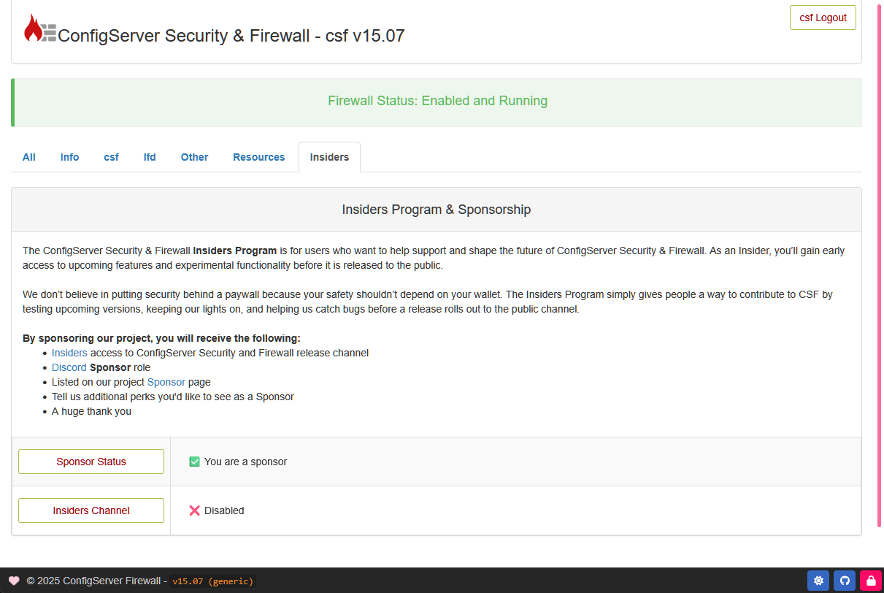

## About

You can continue supporting CSF as a Sponsor, but you may choose to switch back to the stable release channel for greater stability. This section explains how to disable the Insiders release channel.

<br />

---

<br />

## Disable Insiders

Disabling your Insiders access is simple. Open your `/etc/csf/csf.conf` and locate the setting `SPONSOR_RELEASE_INSIDERS`.

To disable access to the Insiders release channel, change the setting to ++0++ as shown in the example below.

```
# #
#   Set this to "1" to receive Insiders updates.
#   
#   Insiders updates arrive before the official public stable builds.
#   
#   While optional, it really helps if Insiders participants report
#   any bugs they find by opening a ticket on our Github:
#       https://github.com/Aetherinox/csf-firewall
#   
#   You can also ask general questions on our Discord server:
#       https://discord.configserver.dev
#   
#   Restart CSF + LFD after setting these:
#       sudo csf -ra
# #

SPONSOR_RELEASE_INSIDERS = "0"
```

<br />

After you have modified the above setting, you simply need to give CSF's services a restart by running the following command:

=== ":aetherx-axs-command: Command"

    ``` shell
    sudo csf -ra
    ```

<br />

---

<br />

## Verify Status

Once CSF has restarted, you can verify the status of your Insiders configuration by one of the following methods:

<br />

### Web Interface

Open the web interface for CSF and sign in. On the main page, find and click on the `Insiders` tab.

<figure markdown="span">
    { width="700" }
    <figcaption>CSF › Insiders Program › Disabled</figcaption>
</figure>

<br />

At the bottom of the page, you should see two status indicators:

1. Sponsorship License Status: ✅ You are a sponsor
2. Insiders Channel Status: ❌ Disabled

<br />

If you see both items aboved, your license key has been accepted but you are still receiving updates from the stable release channel.

<br />

### Commandline

If you want to check the status of your Sponsorship and Insiders channel access without the [web interface](#web-interface), you can check the status in your terminal by specifying the `--insiders` or `-in` flag as shown below:

=== ":aetherx-axs-command: Insiders (Disabled)"

    The following will show in your terminal if your Sponsorship license is valid, but your Insiders access is **disabled**.

    ``` shell
    sudo csf --insiders

    Checking CSF sponsorship and Insiders access
    Connecting to license server ...

      Status ..................... OK
      Sponsorship License ........ Valid
      Insiders Channel ........... Disabled
      Message .................... Success
    ```

<br />
<br />
