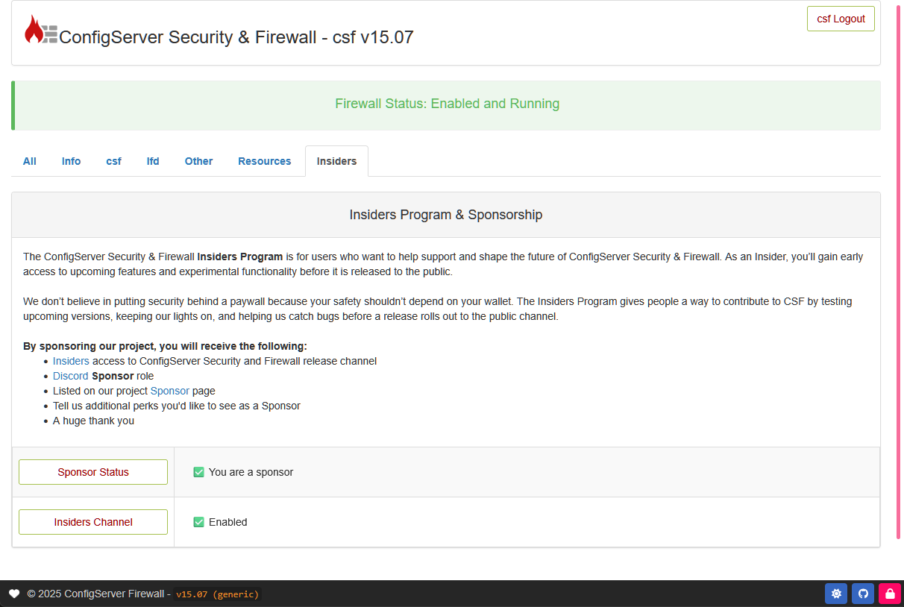

## About

The **Insiders** program gives users access to an exclusive release channel for ConfigServer Security & Firewall, available only to our [Sponsors](../insiders/sponsors.md).

Once you’ve joined the Insiders program through a donation, you will receive a **unique license key** tied to your account.

This section of the guide outlines how to plug your Insiders license key into CSF so that you can take advantage of the benefits.

<br />

---

<br />

## Configure

To activate your Insiders license key, open your `/etc/csf/csf.conf` file and update the following settings:

<br />

### SPONSOR_LICENSE
<!-- md:flag optional --> <!-- md:fileViewDLExt https://raw.githubusercontent.com/Aetherinox/csf-firewall/main/extras/example_configs/etc/csf/csf.conf https://raw.githubusercontent.com/Aetherinox/csf-firewall/main/extras/example_configs/etc/csf/csf.conf --> <!-- md:source /etc/csf/csf.conf --> <!-- md:default `empty` -->

Enter the **license key** you received when joining the [Insiders](../insiders/sponsors.md) program. This key uniquely identifies your account and enables access to the exclusive Insiders features and release channel.

```ini
# #
#   SECTION: Sponsor & Insiders Program
# #
#   Enter your Insiders program license key here.
#   
#   Joining the Insiders program lets you try new features
#   before they reach the public release channel.
#   
#   This option alone won’t let you download Insiders builds.
#   You must provide your license key below, then enable:
#       SPONSOR_RELEASE_INSIDERS = "1"
#   
#   Restart CSF + LFD after setting these:
#       sudo csf -ra
# #

SPONSOR_LICENSE = "XXXXXX-XXXX-XXXX-XXXXXXXXX"
```

<br />
<br />

### SPONSOR_RELEASE_INSIDERS
<!-- md:flag optional --> <!-- md:fileViewDLExt https://raw.githubusercontent.com/Aetherinox/csf-firewall/main/extras/example_configs/etc/csf/csf.conf https://raw.githubusercontent.com/Aetherinox/csf-firewall/main/extras/example_configs/etc/csf/csf.conf --> <!-- md:source /etc/csf/csf.conf --> <!-- md:default `0` -->

Once you’ve entered your Insiders license key in the setting [SPONSOR_LICENSE](#sponsor_license), you can choose whether to enable the **Insiders release channel**.  

This setting is entirely optional — you are not required to use the Insiders channel. You can enable or disable it at any time.  

If you disable it, your system will automatically switch back to the **stable release channel**, which is the default channel used by all other users to download the latest version of CSF.

This setting takes a simple ++0++ or ++1++ to define enabled or disabled.

```
# #
#   Set this to "1" to receive Insiders updates.
#   
#   Insiders updates arrive before the official public stable builds.
#   
#   While optional, it really helps if Insiders participants report
#   any bugs they find by opening a ticket on our Github:
#       https://github.com/Aetherinox/csf-firewall
#   
#   You can also ask general questions on our Discord server:
#       https://discord.configserver.dev
#   
#   Restart CSF + LFD after setting these:
#       sudo csf -ra
# #

SPONSOR_RELEASE_INSIDERS = "0"
```

<br />

---

<br />

## Restart

After you've configured the settings specified above; you should now give ConfigServer Security & Firewall + LFD a restart. You can do this with the following command:

=== ":aetherx-axs-command: Command"

    ``` shell
    sudo csf -ra
    ```

<br />

---

<br />

## Verify Status

Once CSF has restarted, you can verify the status of your Insiders configuration by one of the following methods:

<br />

### Web Interface

Open the web interface for CSF and sign in. On the main page, find and click on the `Insiders` tab.

<figure markdown="span">
    { width="700" }
    <figcaption>CSF › Insiders Program</figcaption>
</figure>

<br />

At the bottom of the page, you should see two status indicators:

1. Sponsorship License Status
2. Insiders Channel Status

<br />

If you see both items aboved, your license key has been accepted and you are now receiving insiders updates as they become available.

<br />

### Commandline

If you want to check the status of your Sponsorship and Insiders channel access without the [web interface](#web-interface), you can check the status in your terminal by specifying the `--insiders` or `-in` flag as shown below:

=== ":aetherx-axs-command: Command (Enabled)"

    The following will show in your terminal if your Sponsorship license and/or Insiders access is valid and enabled.

    ``` shell
    sudo csf --insiders

    Checking CSF sponsorship and Insiders access
    Connecting to license server ...

      Status ..................... OK
      Sponsorship License ........ Valid
      Insiders Channel ........... Enabled
      Message .................... Success
    ```


=== ":aetherx-axs-command: Command  (Disabled)"

    The following will show in your terminal if your Sponsorship license and/or Insiders access is invalid or disabled.

    ``` shell
    sudo csf --insiders

    Checking CSF sponsorship and Insiders access
    Connecting to license server ...

      Status ..................... Failed
      Sponsorship License ........ Invalid
      Insiders Channel ........... Disabled
      Message .................... Invalid license key
    ```

<br />
<br />
