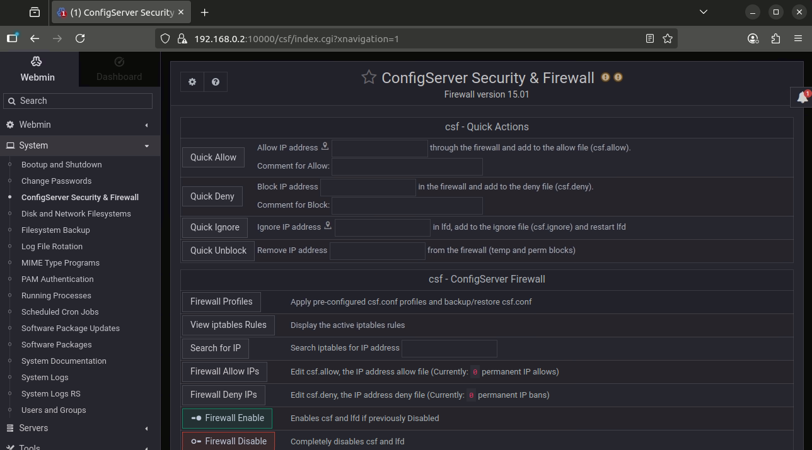

# Install CSF <!-- omit from toc -->

In the previous section, we covered how to install the required dependencies for CSF, download and extract the necessary files, and run the [csftest.pl](tests.md#csftestpl) script.  

If your tests were successful, you are now ready to install CSF on your server and begin configuring your new firewall. This section focuses on the **basic installation process** — detailed configuration will be covered in a later chapter.

<div align="center" class="icon-container" markdown>

  <a href="#install-generic" class="icon-dim"></a>
  <a href="#install-cpanel-and-whm" class="icon-dim"></a>
  <a href="#install-cpanel-and-whm" class="icon-dim"></a>
  <a href="#install-webmin" class="icon-dim"></a>
  <a href="#install-directadmin" class="icon-dim"></a>
  <a href="#install-interworx" class="icon-dim"></a>
  <a href="#install-vestacp" class="icon-dim"></a>
  <a href="#install-cyberpanel" class="icon-dim"></a>

</div>

<br />

---

<br />

## Before You Begin

This page includes installation instructions for numerous control panels, however, the install script has been developed to be automatic in how it detects what distro you are on, and if you are using any control panels such as cPanel / WHM, VestaCP, etc.

Typically, all users are going to run the same `install.sh` file, and then the installation wizard will detect if it needs to do anything extra. However, individual platforms instructions have been provided on this page.

If your distro or control panel is not mentioned here, follow the [Install: Generic](#install-generic) instructions, and CSF will automatically detect anything extra that it needs to do.

<br />

---

<br />

## Install: Generic

Before installing CSF, we need to make sure that no other firewalls are running. Use the commands below to disable any existing firewalls:

=== ":aetherx-axs-block-brick-fire: UFW"

    Stop and disable `ufw`

    ```bash
    sudo systemctl stop ufw
    sudo systemctl disable ufw
    ```

    Confirm `ufw` is disabled with:

    ```bash
    sudo systemctl status ufw
    ```

=== ":aetherx-axs-block-brick-fire: Firewalld"

    Stop and disable `firewalld`

    ```bash
    sudo systemctl stop firewalld
    sudo systemctl disable firewalld
    ```

    Confirm `firewalld` is disabled with:

    ```bash
    sudo systemctl status firewalld
    ```

<br />

??? note "Previous Chapter: Download"

    If coming from the previous [download](download.md) chapter, you should have downloaded a copy of CSF and extracted it on your server.  

    If so, skip ahead a few steps.

<br />

If you do not have the latest vesion of CSF downloaded; grab a copy with one of the following commands:

=== ":aetherx-axs-file-zipper: .tgz"

    ```shell
    # Using wget (tgz)
    wget https://download.configserver.dev/csf.tgz

    # Using curl (tgz)
    curl -O https://download.configserver.dev/csf.tgz
    ```

=== ":aetherx-axs-file-zip: .zip"

    ```shell
    # Using wget (zip)
    wget https://download.configserver.dev/csf.zip

    # Using curl (zip)
    curl -O https://download.configserver.dev/csf.zip
    ```

<br />

Decompress / unzip the downloaded archive file:

=== ":aetherx-axs-file-zipper: .tgz"

    ```bash
    tar -xzf csf.tgz -C /tmp
    ```

=== ":aetherx-axs-file-zip: .zip"

    ```bash
    unzip csf.zip -d /tmp
    ```

<br />

Run the CSF installation script:

=== ":aetherx-axd-command: Command"

      ```bash
      sudo sh /tmp/csf/install.sh
      ```

<br />

Follow any instructions on-screen. If prompted for any additional information, enter it. Once the wizard completes, you can confirm if CSF is installed and functioning by accessing your server via SSH, and running the CSF version command:

=== ":aetherx-axd-command: Command"

      ```shell
      sudo csf -v
      ```

=== ":aetherx-axs-square-terminal: Output"

      ```shell
      csf: v15.10 (generic)
      ```

<br />

Confirm the status of `csf` by running:

=== ":aetherx-axd-command: Command"

      ```shell
      sudo systemctl status csf
      ```

=== ":aetherx-axs-square-terminal: Output"

      ```shell
      ● csf.service - ConfigServer Firewall & Security - csf
          Loaded: loaded (/lib/systemd/system/csf.service; enabled; vendor preset: enabled)
          Active: active (exited) since Mon 2025-09-15 23:45:04 UTC; 14 seconds ago
        Main PID: 597 (code=exited, status=0/SUCCESS)
              CPU: 0min 14.956s

      Notice: journal has been rotated since unit was started, output may be incomplete.
      ```

<br />


??? warning "Testing Mode Disables LFD"

    If you have not yet disabled testing mode in the `csf.conf`, lfd will be unable to start. Performing this step is covered in the next [Configuration](../usage/configuration.md) chapter.

<br />

If you receive the expected response, you can skip the remaining steps on this page and continue to the [Next Steps](#next-steps) section. Detailed instructions on using CSF will be provided in the next chapter of this guide.

<br />
<br />

---

<br />
<br />

## Install: cPanel and WHM

Installing CSF for WHM is almost the same process outlined in the [Install: Generic](#install-generic) steps, just with different extraction paths, and how you will access the CSF web interface.

<br />

Log in as the `root` user via SSH.

=== ":aetherx-axs-key: Using Password"

    ```shell
    ssh -vvv root@XX.XX.XX.XX -p 22
    ```

=== ":aetherx-axs-file: Using Private Key"

    ```shell
    ssh -i /path/to/private_key -vvv root@XX.XX.XX.XX -p 22
    ```

<br />

You must already have cPanel installed to your server. cPanel offers a [15-day free trial](https://cpanel.net/products/trial/), or you can [purchase a license](https://cpanel.net/pricing/). To install and activate a free trial, run the following command on your server:

=== ":aetherx-axd-command: Command"

      ```shell
      cd /home && sudo curl -o latest -L https://securedownloads.cpanel.net/latest && sudo sh latest
      ```

<br />

The installation of **cPanel** usually takes between **5 and 20 minutes**, depending on your server’s hardware and internet connection, as it installs and configures a large number of system packages.  

While the installation is in progress, you’ll need to [**create a cPanel account**](https://store.cpanel.net/register.php). This account is required to activate your free trial or paid license, and you’ll use it to sign in once the installation finishes.  

<br />

After the installation completes, you’ll see output similar to the following in your terminal:

=== ":aetherx-axs-square-terminal: Output"

      ```shell
      [19126] ( INFO): Flushing the task queue
      [19126] ( INFO): cPanel install finished in 6 minutes and 28 seconds!
      [19126] ( INFO): Congratulations! Your installation of cPanel & WHM 11.130 is now complete. The next step is to configure your server. 
      [19126] ( INFO): 
      [19126] ( INFO): Before you configure your server, ensure that your firewall allows access on port 2087.
      [19126] ( INFO): 
      [19126] ( INFO): After ensuring that your firewall allows access on port 2087, you can configure your server.
      [19126] ( INFO): 
      [19126] ( INFO): 1. Open your preferred browser
      [19126] ( INFO): 
      [19126] ( INFO): 2. Navigate to the following url using the address bar and enter this one-time autologin url:
      [19126] ( INFO): 
      [19126] ( INFO): https://cp.configserver.dev:2087/cpsess4927138456/login/?session=root%x7rGd9PLkWqz3YFb2t%3acreate_user_session%f8b47c19a5de91b03ce6f20dbb1847e9d2
      ```

<br />

Open the link in your browser and begin activating cPanel. Copy/paste the link you were provided in the terminal into your browser. 

<figure markdown="span">
    { width="700" }
    <figcaption>cPanel › WHM Introduction Screen</figcaption>
</figure>

<br />

During setup, you may be prompted to review and accept the **cPanel License Agreement** or **Terms of Use**.  

On the following page, click **Log in to cPanel Store** button in the lower-right corner to activate your license. You will be prompted to sign into your cPanel account that you created earlier.  

If you ever need to verify your cPanel license later, you can do so by running the command below in your terminal:


=== ":aetherx-axd-command: Command"

      ```shell
      sudo /usr/local/cpanel/cpkeyclt
      ```

=== ":aetherx-axs-square-terminal: Output"

      ```shell
      Updating cPanel license...Done. Update succeeded.
      ```

<br />

If you get the following response from running the command, you will need to reach out to the [cPanel Support Team](https://support.cpanel.net/hc/en-us/requests/new) by creating a ticket.

=== ":aetherx-axs-square-terminal: Output"

      ```shell
      Updating cPanel license...Done. Update Failed!
      Error message:
      The cPanel license server said that a license could not be issued for your server (66).
      For more information visit: https://www.cpanel.net/lic/

      The exact message was: No valid cPanel/WHM license found. (XX.XX.XX.XX)
      ```

<br />

Complete the cPanel Activation Wizard, and at some point, you will be taken to the homepage of WHM:

<figure markdown="span">
    { width="700" }
    <figcaption>WHM › Home</figcaption>
</figure>

<br />

Set WHM aside for a moment. Next, we need to ensure that we don't have any existing firewalls that need to be disabled. Run the commands below to disable them:

=== ":aetherx-axs-block-brick-fire: UFW"

    Stop and disable `ufw`

    ```bash
    sudo systemctl stop ufw
    sudo systemctl disable ufw
    ```

    Confirm `ufw` is disabled with:

    ```bash
    sudo systemctl status ufw
    ```

=== ":aetherx-axs-block-brick-fire: Firewalld"

    Stop and disable `firewalld`

    ```bash
    sudo systemctl stop firewalld
    sudo systemctl disable firewalld
    ```

    Confirm `firewalld` is disabled with:

    ```bash
    sudo systemctl status firewalld
    ```

<br />

??? note "Previous Chapter: Download"

    If coming from the previous [download](download.md) chapter, you should have downloaded a copy of CSF and extracted it on your server.  

    If so, skip ahead a few steps.

<br />

If you do not have the latest vesion of CSF downloaded; grab a copy with one of the following commands:

=== ":aetherx-axs-file-zipper: .tgz"

    ```shell
    # Using wget (tgz)
    wget https://download.configserver.dev/csf.tgz

    # Using curl (tgz)
    curl -O https://download.configserver.dev/csf.tgz
    ```

=== ":aetherx-axs-file-zip: .zip"

    ```shell
    # Using wget (zip)
    wget https://download.configserver.dev/csf.zip

    # Using curl (zip)
    curl -O https://download.configserver.dev/csf.zip
    ```

<br />

Decompress / unzip the downloaded archive file:

??? warning "Root required for tar extraction"

    On a cPanel server, you must extract CSF as **root** when decompressing to `/usr/src/`. Otherwise will you get the error:

      - `tar: csf: Cannot mkdir: Permission denied`

    You can also extract to `/tmp`

<br />

=== ":aetherx-axs-file-zipper: .tgz"

    ```bash
    tar -xzf csf.tgz -C /usr/src/
    ```

=== ":aetherx-axs-file-zip: .zip"

    ```bash
    unzip csf.zip -d /usr/src/
    ```

<br />

Run the CSF installation script:

=== ":aetherx-axd-command: Command"

      ```bash
      sudo sh /usr/src/csf/install.sh
      ```

<br />

Follow any instructions on-screen. If prompted for any additional information, enter it. Once the wizard completes, you can confirm if CSF is installed and functioning by accessing your server via SSH, and running the CSF version command:

=== ":aetherx-axd-command: Command"

      ```shell
      sudo csf -v
      ```

=== ":aetherx-axs-square-terminal: Output"

      ```shell
      csf: v15.01 (cPanel)
      ```

<br />

Confirm the status of `csf` by running:

=== ":aetherx-axd-command: Command"

      ```shell
      sudo systemctl status csf
      ```

=== ":aetherx-axs-square-terminal: Output"

      ```shell
      ● csf.service - ConfigServer Firewall & Security - csf
          Loaded: loaded (/lib/systemd/system/csf.service; enabled; vendor preset: enabled)
          Active: active (exited) since Mon 2025-09-15 23:45:04 UTC; 14 seconds ago
        Main PID: 597 (code=exited, status=0/SUCCESS)
              CPU: 0min 14.956s

      Notice: journal has been rotated since unit was started, output may be incomplete.
      ```

<br />


??? warning "Testing Mode Disables LFD"

    If you have not yet disabled testing mode in the `csf.conf`, lfd will be unable to start. Performing this step is covered in the next [Configuration](../usage/configuration.md) chapter.

<br />

If you received the expected response, CSF has successfully installed. Next, log back into your WHM control panel at `https://domain.lan:2087` or `https://127.0.0.1:2087`. On the left-side WHM menu, navigate to:

  - WHM » Home » Plugins » `ConfigServer Security & Firewall` 

<figure markdown="span">
    { width="700" }
    <figcaption>WHM › Plugins › ConfigServer Security & Firewall</figcaption>
</figure>

<br />

If you see **ConfigServer Security & Firewall** within your **WHM › Plugins** menu, this means that CSF has been successfully integrated and is ready to [configure](../usage/configuration.md). You can skip the remaining steps on this page and continue to the [Next Steps](#next-steps) section. Detailed instructions on using CSF will be provided in the next chapter of this guide.

<br />
<br />

---

<br />
<br />

## Install: Webmin

Installing CSF with Webmin integration is straightforward. Simply install Webmin first, then install CSF, and finally add the CSF module to Webmin to complete the integration.

<br />

Log in as the `root` user via SSH.

=== ":aetherx-axs-key: Using Password"

    ```shell
    ssh -vvv root@XX.XX.XX.XX -p 22
    ```

=== ":aetherx-axs-file: Using Private Key"

    ```shell
    ssh -i /path/to/private_key -vvv root@XX.XX.XX.XX -p 22
    ```

<br />

Ensure you have Webmin installed. If not, download the Webmin installer script:

=== ":aetherx-axd-command: Command"

      ```shell
      curl -o webmin-setup-repo.sh \
        https://raw.githubusercontent.com/webmin/webmin/master/webmin-setup-repo.sh
      ```

=== ":aetherx-axs-square-terminal: Output"

      ```shell
        % Total    % Received % Xferd  Average Speed   Time    Time     Time  Current
                                      Dload  Upload   Total   Spent    Left  Speed
      100 17604  100 17604    0     0  59917      0 --:--:-- --:--:-- --:--:-- 60081
      ```

<br />

Run the Webmin installer:

=== ":aetherx-axd-command: Command"

      ```shell
      sudo sh webmin-setup-repo.sh
      ```

=== ":aetherx-axs-square-terminal: Output"

      ```shell
      Setup Webmin releases repository? (y/N) y
        Downloading Webmin developers key ..
        .. done
        Installing Webmin developers key ..
        .. done
        Setting up Webmin releases repository ..
        .. done
        Cleaning repository metadata ..
        .. done
        Downloading repository metadata ..
        .. done
      Webmin and Usermin can be installed with:
        apt-get install --install-recommends webmin usermin
      ```

<br />

Do as instructed on-screen and run the command to install the required dependencies and the Webmin package. When prompted, press `Y`:

=== ":aetherx-axb-debian: Debian/Ubuntu (apt-get)"

    ```bash
    apt-get install --install-recommends webmin usermin
    ```

=== ":aetherx-axb-redhat: CentOS/RHEL (yum/dnf)"

    ```bash
    sudo dnf install webmin
    ```

=== ":aetherx-axs-square-terminal: Output"

      ```shell
      The following NEW packages will be installed:
        html2text libalgorithm-c3-perl libauthen-pam-perl libb-hooks-endofscope-perl libb-hooks-op-check-perl libclass-c3-perl libclass-c3-xs-perl
        libclass-data-inheritable-perl libclass-inspector-perl libclass-method-modifiers-perl libclass-singleton-perl libclass-xsaccessor-perl
        libcommon-sense-perl libdata-optlist-perl libdatetime-locale-perl libdatetime-perl libdatetime-timezone-perl libdbd-mysql-perl libdbi-perl
        libdevel-callchecker-perl libdevel-caller-perl libdevel-lexalias-perl libdevel-stacktrace-perl libdynaloader-functions-perl
        libencode-detect-perl libeval-closure-perl libexception-class-perl libfile-sharedir-perl libio-pty-perl libjson-xs-perl
        libmodule-implementation-perl libmodule-runtime-perl libmro-compat-perl libnamespace-autoclean-perl libnamespace-clean-perl
        libpackage-stash-perl libpackage-stash-xs-perl libpadwalker-perl libparams-classify-perl libparams-util-perl
        libparams-validationcompiler-perl libqrencode4 libreadonly-perl libref-util-perl libref-util-xs-perl librole-tiny-perl libsocket6-perl
        libspecio-perl libsub-exporter-perl libsub-exporter-progressive-perl libsub-identify-perl libsub-install-perl libsub-name-perl
        libsub-quote-perl libtypes-serialiser-perl libvariable-magic-perl libxstring-perl qrencode usermin webmin
      0 upgraded, 60 newly installed, 0 to remove and 5 not upgraded.
      Need to get 42.3 MB of archives.
      After this operation, 265 MB of additional disk space will be used.

      Do you want to continue? [Y/n]  Y

      [...]
      Setting up libspecio-perl (0.47-1) ...
      Setting up libb-hooks-endofscope-perl (0.25-1) ...
      Setting up libnamespace-clean-perl (0.27-1) ...
      Setting up libnamespace-autoclean-perl (0.29-1) ...
      Setting up libdatetime-locale-perl (1:1.33-1) ...
      Setting up libdatetime-timezone-perl (1:2.51-1+2021e) ...
      Setting up libdatetime-perl:amd64 (2:1.55-1build1) ...
      Processing triggers for man-db (2.10.2-1) ...
      Processing triggers for mailcap (3.70+nmu1ubuntu1) ...
      Processing triggers for libc-bin (2.35-0ubuntu3.11) ...
      ```

<br />

After installation is complete, open your browser and navigate to:

- `https://127.0.0.1:10000/`

<br />

You should be greeted with a Webmin authentication page. Test signing in to make sure you have root access. The username and password will be associated with your root account on your server.

<figure markdown="span">
    { width="700" }
    <figcaption>Webmin Login Screen</figcaption>
</figure>

<br />

Put Webmin aside for a moment; we need to make sure that we don't have any existing firewalls that need disabled. If so, run the commands below:

=== ":aetherx-axs-block-brick-fire: UFW"

    Stop and disable `ufw`

    ```bash
    sudo systemctl stop ufw
    sudo systemctl disable ufw
    ```

    Confirm `ufw` is disabled with:

    ```bash
    sudo systemctl status ufw
    ```

=== ":aetherx-axs-block-brick-fire: Firewalld"

    Stop and disable `firewalld`

    ```bash
    sudo systemctl stop firewalld
    sudo systemctl disable firewalld
    ```

    Confirm `firewalld` is disabled with:

    ```bash
    sudo systemctl status firewalld
    ```

<br />

We are ready to install CSF, which you should already have downloaded to your system. If not; download the latest version of CSF:

=== ":aetherx-axs-file-zipper: .tgz"

    ```shell
    # Using wget (tgz)
    wget https://download.configserver.dev/csf.tgz

    # Using curl (tgz)
    curl -O https://download.configserver.dev/csf.tgz
    ```

=== ":aetherx-axs-file-zip: .zip"

    ```shell
    # Using wget (zip)
    wget https://download.configserver.dev/csf.zip

    # Using curl (zip)
    curl -O https://download.configserver.dev/csf.zip
    ```

<br />

Decompress / unzip the downloaded archive file:

=== ":aetherx-axs-file-zipper: .tgz"

    ```bash
    tar -xzf csf.tgz -C /tmp
    ```

=== ":aetherx-axs-file-zip: .zip"

    ```bash
    unzip csf.zip -d /tmp
    ```

<br />

Run the CSF installation script:

=== ":aetherx-axd-circle-1: Option 1"

    :aetherx-axd-circle-1: Runs `install.sh` :aetherx-axd-dot: uses `sh` shell :aetherx-axd-dot: executable permission not required

    ```bash
    sudo sh /tmp/csf/install.sh
    ```

=== ":aetherx-axd-circle-2: Option 2"

    :aetherx-axd-circle-2: Runs `install.sh` :aetherx-axd-dot: uses shebang interpreter :aetherx-axd-dot: requires executable `+x` permission

    ```bash
    sudo chmod +x /tmp/csf/install.sh
    sudo /tmp/csf/install.sh
    ```

<br />

Follow any instructions on-screen. If prompted for any additional information, enter it.

<br />

Log back into Webmin. Once in, navigate to **Webmin Configuration** › **Webmin Modules** from the left-hand menu.

<figure markdown="span">
    { width="700" }
    <figcaption>Webmin Configuration › Webmin Modules</figcaption>
</figure>

<br />

A form will appear asking how you'd like to install the CSF module. Choose **From Local File**, then click **Browse** and select the file located at `/usr/local/csf/csfwebmin.tgz`.

<figure markdown="span">
    { width="700" }
    <figcaption>Webmin Modules › Select `/usr/local/csf/csfwebmin.tgz`</figcaption>
</figure>

<br />

Click the **Install Module** button at the bottom.

<figure markdown="span">
    { width="700" }
    <figcaption>Webmin Modules › Install Module</figcaption>
</figure>

<br />

After installation, Webmin will display a confirmation message indicating that CSF was successfully installed.  
To access it, go to the left-hand Webmin menu and navigate to:

- **System** › **ConfigServer Security & Firewall**

<figure markdown="span">
    { width="700" }
    <figcaption>Webmin › Install Module › Success</figcaption>
</figure>

<br />

On the next page, you should see the following message:

??? note "Symlink Created"

    csf updated to symlink webmin module to /usr/local/csf/lib/webmin/csf/. Click here to continue

<br />

Click the text link and you'll be taken to the home screen of CSF.

<figure markdown="span">
    { width="700" }
    <figcaption>Webmin › CSF › Homepage</figcaption>
</figure>

<br />

If the interface matches the screenshot above, the CSF integration with Webmin is complete.  

You can now proceed to the [Next Steps](#next-steps) or skip the rest of this section and begin our [Configuration](../usage/configuration.md) chapter to get things set up.

<br />

??? warning "Testing Mode Disables LFD"

    If you have not yet disabled testing mode in the `csf.conf`, lfd will be unable to start. Performing this step is covered in the next [Configuration](../usage/configuration.md) chapter.

<br />
<br />

---

<br />
<br />

## Install: DirectAdmin

This part of the documentation is currently being written.

<br />
<br />

---

<br />
<br />

## Install: Interworx

Installing CSF with Interworx integration is simple. First we need to install Interworx, then install CSF, and finally enable the CSF module within Interworx to complete the integration.

<br />

Log in as the `root` user via SSH.

=== ":aetherx-axs-key: Using Password"

    ```shell
    ssh -vvv root@XX.XX.XX.XX -p 22
    ```

=== ":aetherx-axs-file: Using Private Key"

    ```shell
    ssh -i /path/to/private_key -vvv root@XX.XX.XX.XX -p 22
    ```

<br />

Ensure you have Interworx installed. If not, download the installer script:

??? note "Valid TLD / Host Required"

    Before installing Interworx, you must set your server's hostname to a valid host.

<br />

=== ":aetherx-axd-command: Install (Option 1)"

      ```shell
      sudo sh <((curl -sL updates.interworx.com/interworx/8/install.sh))
      ```

=== ":aetherx-axd-command: Install (Option 2)"

      ```shell
      wget updates.interworx.com/interworx/8/install.sh
      sudo sh install.sh
      ```

=== ":aetherx-axs-square-terminal: Output"

      ```shell
      STATUS: Determining Linux distribution
      STATUS: Checking network interface names

      -=-=-=-=-= Installing InterWorx-CP =-=-=-=-=-

      This script will install InterWorx-CP on your system.
      Please make sure that you have backed up any critical
      data!

      This script may be run multiple times without any
      problems.  This is helpful if you find an error
      during installation, you can safely ctrl-c out of
      this script, fix the error and re-start the script.

      STATUS: Checking Hostname
      The hostname 'configserver.dev' is valid.

      Details of this installation will be logged in iworx-install.log

      HOSTNAME   : configserver.dev
      TARGET     : CentOS Linux release 7.9.2009 (Core)
      PLATFORM   : GNU/Linux
      PROCESSOR  : x86_64
      RPM TARGET : rhe7x
      RPM DISTRO : cos7x
      RPM DIR    : /usr/src/redhat/RPMS
      SRPM DIR   : /usr/src/redhat/SRPMS
      SRPM HOST  : updates.interworx.com
      IWORX REPO : ga
      DEFAULT PHP: PHP 8.2
      MYSQL      : MARIADB 10.6
      ```
  
<br />

While the installation is in progress, you’ll need to have a valid **license key** which Interworx setup wizard will ask for once you access the web control panel. Interworx offers a **2 week** free trial license key which you can [apply for here](https://www.interworx.com/interworx-demos/)

At the end of the installation, you'll be provided with a link you must visit in order to activate Interworx.

=== ":aetherx-axs-square-terminal: Output"

      ```shell
      -=-=-=-=-= Installation Complete! Next Step: License Activation! =-=-=-=-=-

      To activate your license, go to
      https://your-ip:2443/nodeworx/
      or run: ~iworx/bin/goiworx.pex
      Also, check out https://www.interworx.com for news, updates, and support!

      -=-=-=-=-= THANK YOU FOR USING INTERWORX! =-=-=-=-=-
      ```

<br />

After installation is complete, open your browser and navigate to:

- `https://your-ip:2443/nodeworx/`
- `https://127.0.0.1:2443/nodeworx/`

<br />

You should be greeted with a Interworx authentication page. Provide a valid e-mail address, password, and finally, provide your **license key**.

<figure markdown="span">
    { width="700" }
    <figcaption>Interworx › Login Screen</figcaption>
</figure>

<br />

Once you input the information asked, Interworx will also ask you to provide valid **nameservers**. For our docs, we will provide:

- `ns1.configserver.dev`
- `ns2.configserver.dev`

<br />

At this point, Interworx will take anywhere around 5-10 minutes to complete the installation. Afterward, you'll be re-directed to the Interworx dashboard.

<figure markdown="span">
    { width="700" }
    <figcaption>Interworx › Dashboard</figcaption>
</figure>

<br />

Set Interworx aside for a moment; we need to make sure that we don't have any existing firewalls that need disabled. If so, run the commands below:

=== ":aetherx-axs-block-brick-fire: UFW"

    Stop and disable `ufw`

    ```bash
    sudo systemctl stop ufw
    sudo systemctl disable ufw
    ```

    Confirm `ufw` is disabled with:

    ```bash
    sudo systemctl status ufw
    ```

=== ":aetherx-axs-block-brick-fire: Firewalld"

    Stop and disable `firewalld`

    ```bash
    sudo systemctl stop firewalld
    sudo systemctl disable firewalld
    ```

    Confirm `firewalld` is disabled with:

    ```bash
    sudo systemctl status firewalld
    ```

<br />

We are ready to install CSF, which you should already have downloaded to your system. If not; download the latest version of CSF:

=== ":aetherx-axs-file-zipper: .tgz"

    ```shell
    # Using wget (tgz)
    wget https://download.configserver.dev/csf.tgz

    # Using curl (tgz)
    curl -O https://download.configserver.dev/csf.tgz
    ```

=== ":aetherx-axs-file-zip: .zip"

    ```shell
    # Using wget (zip)
    wget https://download.configserver.dev/csf.zip

    # Using curl (zip)
    curl -O https://download.configserver.dev/csf.zip
    ```

<br />

Decompress / unzip the downloaded archive file:

=== ":aetherx-axs-file-zipper: .tgz"

    ```bash
    tar -xzf csf.tgz -C /tmp
    ```

=== ":aetherx-axs-file-zip: .zip"

    ```bash
    unzip csf.zip -d /tmp
    ```

<br />

Run the CSF installation script:

=== ":aetherx-axd-circle-1: Option 1"

    :aetherx-axd-circle-1: Runs `install.sh` :aetherx-axd-dot: uses `sh` shell :aetherx-axd-dot: executable permission not required

    ```bash
    sudo sh /tmp/csf/install.sh
    ```

=== ":aetherx-axd-circle-2: Option 2"

    :aetherx-axd-circle-2: Runs `install.sh` :aetherx-axd-dot: uses shebang interpreter :aetherx-axd-dot: requires executable `+x` permission

    ```bash
    sudo chmod +x /tmp/csf/install.sh
    sudo /tmp/csf/install.sh
    ```

<br />

Follow any instructions on-screen. If prompted for any additional information, enter it.

<br />

Log back into Interworx. Once in, navigate to **NodeWorx** › **Plugins** from the left-hand menu. You will be presented with a list of available plugins, scroll down and locate **ConfigServer Security & Firewall**. Click the pencil to the left to edit the status.

<figure markdown="span">
    { width="700" }
    <figcaption>Interworx › NodeWorx › Plugins › Edit ConfigServer</figcaption>
</figure>

<br />

On the right side, change the status of **ConfigServer Security & Firewall** from `disabled` to `enabled` and press **save**.

<figure markdown="span">
    { width="700" }
    <figcaption>Interworx › NodeWorx › Plugins › Change Status</figcaption>
</figure>

<br />

After enabling the plugin, go back to the Interworx menu on the left, and navigate to

- **ConfigServer Plugins** › **Security and Firewall**

<figure markdown="span">
    { width="700" }
    <figcaption>Interworx › ConfigServer Security & Firewall › Dashboard</figcaption>
</figure>

<br />

If the interface matches the screenshot above, the CSF integration with Interworx is complete.  

You can now proceed to the [Next Steps](#next-steps) or skip the rest of this section and begin our [Configuration](../usage/configuration.md) chapter to get things set up.

<br />
<br />

---

<br />
<br />

## Install: VestaCP

??? danger "Danger: Security Vulnerabilities"

    As of **10/10/2025**, there are over **20** known [security vulnerabilities listed for VestaCP](https://www.cve.org/CVERecord/SearchResults?query=vesta). Take these warnings serious in terms of your decision to use VestaCP on outdated distros such as CentOS 7, which reached EOL on **June 30, 2024**.

??? bug "Bug: CSF Header Button"

    As of **VestaCP v1.0**, the application was migrated to **React**, which fundamentally changed how the web interface works. The UI is now compiled into a series of `.CSS` and `.JS` files, rather than using the older PHP/HTML templates.

    Because of this change, **CSF does not currently appear in the top menu** of VestaCP, even though the CSF page itself is still fully accessible at `https://192.168.0.16:5463/list/csf`.

    To restore the CSF menu link, the **VestaCP developers would need to add a conditional menu item** that detects when CSF is installed and ready to use. After they add this change to their source menu code, they can re-build the React .js file to push for public release.

    Unfortunately, due to the lack of recent updates from the VestaCP team, this integration may never be corrected, and users will need to access CSF directly via its URL.

??? note "Note: Project Status Unknown"

    The current status of VestaCP is unknown. The developers [announced a release](https://vestacp.com/docs/vesta-2-development) of VestaCP 2.0 in 2024, however, no other information was given after that time.

    The [repository](https://github.com/outroll/vesta) has not been updated in over a year.

<br />

[Vesta](https://github.com/outroll/vesta) is an open-source hosting control panel designed to simplify server management tasks. It provides a clean and focused interface without unnecessary clutter, allowing users to efficiently manage their hosting environments. VestaCP supports various features, including:

- Web, DNS, and Mail Management: Easily manage domains, DNS records, and email accounts.
- Database Support: Create and manage MySQL and PostgreSQL databases.
- SSL Integration: Automatically generate SSL/TLS certificates with Let's Encrypt.
- Security Features: Configure firewalls and manage user access.
- Backup Solutions: Schedule and manage backups for your data.

Vesta is licensed under the [GPL v3 license](https://github.com/outroll/vesta/blob/master/LICENSE), ensuring that it remains free and open for community contributions.

<br />

| Distro | Supported Versions |
| --- | --- |
| :aetherx-axb-centos: RHEL / CentOS | 5, 6, 7 |
| :aetherx-axb-debian: Debian | 7, 8, 9 |
| :aetherx-axb-ubuntu: Ubuntu | 12.04 - 18.10 |

<br />

The installation of VestaCP is a bit different than our other instructions. We will need to generate a build command using their website, and then use that command to install VestaCP to your server.

<br />

Log in as the `root` user via SSH.

=== ":aetherx-axs-key: Using Password"

    ```shell
    ssh -vvv root@XX.XX.XX.XX -p 22
    ```

=== ":aetherx-axs-file: Using Private Key"

    ```shell
    ssh -i /path/to/private_key -vvv root@XX.XX.XX.XX -p 22
    ```

<br />

Head over to their website so that you can generate an installation command that you will run in your shell:

- https://vestacp.com/install#install-configure

<br />

We did a very basic configuration:

- [x] Web: `Apache`
- [x] FTP: `No`
- [x] Mail: `No`
- [x] DNS: `No`
- [x] Firewall: `Iptables`
- [x] Softaculous: `Yes`
- [x] Additional Repository: `Yes`
- [x] File System Quota: `No`
- [x] DB : `None`
- [x] Hostname: `panel.configserver.dev`
- [x] Email: `user@configserver.dev`
- [x] Port: `5463`
- [x] Password: `*********************************`

<br />

Download the VestaCP installation script:

=== ":aetherx-axd-command: Command"

    ```shell
    curl -O https://vestacp.com/pub/vst-install.sh
    ```

<br />

Next, we must use the command we generated earlier:

??? danger "**DANGER**: Plain-text Passwords in Terminal Commands"

    Supplying passwords directly in plain-text commands is strongly discouraged. Unfortunately, this is how VestaCP is currently configured.

    To reduce the risk, it is recommended to set `HISTCONTROL` to `ignorespace` and then prefix your command with a ++space++. This prevents the command from being recorded in your shell history.

    The codeblock below includes this command, and starts with a space character.

=== ":aetherx-axd-command: Command"

    ```shell
    export HISTCONTROL=ignorespace

     bash vst-install.sh \
       --nginx no \
       --apache yes \
       --phpfpm no \
       --vsftpd no \
       --proftpd no \
       --exim no \
       --dovecot no \
       --spamassassin no \
       --clamav no \
       --named no \
       --iptables yes \
       --fail2ban no \
       --softaculous yes \
       --remi yes \
       --quota no \
       --mysql no \
       --postgresql no \
       --hostname panel.configserver.dev \
       --email user@email.com \
       --port 5463 \
       --password *********************************
    ```

<br />

You will be given the following response in terminal:

=== ":aetherx-axs-square-terminal: Output"

      ```shell
      _|      _|  _|_|_|_|    _|_|_|  _|_|_|_|_|    _|_|
      _|      _|  _|        _|            _|      _|    _|
      _|      _|  _|_|_|      _|_|        _|      _|_|_|_|
        _|  _|    _|              _|      _|      _|    _|
          _|      _|_|_|_|  _|_|_|        _|      _|    _|

                                        Vesta Control Panel


      The following software will be installed on your system:
        - Apache Web Server
        - Softaculous Plugin
        - Iptables Firewall


      Would you like to continue [y/n]: y
      ```

<br />

The installation of VestaCP will take anywhere from **5 - 15 minutes** depending on the specs of your server. Once the installation is complete, you'll see the following:

=== ":aetherx-axs-square-terminal: Output"

      ```shell
      _|      _|  _|_|_|_|    _|_|_|  _|_|_|_|_|    _|_|   
      _|      _|  _|        _|            _|      _|    _| 
      _|      _|  _|_|_|      _|_|        _|      _|_|_|_| 
        _|  _|    _|              _|      _|      _|    _| 
          _|      _|_|_|_|  _|_|_|        _|      _|    _| 


      Congratulations, you have just successfully installed Vesta Control Panel

          https://192.168.0.16:5463
          username: admin
          password: *********************************

      We hope that you enjoy your installation of Vesta. Please feel free to contact us anytime if you have any questions.
      Thank you.

      --
      Sincerely yours
      vestacp.com team
      ```

<br />

At the end of the installation, you can now access the VestaCP dashboard by opening your browser and going to the URL:

- `https://192.168.0.16:5463`

<br />

You should be greeted with a VestaCP authentication page. Provide your system username and password:

<figure markdown="span">
    { width="700" }
    <figcaption>VestaCP › Login Screen</figcaption>
</figure>

<br />

Once you sign in with the system username and password you provided within the **build command**, you'll be taken to the VestaCP dashboard:

<figure markdown="span">
    { width="700" }
    <figcaption>VestaCP › Dashboard</figcaption>
</figure>

<br />

Set VestaCP aside for a moment; we need to make sure that we don't have any existing firewalls that need disabled. If so, run the commands below:

=== ":aetherx-axs-block-brick-fire: UFW"

    Stop and disable `ufw`

    ```bash
    sudo systemctl stop ufw
    sudo systemctl disable ufw
    ```

    Confirm `ufw` is disabled with:

    ```bash
    sudo systemctl status ufw
    ```

=== ":aetherx-axs-block-brick-fire: Firewalld"

    Stop and disable `firewalld`

    ```bash
    sudo systemctl stop firewalld
    sudo systemctl disable firewalld
    ```

    Confirm `firewalld` is disabled with:

    ```bash
    sudo systemctl status firewalld
    ```

<br />

We are ready to install CSF, which you should already have downloaded to your system. If not; download the latest version of CSF:

=== ":aetherx-axs-file-zipper: .tgz"

    ```shell
    # Using wget (tgz)
    wget https://download.configserver.dev/csf.tgz

    # Using curl (tgz)
    curl -O https://download.configserver.dev/csf.tgz
    ```

=== ":aetherx-axs-file-zip: .zip"

    ```shell
    # Using wget (zip)
    wget https://download.configserver.dev/csf.zip

    # Using curl (zip)
    curl -O https://download.configserver.dev/csf.zip
    ```

<br />

Decompress / unzip the downloaded archive file:

=== ":aetherx-axs-file-zipper: .tgz"

    ```bash
    tar -xzf csf.tgz -C /tmp
    ```

=== ":aetherx-axs-file-zip: .zip"

    ```bash
    unzip csf.zip -d /tmp
    ```

<br />

Run the CSF installation script:

=== ":aetherx-axd-circle-1: Option 1"

    :aetherx-axd-circle-1: Runs `install.sh` :aetherx-axd-dot: uses `sh` shell :aetherx-axd-dot: executable permission not required

    ```bash
    sudo sh /tmp/csf/install.sh
    ```

=== ":aetherx-axd-circle-2: Option 2"

    :aetherx-axd-circle-2: Runs `install.sh` :aetherx-axd-dot: uses shebang interpreter :aetherx-axd-dot: requires executable `+x` permission

    ```bash
    sudo chmod +x /tmp/csf/install.sh
    sudo /tmp/csf/install.sh
    ```

<br />

Follow any instructions on-screen. If prompted for any additional information, enter it.

<br />

Log back into VestaCP.  At this point, you're probably asking _"Where is the menu link to CSF?"_. Here comes the bad news ...

<figure markdown="span">
    { width="700" }
    <figcaption>VestaCP › CSF</figcaption>
</figure>

<br />

!!! bug inline end "Bug: VestaCP Header Fix"

    CSF [v15.02](../about/changelog.md#15.02) introduced a fix which allows the VestaCP header to once again show on the CSF page. 
    
    However, this does not address the VestaCP top nav menu not showing **CSF**.

As of **VestaCP v1.0**, the application was migrated to **React**, which fundamentally changes how the web interface works. The UI is now compiled into a series of `.CSS` and `.JS` files, rather than using the older PHP/HTML templates.

Because of this change, **CSF does not currently appear in the top menu** of VestaCP, even though the CSF page itself is still fully accessible at `https://192.168.0.16:5463/list/csf`.

To restore the CSF menu link, the **VestaCP developers would need to add a conditional menu item** that detects when CSF is installed and ready to use. 

Unfortunately, due to the lack of recent updates from the VestaCP team, this integration may never be corrected, and users will need to access CSF directly via its URL.

- `https://192.168.0.16:5463/list/csf`

<br />

By manually going to the link within VestaCP, you should see the following page:

<figure markdown="span">
    { width="700" }
    <figcaption>VestaCP › CSF</figcaption>
</figure>

<br />

If the interface matches the screenshot above, the CSF integration with VestaCP is complete.  

You can now proceed to the [Next Steps](#next-steps) or skip the rest of this section and begin our [Configuration](../usage/configuration.md) chapter to get things set up.

<br />
<br />

---

<br />
<br />

## Install: Cyberpanel

This part of the documentation is currently being written.

<br />
<br />

---

<br />
<br />

## Installer File Summary

This section provides a list of the installer scripts included with CSF and what their role plays in the installation process. This is available within our docs for more advanced users who wish to understand the process.

The installation process for CSF is handled through a main script that triggers several sub-installer scripts.  
You will run the `install.sh` script, which automatically detects your platform and then executes the appropriate sub-script.  

Each sub-script follows the naming scheme `install.<PLATFORM>.sh`. We have provided a list of the files below:

| File                            | Requires                              | Platform                                                                                                                                  |
| ------------------------------- | ------------------------------------- | ----------------------------------------------------------------------------------------------------------------------------------------- |
| `install.sh`                    |                                       | Main installer script, detects your platform and re-reroutes your installation request to the correct installer sub-script listed below   |
| `install.generic.sh`            |                                       | Baremetal                                                                                                                                 |
| `install.cpanel.sh`             | `/usr/local/cpanel/version`           | cPanel / WHM                                                                                                                              |
| `install.cwp.sh`                | `/usr/local/cwpsrv`                   | CentOS Web Panel (CWP)                                                                                                                    |
| `install.cyberpanel.sh`         | `/usr/local/CyberCP`                  | CyberPanel                                                                                                                                |
| `install.directadmin.sh`        | `/usr/local/directadmin/directadmin`  | DirectAdmin                                                                                                                               |
| `install.interworx.sh`          | `/usr/local/interworx`                | Interworx                                                                                                                                 |
| `install.vesta.sh`              | `/usr/local/vesta`                    | VestaCP                                                                                                                                   |

<br />

### install.sh

The `install.sh` script serves as a launcher that directs you to the appropriate installation script for your platform. It can be run on any system, automatically detects your environment, and executes the correct installer from the files listed above. Before running it, make sure the script is executable by running `chmod +x install.sh`. We’ll cover this in the steps below.

<br />

### install.generic.sh

This is the generic bare-metal installer for CSF. You should use this script when installing CSF on a server that does not have WHM, cPanel, DirectAdmin, or other control panels installed. If you run `install.sh`  and it does not detect any supported control panels, it will automatically start `install.generic.sh` to begin the installation.

<br />

### install.cpanel.sh


The `install.cpanel.sh` script is ran in order to integrate CSF with an existing cPanel/WHM installation. This file triggers if you run `install.sh`, which checks to see if your server has the file `/usr/local/cpanel/version`. 

<br />

### install.cwp.sh


The `install.cwp.sh` script is ran in order to integrate CSF with an existing copy of [CentOS Web Panel (CWP)](https://centos-webpanel.com/). This file triggers when you run `install.sh`, which checks to see if your server has the file `/usr/local/cwpsrv`.

<br />

### install.cyberpanel.sh


The `install.cyberpanel.sh` script is ran in order to integrate CSF with an existing copy of [Cyber Panel](https://cyberpanel.net/). This file triggers when you run `install.sh`, which checks to see if your server has the file `/usr/local/CyberCP`.

<br />

### install.directadmin.sh

The `install.directadmin.sh` script is ran in order to integrate CSF with an existing copy of [DirectAdmin](https://directadmin.com/). This file triggers when you run `install.sh`, which checks to see if your server has the file `/usr/local/directadmin/directadmin`.

<br />

### install.interworx.sh


The `install.interworx.sh` script is ran in order to integrate CSF with an existing copy of [Interworx](https://interworx.com/). This file triggers when you run `install.sh`, which checks to see if your server has the file `/usr/local/interworx`.

<br />

### install.vesta.sh


The `install.vesta.sh` script is ran in order to integrate CSF with an existing copy of [VestaCP](https://vestacp.com/). This file triggers when you run `install.sh`, which checks to see if your server has the file `/usr/local/vesta`.

<br />

---

<br />

## Next Steps <!-- omit from toc -->

{==

Select what documentation you would like to proceed with next ...

==}

<div class="grid cards" markdown>

-   :aetherx-axs-gear-complex: &nbsp; __[Start System Services](../install/services.md)__

    ---

    Starting CSF requires disabling testing mode and enabling the firewall so it
    runs normally.  

    This chapter explains how to start both CSF and LFD services and ensure they
    launch on boot.  

    You’ll also find troubleshooting tips for common startup errors and how to
    fix them quickly.  

-   :aetherx-axs-browser: &nbsp; __[Enable Web Interface](../install/webui.md)__

    ---

    The web interface lets you manage your firewall through a browser instead
    of a command line.  

    This chapter covers installation of dependencies, enabling the interface,
    and whitelisting your IP for security.  

</div>

<br />

<br />
