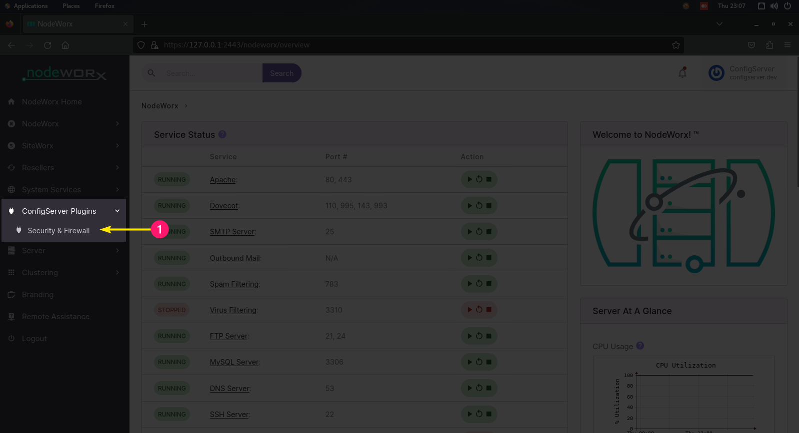

# Install CSF <!-- omit from toc -->

In the previous section, we covered how to install the required dependencies for CSF, download and extract the necessary files, and run the [csftest.pl](tests.md#csftestpl) script.  

If your tests were successful, you are now ready to install CSF on your server and begin configuring your new firewall. This section focuses on the **basic installation process** — detailed configuration will be covered in a later chapter.

<div align="center" class="icon-container" markdown>

  <a href="#install-generic" class="icon-dim"></a>
  <a href="#install-cpanel-and-whm" class="icon-dim"></a>
  <a href="#install-cpanel-and-whm" class="icon-dim"></a>
  <a href="#install-webmin" class="icon-dim"></a>
  <a href="#install-directadmin" class="icon-dim"></a>
  <a href="#install-interworx" class="icon-dim"></a>
  <a href="#install-vestacp" class="icon-dim"></a>
  <a href="#install-cyberpanel" class="icon-dim"></a>
  <a href="#install-control-web-panel" class="icon-dim"></a>

</div>

<br />

---

<br />

## Before You Begin

This page includes installation instructions for numerous control panels, however, the install script has been developed to be automatic in how it detects what distro you are on, and if you are using any control panels such as cPanel / WHM, VestaCP, etc.

Typically, all users are going to run the same `install.sh` file, and then the installation wizard will detect if it needs to do anything extra. However, individual platforms instructions have been provided on this page.

If your distro or control panel is not mentioned here, follow the [Install: Generic](#install-generic) instructions, and CSF will automatically detect anything extra that it needs to do.

<br />

---

<br />

## Install: Generic

Before installing CSF, we need to make sure that no other firewalls are running. Use the commands below to disable any existing firewalls:

=== ":aetherx-axs-block-brick-fire: UFW"

    Stop and disable `ufw`

    ```bash
    sudo systemctl stop ufw
    sudo systemctl disable ufw
    ```

    Confirm `ufw` is disabled with:

    ```bash
    sudo systemctl status ufw
    ```

=== ":aetherx-axs-block-brick-fire: Firewalld"

    Stop and disable `firewalld`

    ```bash
    sudo systemctl stop firewalld
    sudo systemctl disable firewalld
    ```

    Confirm `firewalld` is disabled with:

    ```bash
    sudo systemctl status firewalld
    ```

<br />

??? note "Previous Chapter: Download"

    If coming from the previous [download](download.md) chapter, you should have downloaded a copy of CSF and extracted it on your server.  

    If so, skip ahead a few steps.

<br />

If you do not have the latest vesion of CSF downloaded; grab a copy with one of the following commands:

=== ":aetherx-axs-file-zipper: .tgz"

    ```shell
    # Using wget (tgz)
    wget https://download.configserver.dev/csf.tgz

    # Using curl (tgz)
    curl -O https://download.configserver.dev/csf.tgz
    ```

=== ":aetherx-axs-file-zip: .zip"

    ```shell
    # Using wget (zip)
    wget https://download.configserver.dev/csf.zip

    # Using curl (zip)
    curl -O https://download.configserver.dev/csf.zip
    ```

<br />

Decompress / unzip the downloaded archive file:

=== ":aetherx-axs-file-zipper: .tgz"

    ```bash
    tar -xzf csf.tgz -C /tmp
    ```

=== ":aetherx-axs-file-zip: .zip"

    ```bash
    unzip csf.zip -d /tmp
    ```

<br />

Run the CSF installation script:

=== ":aetherx-axd-command: Command"

      ```bash
      sudo sh /tmp/csf/install.sh
      ```

<br />

Follow any instructions on-screen. If prompted for any additional information, enter it. Once the wizard completes, you can confirm if CSF is installed and functioning by accessing your server via SSH, and running the CSF version command:

=== ":aetherx-axd-command: Command"

      ```shell
      sudo csf -v
      ```

=== ":aetherx-axs-square-terminal: Output"

      ```shell
      csf: v15.10 (generic)
      ```

<br />

Confirm the status of `csf` by running:

=== ":aetherx-axd-command: Command"

      ```shell
      sudo systemctl status csf
      ```

=== ":aetherx-axs-square-terminal: Output"

      ```shell
      ● csf.service - ConfigServer Security & Firewall - csf
          Loaded: loaded (/lib/systemd/system/csf.service; enabled; vendor preset: enabled)
          Active: active (exited) since Mon 2025-09-15 23:45:04 UTC; 14 seconds ago
        Main PID: 597 (code=exited, status=0/SUCCESS)
              CPU: 0min 14.956s

      Notice: journal has been rotated since unit was started, output may be incomplete.
      ```

<br />


??? warning "Testing Mode Disables LFD"

    If you have not yet disabled testing mode in the `csf.conf`, lfd will be unable to start. Performing this step is covered in the next [Configuration](../usage/configuration.md) chapter.

<br />

If you receive the expected response, you can skip the remaining steps on this page and continue to the [Next Steps](#next-steps) section. Detailed instructions on using CSF will be provided in the next chapter of this guide.

<br />
<br />

---

<br />
<br />

## Install: cPanel and WHM

Installing CSF for WHM is almost the same process outlined in the [Install: Generic](#install-generic) steps, just with different extraction paths, and how you will access the CSF web interface.

<br />

Log in as the `root` user via SSH.

=== ":aetherx-axs-key: Using Password"

    ```shell
    ssh -vvv root@XX.XX.XX.XX -p 22
    ```

=== ":aetherx-axs-file: Using Private Key"

    ```shell
    ssh -i /path/to/private_key -vvv root@XX.XX.XX.XX -p 22
    ```

<br />

You must already have cPanel installed to your server. cPanel offers a [15-day free trial](https://cpanel.net/products/trial/), or you can [purchase a license](https://cpanel.net/pricing/). To install and activate a free trial, run the following command on your server:

=== ":aetherx-axd-command: Command"

      ```shell
      cd /home && sudo curl -o latest -L https://securedownloads.cpanel.net/latest && sudo sh latest
      ```

<br />

The installation of **cPanel** usually takes between **5 and 20 minutes**, depending on your server’s hardware and internet connection, as it installs and configures a large number of system packages.  

While the installation is in progress, you’ll need to [**create a cPanel account**](https://store.cpanel.net/register.php). This account is required to activate your free trial or paid license, and you’ll use it to sign in once the installation finishes.  

<br />

After the installation completes, you’ll see output similar to the following in your terminal:

=== ":aetherx-axs-square-terminal: Output"

      ```shell
      [19126] ( INFO): Flushing the task queue
      [19126] ( INFO): cPanel install finished in 6 minutes and 28 seconds!
      [19126] ( INFO): Congratulations! Your installation of cPanel & WHM 11.130 is now complete. The next step is to configure your server. 
      [19126] ( INFO): 
      [19126] ( INFO): Before you configure your server, ensure that your firewall allows access on port 2087.
      [19126] ( INFO): 
      [19126] ( INFO): After ensuring that your firewall allows access on port 2087, you can configure your server.
      [19126] ( INFO): 
      [19126] ( INFO): 1. Open your preferred browser
      [19126] ( INFO): 
      [19126] ( INFO): 2. Navigate to the following url using the address bar and enter this one-time autologin url:
      [19126] ( INFO): 
      [19126] ( INFO): https://cp.configserver.dev:2087/cpsess4927138456/login/?session=root%x7rGd9PLkWqz3YFb2t%3acreate_user_session%f8b47c19a5de91b03ce6f20dbb1847e9d2
      ```

<br />

Open the link in your browser and begin activating cPanel. Copy/paste the link you were provided in the terminal into your browser. 

<figure markdown="span">
    { width="700" }
    <figcaption>cPanel › WHM Introduction Screen</figcaption>
</figure>

<br />

During setup, you may be prompted to review and accept the **cPanel License Agreement** or **Terms of Use**.  

On the following page, click **Log in to cPanel Store** button in the lower-right corner to activate your license. You will be prompted to sign into your cPanel account that you created earlier.  

If you ever need to verify your cPanel license later, you can do so by running the command below in your terminal:


=== ":aetherx-axd-command: Command"

      ```shell
      sudo /usr/local/cpanel/cpkeyclt
      ```

=== ":aetherx-axs-square-terminal: Output"

      ```shell
      Updating cPanel license...Done. Update succeeded.
      ```

<br />

If you get the following response from running the command, you will need to reach out to the [cPanel Support Team](https://support.cpanel.net/hc/en-us/requests/new) by creating a ticket.

=== ":aetherx-axs-square-terminal: Output"

      ```shell
      Updating cPanel license...Done. Update Failed!
      Error message:
      The cPanel license server said that a license could not be issued for your server (66).
      For more information visit: https://www.cpanel.net/lic/

      The exact message was: No valid cPanel/WHM license found. (XX.XX.XX.XX)
      ```

<br />

Complete the cPanel Activation Wizard, and at some point, you will be taken to the homepage of WHM:

<figure markdown="span">
    { width="700" }
    <figcaption>WHM › Home</figcaption>
</figure>

<br />

Set WHM aside for a moment. Next, we need to ensure that we don't have any existing firewalls that need to be disabled. Run the commands below to disable them:

=== ":aetherx-axs-block-brick-fire: UFW"

    Stop and disable `ufw`

    ```bash
    sudo systemctl stop ufw
    sudo systemctl disable ufw
    ```

    Confirm `ufw` is disabled with:

    ```bash
    sudo systemctl status ufw
    ```

=== ":aetherx-axs-block-brick-fire: Firewalld"

    Stop and disable `firewalld`

    ```bash
    sudo systemctl stop firewalld
    sudo systemctl disable firewalld
    ```

    Confirm `firewalld` is disabled with:

    ```bash
    sudo systemctl status firewalld
    ```

<br />

??? note "Previous Chapter: Download"

    If coming from the previous [download](download.md) chapter, you should have downloaded a copy of CSF and extracted it on your server.  

    If so, skip ahead a few steps.

<br />

If you do not have the latest vesion of CSF downloaded; grab a copy with one of the following commands:

=== ":aetherx-axs-file-zipper: .tgz"

    ```shell
    # Using wget (tgz)
    wget https://download.configserver.dev/csf.tgz

    # Using curl (tgz)
    curl -O https://download.configserver.dev/csf.tgz
    ```

=== ":aetherx-axs-file-zip: .zip"

    ```shell
    # Using wget (zip)
    wget https://download.configserver.dev/csf.zip

    # Using curl (zip)
    curl -O https://download.configserver.dev/csf.zip
    ```

<br />

Decompress / unzip the downloaded archive file:

??? warning "Root required for tar extraction"

    On a cPanel server, you must extract CSF as **root** when decompressing to `/usr/src/`. Otherwise will you get the error:

      - `tar: csf: Cannot mkdir: Permission denied`

    You can also extract to `/tmp`

<br />

=== ":aetherx-axs-file-zipper: .tgz"

    ```bash
    tar -xzf csf.tgz -C /usr/src/
    ```

=== ":aetherx-axs-file-zip: .zip"

    ```bash
    unzip csf.zip -d /usr/src/
    ```

<br />

Run the CSF installation script:

=== ":aetherx-axd-command: Command"

      ```bash
      sudo sh /usr/src/csf/install.sh
      ```

<br />

Follow any instructions on-screen. If prompted for any additional information, enter it. Once the wizard completes, you can confirm if CSF is installed and functioning by accessing your server via SSH, and running the CSF version command:

=== ":aetherx-axd-command: Command"

      ```shell
      sudo csf -v
      ```

=== ":aetherx-axs-square-terminal: Output"

      ```shell
      csf: v15.01 (cPanel)
      ```

<br />

Confirm the status of `csf` by running:

=== ":aetherx-axd-command: Command"

      ```shell
      sudo systemctl status csf
      ```

=== ":aetherx-axs-square-terminal: Output"

      ```shell
      ● csf.service - ConfigServer Security & Firewall - csf
          Loaded: loaded (/lib/systemd/system/csf.service; enabled; vendor preset: enabled)
          Active: active (exited) since Mon 2025-09-15 23:45:04 UTC; 14 seconds ago
        Main PID: 597 (code=exited, status=0/SUCCESS)
              CPU: 0min 14.956s

      Notice: journal has been rotated since unit was started, output may be incomplete.
      ```

<br />


??? warning "Testing Mode Disables LFD"

    If you have not yet disabled testing mode in the `csf.conf`, lfd will be unable to start. Performing this step is covered in the next [Configuration](../usage/configuration.md) chapter.

<br />

If you received the expected response, CSF has successfully installed. Next, log back into your WHM control panel at `https://domain.lan:2087` or `https://127.0.0.1:2087`. On the left-side WHM menu, navigate to:

  - WHM » Home » Plugins » `ConfigServer Security & Firewall` 

<figure markdown="span">
    { width="700" }
    <figcaption>WHM › Plugins › ConfigServer Security & Firewall</figcaption>
</figure>

<br />

If you see **ConfigServer Security & Firewall** within your **WHM › Plugins** menu, this means that CSF has been successfully integrated and is ready to [configure](../usage/configuration.md). You can skip the remaining steps on this page and continue to the [Next Steps](#next-steps) section. Detailed instructions on using CSF will be provided in the next chapter of this guide.

<br />
<br />

---

<br />
<br />

## Install: Webmin

Installing CSF with Webmin integration is straightforward. Simply install Webmin first, then install CSF, and finally add the CSF module to Webmin to complete the integration.

<br />

Log in as the `root` user via SSH.

=== ":aetherx-axs-key: Using Password"

    ```shell
    ssh -vvv root@XX.XX.XX.XX -p 22
    ```

=== ":aetherx-axs-file: Using Private Key"

    ```shell
    ssh -i /path/to/private_key -vvv root@XX.XX.XX.XX -p 22
    ```

<br />

Ensure you have Webmin installed. If not, download the Webmin installer script:

=== ":aetherx-axd-command: Command"

    ```shell
    curl -o webmin-setup-repo.sh \
    https://raw.githubusercontent.com/webmin/webmin/master/webmin-setup-repo.sh
    ```

=== ":aetherx-axs-square-terminal: Output"

    ```shell
    % Total    % Received % Xferd  Average Speed   Time    Time     Time  Current
                                    Dload  Upload   Total   Spent    Left  Speed
    100 17604  100 17604    0     0  59917      0 --:--:-- --:--:-- --:--:-- 60081
    ```

<br />

Run the Webmin installer:

=== ":aetherx-axd-command: Command"

      ```shell
      sudo sh webmin-setup-repo.sh
      ```

=== ":aetherx-axs-square-terminal: Output"

      ```shell
      Setup Webmin releases repository? (y/N) y
        Downloading Webmin developers key ..
        .. done
        Installing Webmin developers key ..
        .. done
        Setting up Webmin releases repository ..
        .. done
        Cleaning repository metadata ..
        .. done
        Downloading repository metadata ..
        .. done
      Webmin and Usermin can be installed with:
        apt-get install --install-recommends webmin usermin
      ```

<br />

??? note "Setup Script"

    One of the first actions performed when running the `webmin-setup-repo.sh` script is that the developer's GPG key
    will be downloaded to your system.

    You can do this manually by running the command:

    === ":aetherx-axd-command: Command"

        ```shell
        sudo curl -4 -v -fSL -o /tmp/developers-key.asc http://download.webmin.com/developers-key.asc
        ```

<br />

Do as instructed on-screen and run the command to install the required dependencies and the Webmin package. When prompted, press `Y`:

=== ":aetherx-axb-debian: Debian/Ubuntu (apt-get)"

    ```bash
    apt-get install --install-recommends webmin usermin
    ```

=== ":aetherx-axb-redhat: CentOS/RHEL (yum/dnf)"

    To perfor ma standard install of Webmin:

    ```bash
    sudo dnf install webmin
    ```

    To skip all GPG / SSL checks:

    ```bash
    sudo dnf install webmin --setopt=sslverify=false --nogpgcheck
    ```

=== ":aetherx-axs-square-terminal: Output"

      ```shell
      The following NEW packages will be installed:
        html2text libalgorithm-c3-perl libauthen-pam-perl libb-hooks-endofscope-perl libb-hooks-op-check-perl libclass-c3-perl libclass-c3-xs-perl
        libclass-data-inheritable-perl libclass-inspector-perl libclass-method-modifiers-perl libclass-singleton-perl libclass-xsaccessor-perl
        libcommon-sense-perl libdata-optlist-perl libdatetime-locale-perl libdatetime-perl libdatetime-timezone-perl libdbd-mysql-perl libdbi-perl
        libdevel-callchecker-perl libdevel-caller-perl libdevel-lexalias-perl libdevel-stacktrace-perl libdynaloader-functions-perl
        libencode-detect-perl libeval-closure-perl libexception-class-perl libfile-sharedir-perl libio-pty-perl libjson-xs-perl
        libmodule-implementation-perl libmodule-runtime-perl libmro-compat-perl libnamespace-autoclean-perl libnamespace-clean-perl
        libpackage-stash-perl libpackage-stash-xs-perl libpadwalker-perl libparams-classify-perl libparams-util-perl
        libparams-validationcompiler-perl libqrencode4 libreadonly-perl libref-util-perl libref-util-xs-perl librole-tiny-perl libsocket6-perl
        libspecio-perl libsub-exporter-perl libsub-exporter-progressive-perl libsub-identify-perl libsub-install-perl libsub-name-perl
        libsub-quote-perl libtypes-serialiser-perl libvariable-magic-perl libxstring-perl qrencode usermin webmin
      0 upgraded, 60 newly installed, 0 to remove and 5 not upgraded.
      Need to get 42.3 MB of archives.
      After this operation, 265 MB of additional disk space will be used.

      Do you want to continue? [Y/n]  Y

      [...]
      Setting up libspecio-perl (0.47-1) ...
      Setting up libb-hooks-endofscope-perl (0.25-1) ...
      Setting up libnamespace-clean-perl (0.27-1) ...
      Setting up libnamespace-autoclean-perl (0.29-1) ...
      Setting up libdatetime-locale-perl (1:1.33-1) ...
      Setting up libdatetime-timezone-perl (1:2.51-1+2021e) ...
      Setting up libdatetime-perl:amd64 (2:1.55-1build1) ...
      Processing triggers for man-db (2.10.2-1) ...
      Processing triggers for mailcap (3.70+nmu1ubuntu1) ...
      Processing triggers for libc-bin (2.35-0ubuntu3.11) ...
      ```

<br />

After installation is complete, open your browser and navigate to:

- https://127.0.0.1:10000/

<br />

You should be greeted with a Webmin authentication page. Test signing in to make sure you have root access. The username and password will be associated with your root account on your server.

<figure markdown="span">
    { width="700" }
    <figcaption>Webmin Login Screen</figcaption>
</figure>

<br />

Put Webmin aside for a moment; we need to make sure that we don't have any existing firewalls that need disabled. If so, run the commands below:

=== ":aetherx-axs-block-brick-fire: UFW"

    Stop and disable `ufw`

    ```bash
    sudo systemctl stop ufw
    sudo systemctl disable ufw
    ```

    Confirm `ufw` is disabled with:

    ```bash
    sudo systemctl status ufw
    ```

=== ":aetherx-axs-block-brick-fire: Firewalld"

    Stop and disable `firewalld`

    ```bash
    sudo systemctl stop firewalld
    sudo systemctl disable firewalld
    ```

    Confirm `firewalld` is disabled with:

    ```bash
    sudo systemctl status firewalld
    ```

<br />

We are ready to install CSF, which you should already have downloaded to your system. If not; download the latest version of CSF:

=== ":aetherx-axs-file-zipper: .tgz"

    ```shell
    # Using wget (tgz)
    wget https://download.configserver.dev/csf.tgz

    # Using curl (tgz)
    curl -O https://download.configserver.dev/csf.tgz
    ```

=== ":aetherx-axs-file-zip: .zip"

    ```shell
    # Using wget (zip)
    wget https://download.configserver.dev/csf.zip

    # Using curl (zip)
    curl -O https://download.configserver.dev/csf.zip
    ```

<br />

Decompress / unzip the downloaded archive file:

=== ":aetherx-axs-file-zipper: .tgz"

    ```bash
    tar -xzf csf.tgz -C /tmp
    ```

=== ":aetherx-axs-file-zip: .zip"

    ```bash
    unzip csf.zip -d /tmp
    ```

<br />

Run the CSF installation script:

=== ":aetherx-axd-circle-1: Option 1"

    :aetherx-axd-circle-1: Runs `install.sh` :aetherx-axd-dot: uses `sh` shell :aetherx-axd-dot: executable permission not required

    ```bash
    sudo sh /tmp/csf/install.sh
    ```

=== ":aetherx-axd-circle-2: Option 2"

    :aetherx-axd-circle-2: Runs `install.sh` :aetherx-axd-dot: uses shebang interpreter :aetherx-axd-dot: requires executable `+x` permission

    ```bash
    sudo chmod +x /tmp/csf/install.sh
    sudo /tmp/csf/install.sh
    ```

<br />

Follow any instructions on-screen. If prompted for any additional information, enter it.

<br />

Log back into Webmin. Once in, navigate to **Webmin Configuration** › **Webmin Modules** from the left-hand menu.

<figure markdown="span">
    { width="700" }
    <figcaption>Webmin Configuration › Webmin Modules</figcaption>
</figure>

<br />

A form will appear asking how you'd like to install the CSF module. Choose **From Local File**, then click **Browse** and select the file located at `/usr/local/csf/csfwebmin.tgz`.

<figure markdown="span">
    { width="700" }
    <figcaption>Webmin Modules › Select `/usr/local/csf/csfwebmin.tgz`</figcaption>
</figure>

<br />

Click the **Install Module** button at the bottom.

<figure markdown="span">
    { width="700" }
    <figcaption>Webmin Modules › Install Module</figcaption>
</figure>

<br />

After installation, Webmin will display a confirmation message indicating that CSF was successfully installed.  
To access it, go to the left-hand Webmin menu and navigate to:

- **System** › **ConfigServer Security & Firewall**

<figure markdown="span">
    { width="700" }
    <figcaption>Webmin › Install Module › Success</figcaption>
</figure>

<br />

On the next page, you should see the following message:

??? note "Symlink Created"

    csf updated to symlink webmin module to /usr/local/csf/lib/webmin/csf/. Click here to continue

<br />

Click the text link and you'll be taken to the home screen of CSF.

<figure markdown="span">
    { width="700" }
    <figcaption>Webmin › CSF › Homepage</figcaption>
</figure>

<br />

If the interface matches the screenshot above, the CSF integration with Webmin is complete.  

<br />

While CSF is in testing mode, several options on the Webmin home page will be hidden for users who have enabled the [Authentic theme](https://github.com/webmin/authentic-theme).  To unlock the full interface, edit `/etc/csf/csf.conf` and set `TESTING = "0"`.  

Until testing mode is disabled, the **Configuration** section and its related buttons will not appear.

- Check Server Security
- Watch System Logs
- Search System Logs
- View Listening Ports
- Check for IPs in RBLs
- View Iptables Log

<br />

<figure markdown="span">
    { width="700" }
    <figcaption>Webmin › CSF › Testing Mode</figcaption>
</figure>

<br />

You can now proceed to the [Next Steps](#next-steps) or skip the rest of this section and begin our [Configuration](../usage/configuration.md) chapter to get things set up.

<br />

??? warning "Testing Mode Disables LFD"

    If you have not yet disabled testing mode in the `csf.conf`, lfd will be unable to start. Performing this step is covered in the next [Configuration](../usage/configuration.md) chapter.

<br />
<br />

---

<br />
<br />

## Install: DirectAdmin


<div class="grid cards" markdown>

-   :aetherx-axb-directadmin: &nbsp; __[DirectAdmin: System Requirements](https://docs.directadmin.com/getting-started/installation/overview.html#system-requirements)__

    ---

    System requirements for installing DirectAdmin.

-   :aetherx-axb-directadmin: &nbsp; __[DirectAdmin: Installation Guide](https://docs.directadmin.com/getting-started/installation/installguide.html)__

    ---

    Official DirectAdmin installation guide.

</div>

<br />

Before you begin installing DirectAdmin, you will need a valid license key. You can obtain one by [purchasing a plan](https://directadmin.com/pricing.php).  

DirectAdmin offers competitively priced options, with the **Personal Plus** plan starting at just $5.00 USD per month.

??? note "Free Trial Availability"

    Currently, there is no information available regarding a free trial license for DirectAdmin.  
    If the DirectAdmin team wishes to clarify this, they can contact us via the [GitHub Repository](https://github.com/Aetherinox/csf-firewall/issues).

<br />

Once you have your license, download the DirectAdmin installation script to your server. The specific command to use depends on your Linux distribution.

=== ":aetherx-axd-circle-1: Option 1"

    ```bash
    curl -fsSL https://download.directadmin.com/setup.sh | sudo bash
    ```

=== ":aetherx-axd-circle-2: Option 2"

    ```bash
    sh <(curl -fsSL https://download.directadmin.com/setup.sh)
    ```

<br />

After downloading and running the DirectAdmin installation script, the installation screen should appear as shown below:

<figure markdown="span">
    { width="800" }
    <figcaption>DirectAdmin › Install</figcaption>
</figure>

<br />

The initial installation process may take **3–5 minutes** to complete.  

Once finished, you should see the following output in your :aetherx-axd-rectangle-terminal:{ .icon-clr-yellow } terminal:

=== ":aetherx-axs-square-terminal: Terminal"

    ```
    [setup.sh] Preparing system...

    *** You have /var partition.  The databases, emails and logs will use this partition. *MAKE SURE* its adequately large (6 gig or larger)
    Press ctrl-c in the next 3 seconds if you need to stop
    Checking quotas...
    Running quotacheck
    done
    Done quotacheck

    [setup.sh] Please open the following URL in your browser to continue the DirectAdmin installation:

    http://127.0.0.1:35222/?key=XXXXXXXXXXXXXXXXXXXXXXXXXXXXXXXX
    http://XX.XX.XX.XX:35222/?key=XXXXXXXXXXXXXXXXXXXXXXXXXXXXXXXX

    If installation could not be completed using the given URL, installation can be continued using the command line.
    Would you like to continue in command line mode? [Y/n]:
    ```

<br />

Once the message appears in your :aetherx-axd-rectangle-terminal:{ .icon-clr-yellow } terminal, open your web browser and visit the provided URLs.  

- http://127.0.0.1:35222/?key=XXXXXXXXXXXXXXXXXXXXXXXXXXXXXXXX

<br />

The first page you encounter will prompt you to enter the license key you obtained when purchasing DirectAdmin. Click the **Set License Key** button and DirectAdmin will prepare for validation.

<br />

<figure markdown="span">
    { width="800" }
    <figcaption>Web Browser › DirectAdmin</figcaption>
</figure>

<br />

On the next page, DirectAdmin will ask you to provide information about your server:

- [x] **Username**  
    - The username for the primary admin account.
- [x] **Email Address**  
    - An email address associated with the primary admin account.
- [x] **Server Hostname**  
    - Usually your main top-level domain (e.g., `yourdomain.tld`).
- [x] **Nameserver #1**  
    - The DNS address of your first nameserver.
- [x] **Nameserver #2**  
    - The DNS address of your second nameserver.

<br />

Click **Create Admin Account** when you complete filling in the information.

<br />

<figure markdown="span">
    { width="800" }
    <figcaption>Web Browser › DirectAdmin</figcaption>
</figure>

<br />

Next, you will be prompted to set up a **TLS Certificate** using [Let's Encrypt](https://letsencrypt.org/).  

If you prefer to skip this step for now, you can click **Continue**, though configuring TLS is strongly recommended for security.

<br />

<figure markdown="span">
    { width="800" }
    <figcaption>Web Browser › DirectAdmin</figcaption>
</figure>

<br />

The next step will prompt you to select **Additional Software** to install on your server. You will be asked to configure the following options:

- [x] **Webserver**  
    - Choose the web server package that will host your websites.  
    - Options:
        - `apache`
        - `nginx`
        - `nginx_apache`
        - `litespeed`
        - `openlitespeed`
- [x] **PHP Mode**  
    - Select the PHP handler your server will use to process PHP scripts.  
    - Options:
        - `php-fpm`
        - `fastcgi`
        - `lsphp`
- [x] **PHP Release**  
    - Choose the version of PHP to be installed on your server.  
    - Options:
        - `8.x`
        - `7.x`
        - `5.6`
- [x] **Database Server**  
    - Select the database software for hosting your databases.  
    - Options:
        - `mysql`
        - `mariadb`
        - `no`
- [x] **FTP Server**  
    - Choose the FTP server software for file transfers.  
    - Options:
        - `proftpd`
        - `pureftpd`
        - `no`
- [x] **Spam Filter**  
    - Select the spam filtering software for managing email spam.  
    - Options:
        - `rspamd`
        - `spamassassin`
        - `no`

<br />

If you do not wish to install something, select the dropdown for that item and select `No`. 

After you've selected the desired packages, proceed to the final step.

<br />

<figure markdown="span">
    { width="800" }
    <figcaption>Web Browser › DirectAdmin</figcaption>
</figure>

<br />

On the final step of installation, you will be given your **Username** and **Password**. You must write this down somewhere secure so that you can sign in to your DirectAdmin panel later.

<br />

<figure markdown="span">
    { width="800" }
    <figcaption>Web Browser › DirectAdmin</figcaption>
</figure>

<br />

After completing the installation process, you will be re-directed to the front page of DirectAdmin:

<figure markdown="span">
    { width="800" }
    <figcaption>DirectAdmin › Dashboard</figcaption>
</figure>

<br />

<br />

Set DirectAdmin aside for a moment; we need to make sure that we don't have any existing firewalls that need disabled. If so, run the commands below:

=== ":aetherx-axs-block-brick-fire: UFW"

    Stop and disable `ufw`

    ```bash
    sudo systemctl stop ufw
    sudo systemctl disable ufw
    ```

    Confirm `ufw` is disabled with:

    ```bash
    sudo systemctl status ufw
    ```

=== ":aetherx-axs-block-brick-fire: Firewalld"

    Stop and disable `firewalld`

    ```bash
    sudo systemctl stop firewalld
    sudo systemctl disable firewalld
    ```

    Confirm `firewalld` is disabled with:

    ```bash
    sudo systemctl status firewalld
    ```

<br />

We are ready to install CSF, which you should already have downloaded to your system. If not; download the latest version of CSF:

=== ":aetherx-axs-file-zipper: .tgz"

    ```shell
    # Using wget (tgz)
    wget https://download.configserver.dev/csf.tgz

    # Using curl (tgz)
    curl -O https://download.configserver.dev/csf.tgz
    ```

=== ":aetherx-axs-file-zip: .zip"

    ```shell
    # Using wget (zip)
    wget https://download.configserver.dev/csf.zip

    # Using curl (zip)
    curl -O https://download.configserver.dev/csf.zip
    ```

<br />

Decompress / unzip the downloaded archive file:

=== ":aetherx-axs-file-zipper: .tgz"

    ```bash
    tar -xzf csf.tgz -C /tmp
    ```

=== ":aetherx-axs-file-zip: .zip"

    ```bash
    unzip csf.zip -d /tmp
    ```

<br />

Run the CSF installation script:

=== ":aetherx-axd-circle-1: Option 1"

    :aetherx-axd-circle-1: Runs `install.sh` :aetherx-axd-dot: uses `sh` shell :aetherx-axd-dot: executable permission not required

    ```bash
    sudo sh /tmp/csf/install.sh
    ```

=== ":aetherx-axd-circle-2: Option 2"

    :aetherx-axd-circle-2: Runs `install.sh` :aetherx-axd-dot: uses shebang interpreter :aetherx-axd-dot: requires executable `+x` permission

    ```bash
    sudo chmod +x /tmp/csf/install.sh
    sudo /tmp/csf/install.sh
    ```

<br />

Follow any instructions on-screen. If prompted for any additional information, enter it.

<br />

Log back into DirectAdmin. Once in, navigate to **Extra Features** › **ConfigServer Security and Firewall** from the left-hand menu.

<figure markdown="span">
    { width="800" }
    <figcaption>DirectAdmin › Extra Features</figcaption>
</figure>

<br />

Clicking the menu item **ConfigServer Security and Firewall** will open the CSF interface:

<figure markdown="span">
    { width="800" }
    <figcaption>DirectAdmin › Extra Features › CSF Firewall</figcaption>
</figure>

<br />

The next important page to be aware of is the **Plugins Manager** page:

<figure markdown="span">
    { width="370" }
    <figcaption>DirectAdmin › Extra Features › Plugins Manager</figcaption>
</figure>

<br />

On this page, you can see a list of all currently installed DirectAdmin plugins, including the installed version of CSF:

<figure markdown="span">
    { width="800" }
    <figcaption>DirectAdmin › Extra Features › Plugins Manager</figcaption>
</figure>


<br />

At this point, you should have both DirectAdmin and the CSF plugin installed on your server. You can now proceed to the [Next Steps](#next-steps) or skip the rest of this section and begin our [Configuration](../usage/configuration.md) chapter to get things set up.

<br />
<br />

---

<br />
<br />

## Install: InterWorx

Installing CSF with InterWorx integration is simple. First we need to install InterWorx, then install CSF, and finally enable the CSF module within InterWorx to complete the integration.

<br />

Log in as the `root` user via SSH.

=== ":aetherx-axs-key: Using Password"

    ```shell
    ssh -vvv root@XX.XX.XX.XX -p 22
    ```

=== ":aetherx-axs-file: Using Private Key"

    ```shell
    ssh -i /path/to/private_key -vvv root@XX.XX.XX.XX -p 22
    ```

<br />

Ensure you have InterWorx installed. If not, download the installer script:

??? note "Valid TLD / Host Required"

    Before installing InterWorx, you must set your server's hostname to a valid host.

<br />

=== ":aetherx-axd-command: Install (Option 1)"

      ```shell
      sudo sh <((curl -sL updates.interworx.com/interworx/8/install.sh))
      ```

=== ":aetherx-axd-command: Install (Option 2)"

      ```shell
      wget updates.interworx.com/interworx/8/install.sh
      sudo sh install.sh
      ```

=== ":aetherx-axs-square-terminal: Output"

      ```shell
      STATUS: Determining Linux distribution
      STATUS: Checking network interface names

      -=-=-=-=-= Installing InterWorx-CP =-=-=-=-=-

      This script will install InterWorx-CP on your system.
      Please make sure that you have backed up any critical
      data!

      This script may be run multiple times without any
      problems.  This is helpful if you find an error
      during installation, you can safely ctrl-c out of
      this script, fix the error and re-start the script.

      STATUS: Checking Hostname
      The hostname 'configserver.dev' is valid.

      Details of this installation will be logged in iworx-install.log

      HOSTNAME   : configserver.dev
      TARGET     : CentOS Linux release 7.9.2009 (Core)
      PLATFORM   : GNU/Linux
      PROCESSOR  : x86_64
      RPM TARGET : rhe7x
      RPM DISTRO : cos7x
      RPM DIR    : /usr/src/redhat/RPMS
      SRPM DIR   : /usr/src/redhat/SRPMS
      SRPM HOST  : updates.interworx.com
      IWORX REPO : ga
      DEFAULT PHP: PHP 8.2
      MYSQL      : MARIADB 10.6
      ```
  
<br />

While the installation is in progress, you’ll need to have a valid **license key** which InterWorx setup wizard will ask for once you access the web control panel. InterWorx offers a **2 week** free trial license key which you can [apply for here](https://interworx.com/interworx-demos/)

At the end of the installation, you'll be provided with a link you must visit in order to activate InterWorx.

=== ":aetherx-axs-square-terminal: Output"

      ```shell
      -=-=-=-=-= Installation Complete! Next Step: License Activation! =-=-=-=-=-

      To activate your license, go to
      https://your-ip:2443/nodeworx/
      or run: ~iworx/bin/goiworx.pex
      Also, check out https://www.interworx.com for news, updates, and support!

      -=-=-=-=-= THANK YOU FOR USING INTERWORX! =-=-=-=-=-
      ```

<br />

After installation is complete, open your browser and navigate to:

- `https://your-ip:2443/nodeworx/`
- `https://127.0.0.1:2443/nodeworx/`

<br />

You should be greeted with a InterWorx authentication page. Provide a valid e-mail address, password, and finally, provide your **license key**.

<figure markdown="span">
    { width="700" }
    <figcaption>InterWorx › Login Screen</figcaption>
</figure>

<br />

Once you input the information asked, InterWorx will also ask you to provide valid **nameservers**. For our docs, we will provide:

- `ns1.configserver.dev`
- `ns2.configserver.dev`

<br />

InterWorx should start the installation process. At this point, InterWorx will take anywhere around **5-10 minutes** to complete.

<figure markdown="span">
  { width=350 } { width=350 }
</figure>

<br />

During our tests, we noticed a slightly annoying issue with Interworx regarding the web installer. If you enter your license key, and for whatever reason, Interworx fails to communicate with the Interworx license server, getting the web installer to work again is rather tricky. Each additional time you attempt to register after the first fail, will cause Interworx to go into a loop, and you'll be asked to enter your information again.

If you want to avoid the web installer, you can also use the CLI installation wizard by typing:

=== ":aetherx-axd-command: Command"

      ```shell
      sudo ~iworx/bin/goiworx.pex
      ```

<br />

Here you will be asked for your credentials and license key:

=== ":aetherx-axs-square-terminal: Output"

      ```shell
      +----------------------------------------------------------------------+
      |                            Go! InterWorx                             |
      +----------------------------------------------------------------------+

      [WARNING] The IP address (XX.XX.XX.XX) of this server was not set!
      Continue? [y/N] y

      [NOTE] Getting things ready for activation...
      [NOTE] This step can take up to 2 minutes. Please be patient...

      +----------------------------------------------------------------------+
      |                         License Key Setup...                         |
      +----------------------------------------------------------------------+

      LICENSE KEY: INTERWORX_XXXXXXXXXXXX
      You entered 'INTERWORX_XXXXXXXXXXXX'.

      Is this correct? [Y/n] y

      +----------------------------------------------------------------------+
      |                    Default NodeWorx User Setup...                    |
      +----------------------------------------------------------------------+

      e-mail address: hello@configserver.dev

      password: XXXXXXXXXXXXXXXXXXXXXXXXXXXXXXXXXX
      confirm : XXXXXXXXXXXXXXXXXXXXXXXXXXXXXXXXXX
      ```

<br />

Once installation is complete, navigate to the **InterWorx dashboard** or homepage.

You’ll be prompted to review and accept the **End User License Agreement (EULA)**.

Although it may seem lengthy, it’s strongly recommended that you **read it carefully** to understand what permissions InterWorx requires and what terms you’re agreeing to.

<figure markdown="span">
    { width="700" }
    <figcaption>InterWorx › End User License Agreement</figcaption>
</figure>

??? quote "InterWorx: End User License Agreement"

    InterWorx End User License Agreement (EULA)

    This End User License Agreement, including the
    Order Form which by this reference is incorporated
    herein (this “Agreement”), is a binding agreement
    between InterWorx, LLC (”Licensor”) and the person
    or entity identified on the Order Form as the
    licensee of the Software (”Licensee”).

    LICENSOR PROVIDES THE SOFTWARE SOLELY ON THE TERMS
    AND CONDITIONS SET FORTH IN THIS AGREEMENT AND ON
    THE CONDITION THAT LICENSEE ACCEPTS AND COMPLIES
    WITH THEM. BY DOWNLOADING, INSTALLING, OBTAINING A
    LICENSE KEY, OR OTHERWISE ACCESSING OR USING THE
    SOFTWARE AND DOCUMENTATION, LICENSEE ACKNOWLEDGES
    THAT LICENSEE HAS READ THIS AGREEMENT, UNDERSTANDS
    THE AGREEMENT, AND THAT LICENSEE ACCEPTS AND AGREES
    TO BE BOUND BY ITS TERMS. IF LICENSEE DOES NOT AGREE
    TO THE TERMS OF THIS AGREEMENT, LICENSOR WILL NOT AND
    DOES NOT LICENSE THE SOFTWARE TO LICENSEE AND YOU
    MUST NOT USE THE SOFTWARE OR DOCUMENTATION.

    1. Definitions.

    For purposes of this Agreement, the following terms
    have the following meanings:
      - ”Documentation” means user manuals, technical
        manuals, and any other materials provided by
        Licensor, in printed, electronic, or other form,
        that describe the installation, operation, use,
        or technical specifications of the Software.
      - ”Intellectual Property Rights” means any and all
        registered and unregistered rights granted,
        applied for, or otherwise now or hereafter in
        existence under or related to any patent,
        copyright, trademark, trade secret, database
        protection, or other intellectual property
        rights laws, and all similar or equivalent rights
        or forms of protection, in any part of the world.
      - ”Licensee” has the meaning set forth in the preamble.
      - ”License Fees” means the license fees, including all
        taxes thereon and set forth in the Order Form,
        required to be paid by Licensee for the license
        granted under this Agreement.
      - ”Licensor” has the meaning set forth in the preamble.
      - ”Order Form” means the order form filled out and
        submitted by or on behalf of Licensee, and accepted
        by Licensor, for Licensee’s purchase of the license
        for the Software granted under this Agreement.
      - ”Person” means an individual, corporation, partnership,
        joint venture, limited liability company, governmental
        authority, unincorporated organization, trust,
        association, or other entity.
      - ”Software” means the software programs for which
        Licensee is purchasing a license, as expressly set
        forth in the Order Form.
      - ”Term” has the meaning set forth in Section 11.
      - ”Third Party” means any Person other than Licensee or
        Licensor.

    2. License Grant and Scope.

    Subject to and conditioned upon Licensee’s payment of the
    License Fees and Licensee’s strict compliance with all terms
    and conditions set forth in this Agreement, Licensor hereby
    grants to Licensee a nonexclusive, non-transferable, limited
    license during the Term to use the Software and
    Documentation, solely as set forth in this Section 2 and
    subject to all conditions and limitations set forth in
    Section 4 or elsewhere in this Agreement. This license grants
    Licensee the right to download and install in accordance with
    the Documentation one (1) copy of the Software on a single
    virtual device owned, leased, or otherwise controlled by
    Licensee, at a single time. If Licensee has multiple license
    keys for the Software, Licensee may install and use the
    Software only in accordance with the number of license keys
    Licensee has obtained.

    3. Third-Party Materials.

    The Software may include software, content, data, or other
    materials, including related documentation, that are owned
    by Persons other than Licensor and that are provided to
    Licensee on licensee terms that are in addition to and/or
    different from those contained in this Agreement
    (”Third-Party Licenses”). Licensee is bound by and shall
    comply with all Third-Party Licenses. Any breach by
    Licensee of any Third-Party License is also a breach of
    this Agreement.

    4. Use Restrictions.

    Licensee shall not directly or indirectly:
      - (a) use (including make any copies of) the Software
        or Documentation beyond the scope of the license
        granted under Section 2;
      - (b) unless expressly authorized by Licensor, modify,
        translate, adapt, or otherwise create derivative
        works or improvements, whether or not patentable, of
        the Software or Documentation or any part thereof;
      - (c) combine the Software or any part thereof with,
        or incorporate the Software or any part thereof in,
        any other programs;
      - (d) reverse engineer, disassemble, decompile, decode,
        or otherwise attempt to derive or gain access to the
        source code of the Software or any part thereof;
      - (e) remove, delete, alter, or obscure any trademarks
        or any copyright, trademark, patent, or other
        intellectual property or proprietary rights notices
        provided on or with the Software or Documentation,
        including any copy thereof;
      - (f) copy the Software or Documentation, in whole or
        in part;
      - (g) use the Software or Documentation in, or in
        association with, the design, construction,
        maintenance, or operation of any hazardous
        environments or systems;
      - (h) use the Software or Documentation in violation
        of any law, regulation, or rule; or
      - (i) use the Software or Documentation for purposes
        of competitive analysis of the Software, the
        development of a competing software product or service,
        or any other purpose that is to the Licensor’s
        commercial disadvantage.

    5. Responsibility for Use of Software; Indemnification.

    Licensee is responsible and liable for all uses of the
    Software and Documentation through access thereto
    provided by Licensee, directly or indirectly.
    Specifically, and without limiting the generality of
    the foregoing, Licensee is responsible and liable for
    all actions and failures to take required actions with
    respect to the Software and Documentation by any other
    Person to whom Licensee may provide access to or use
    of the Software and/or Documentation, whether such
    access or use is permitted by or in violation of
    this Agreement. Further, Licensee shall indemnify and
    hold harmless Licensor, its officers, directors, agents,
    and employees from and against any and all demands,
    causes of action, losses, damages, fines, penalties,
    and claims, and all related costs and expenses
    (including reasonable attorneys’ fees) (collectively
    referred to as “Losses”) arising out of the use of the
    Software in a manner inconsistent with the terms of
    this Agreement.

    6. Audit and Compliance Measures.

    During the Term and for three (3) years after the
    termination or expiration of this Agreement,
    Licensor may, upon written notice, audit Licensee’s
    use of the Software to ensure Licensee’s compliance
    with this Agreement. The Licensee shall fully
    cooperate with Licensor’s personnel conducting such
    audits and provide all access requested by the
    Licensor to systems, equipment, and information,
    including machine IDs, serial numbers, and related
    information. If the audit determines that the
    Licensee’s use of the Software exceeds or exceeded
    the use permitted by this Agreement then, in addition
    to any other rights and remedies Licensor may have,
    Licensee shall promptly pay to Licensor any
    underpayments in addition to the cost of the audit.

    7. Maintenance and Support.

    Licensee acknowledges that Licensor has no obligation
    to provide maintenance and support services, however,
    Licensor may provide patches, updates, upgrades,
    enhancements, modifications, or additions to the
    Software only if made publicly available by Licensor
    and if Licensee is not in breach of this Agreement.
    In addition, Licensor may provide such maintenance and
    support services separately as set forth in Licensee’s
    Order Form and subject to the terms of this Agreement.
    Licensee acknowledges that Maintenance and support
    services do not include any new version or new release
    of the Software that Licensor may issue as a separate
    or new product, and Licensor may determine whether any
    issuance qualifies as a new version, new release, or
    update in its sole discretion.

    8. Collection and Use of Information.

      - (a) Licensee acknowledges that Licensor may,
        directly or indirectly through the services
        of Third Parties, and in accordance with
        Licensor’s Privacy Policy found at
        https://www.interworx.com/company/privacy-policy/,
        collect and store information regarding use of
        the Software and about equipment on which the
        Software is installed or through which it
        otherwise is accessed and used, through:
        - i. the provision of maintenance and support
          services; and
        - ii. audit and compliance measures as described
          in Section 6.
      - (b) Licensee agrees that the Licensor may use such
        information for any purpose related to any use of
        the Software by Licensee or on Licensee’s equipment,
        including but not limited to:
        - i. improving the performance of the Software or
          developing updates, upgrades, enhancements,
          modifications, or additions to the Software; and
        - ii. verifying Licensee’s compliance with the terms
          of this Agreement and enforcing the Licensor’s
          rights, including all Intellectual Property Rights
          in and to the Software.

    9. Intellectual Property Rights.

    Licensee acknowledges and agrees that the Software and
    Documentation are provided under license, and not sold,
    to Licensee. Licensee does not acquire any ownership
    interest in the Software or Documentation under this
    Agreement, or any other rights thereto, other than to
    use the same in accordance with the license granted
    and subject to all terms, conditions, and restrictions
    under this Agreement. Licensor reserves and shall
    retain its entire right, title, and interest in and to
    the Software and all Intellectual Property Rights
    arising out of or relating to the Software, except
    as expressly granted to the Licensee in this Agreement.
    Licensee shall safeguard all Software (including all
    copies thereof) from infringement, misappropriation,
    theft, misuse, or unauthorized access. Licensee shall
    promptly notify Licensor if Licensee becomes aware of
    any infringement of the Licensor’s Intellectual Property
    Rights in the Software and fully cooperate with Licensor
    in any legal action taken by Licensor to enforce its
    Intellectual Property Rights.

    10. Payment.

    All License Fees and maintenance and support fees are
    payable in advance in the manner set forth in the Order
    Form and are non-refundable. In addition, should
    Licensee’s use of the Software incur additional taxes
    or duties, whether national, local or otherwise and not
    otherwise reflected in the Order Form, Licensee shall
    reimburse Licensor for the amount of any such taxes
    or duties paid by Licensor and Licensee agrees that
    Licensor may charge any such reimbursable taxes to
    the payment instrument used by Licensee for payment
    under this Agreement Any renewal of the license or
    maintenance and support services hereunder shall not be
    effective until the fees for such renewal have been
    paid in full. Unless otherwise provided in the Order
    Form, License sales are final and payment for License
    Fees is not refundable.

    11. Term and Termination.

    This Agreement and the license granted hereunder shall
    remain in effect for the Term set forth on the Order
    Form. Licensor may terminate this Agreement, effective
    upon written notice to Licensee, if Licensee breaches
    this Agreement, or if Licensee ceases conducting
    business in the normal course, admits its insolvency,
    makes an assignment for the benefit of creditors, or
    becomes the subject of any judicial or administrative
    proceedings in bankruptcy, receivership or
    reorganization. Upon expiration or earlier termination
    of this Agreement, the license granted hereunder shall
    also terminate, and Licensee shall cease using and
    destroy all copies of the Software and Documentation.
    No expiration or termination shall affect Licensee’s
    obligation to pay all Licensee Fees and maintenance
    and support fees, if applicable, that may have become
    due before such expiration or termination, or entitle
    Licensee to any refund.

    12. Limited Warranty, Exclusive Remedy, and Disclaimer.

        - (a) Licensor warrants that, for a period of
          ninety (90) days following the purchase date
          set forth on the Order Form, the Software will,
          when installed properly and in accordance with
          the terms of this Agreement, perform
          substantially in accordance with the
          Documentation. Licensor’s sole liability and
          Licensee’s sole and exclusive remedy for
          failure of this limited warranty is repair or
          replacement (with the warranty continuing to
          run from the initial date on the Order Form)
          of the Software or a refund of the License Fees.
          THE FOREGOING WARRANTY DOES NOT APPLY, AND
          LICENSOR STRICTLY DISCLAIMS ALL WARRANTIES, TO
          ANY THIRD-PARTY MATERIALS.
        - (b) EXCEPT FOR THE LIMITED WARRANTY SET FORTH IN
          SECTION 12(a), THE SOFTWARE AND DOCUMENTATION
          ARE PROVIDED TO LICENSEE “AS IS” AND, TO THE
          MAXIMUM EXTENT PERMITTED UNDER APPLICABLE LAW,
          LICENSOR, ON ITS OWN BEHALF AND ON BEHALF OF ITS
          AFFILIATES AND ITS AND THEIR RESPECTIVE LICENSORS
          AND SERVICE PROVIDERS, EXPRESSLY DISCLAIMS ALL
          WARRANTIES, WHETHER EXPRESS, IMPLIED, STATUTORY,
          OR OTHERWISE, WITH RESPECT TO THE SOFTWARE AND
          DOCUMENTATION, INCLUDING ALL IMPLIED WARRANTIES
          OF MERCHANTABILITY, FITNESS FOR A PARTICULAR
          PURPOSE, TITLE, AND NON-INFRINGEMENT, AND
          WARRANTIES THAT MAY ARISE OUT OF COURSE OF
          DEALING, COURSE OF PERFORMANCE, USAGE, OR TRADE
          PRACTICE. WITHOUT LIMITATION TO THE FOREGOING,
          THE LICENSOR PROVIDES NO WARRANTY OR UNDERTAKING,
          AND MAKES NO REPRESENTATION OF ANY KIND THAT THE
          LICENSED SOFTWARE WILL MEET THE LICENSEE’S
          REQUIREMENTS, ACHIEVE ANY INTENDED RESULTS, BE
          COMPATIBLE, OR WORK WITH ANY OTHER SOFTWARE,
          APPLICATIONS, SYSTEMS, OR SERVICES, OPERATE
          WITHOUT INTERRUPTION, MEET ANY PERFORMANCE OR
          RELIABILITY STANDARDS OR BE ERROR FREE, OR THAT
          ANY ERRORS OR DEFECTS CAN OR WILL BE CORRECTED.

    13. Limitation of Liability.

    TO THE FULLEST EXTENT PERMITTED UNDER APPLICABLE  LAW:
        - (a) IN NO EVENT WILL LICENSOR OR ITS AFFILIATES,
          OR ANY OF ITS OR THEIR RESPECTIVE LICENSORS OR
          SERVICE PROVIDERS, BE LIABLE TO LICENSEE OR ANY
          THIRD PARTY FOR ANY USE, INTERRUPTION, DELAY,
          OR INABILITY TO USE THE SOFTWARE; LOST REVENUES
          OR PROFITS; DELAYS, INTERRUPTION, OR LOSS OF
          SERVICES, BUSINESS, OR GOODWILL; LOSS OR
          CORRUPTION OF DATA; LOSS RESULTING FROM SYSTEM
          OR SYSTEM SERVICE FAILURE, MALFUNCTION, OR
          SHUTDOWN; FAILURE TO ACCURATELY TRANSFER, READ,
          OR TRANSMIT INFORMATION; FAILURE TO UPDATE OR
          PROVIDE CORRECT INFORMATION; SYSTEM
          INCOMPATIBILITY OR PROVISION OF INCORRECT
          COMPATIBILITY INFORMATION; OR BREACHES IN SYSTEM
          SECURITY; OR FOR ANY CONSEQUENTIAL, INCIDENTAL,
          INDIRECT, EXEMPLARY, SPECIAL, OR PUNITIVE DAMAGES,
          WHETHER ARISING OUT OF OR IN CONNECTION WITH THIS
          AGREEMENT, BREACH OF CONTRACT, TORT (INCLUDING
          NEGLIGENCE), OR OTHERWISE, REGARDLESS OF WHETHER
          SUCH DAMAGES WERE FORESEEABLE AND WHETHER OR NOT
          THE LICENSOR WAS ADVISED OF THE POSSIBILITY OF
          SUCH DAMAGES.
        - (b) IN NO EVENT WILL LICENSOR’S AND ITS AFFILIATES’,
          INCLUDING ANY OF ITS OR THEIR RESPECTIVE LICENSORS’
          AND SERVICE PROVIDERS’, COLLECTIVE AGGREGATE
          LIABILITY UNDER OR IN CONNECTION WITH THIS
          AGREEMENTOR ITS SUBJECT MATTER, UNDER ANY LEGAL OR
          EQUITABLE THEORY, INCLUDING BREACH OF CONTRACT,
          TORT (INCLUDING NEGLIGENCE), STRICT LIABILITY, AND
          OTHERWISE, EXCEED THE TOTAL AMOUNT PAID TO THE
          LICENSOR PURSUANT TO THIS AGREEMENT FOR UP TO SIX (6)
          MONTHS OF THE SPECIFIC SERVICES THAT IS THE SUBJECT
          OF THE CLAIM.
        - (c) THE LIMITATIONS SET FORTH IN SECTION 13(a) AND
          SECTION 13(b) SHALL APPLY EVEN IF THE LICENSEE’S
          REMEDIES UNDER THIS AGREEMENT FAIL OF THEIR
          ESSENTIAL PURPOSE.

    14. Export Regulation.

    The Software and Documentation may be subject to US export
    control laws, including the Export Control Reform Act and
    its associated regulations. The Licensee shall not,
    directly or indirectly, export, re-export, or release the
    Software or Documentation to, or make the Software or
    Documentation accessible from, any jurisdiction or country
    to which export, re-export, or release is prohibited by
    law, rule, or regulation. The Licensee shall comply with
    all applicable federal laws, regulations, and rules, and
    complete all required undertakings (including obtaining
    any necessary export license or other governmental
    approval), prior to exporting, re-exporting, releasing,
    or otherwise making the Software or Documentation available
    outside the US.

    15. US Government Rights.

    The Software is commercial computer software, as such term
    is defined in 48 C.F.R. §2.101. Accordingly, if the Licensee
    is the US Government or any contractor therefor, Licensee
    shall receive only those rights with respect to the Software
    and Documentation as are granted to all other end users
    under license, in accordance with (a) 48 C.F.R. §227.7201
    through 48 C.F.R. §227.7204, with respect to the Department
    of Defense and their contractors, or (b) 48 C.F.R. §12.212,
    with respect to all other US Government licensees and their
    contractors.

    16. Miscellaneous.

        - (a) This Agreement shall be governed by and
          interpreted according to the laws of the State
          of Michigan (without regard to its conflict of
          law principles), and each party hereby consents
          to the exclusive jurisdiction of the state or
          federal courts in the State of Michigan to
          adjudicate any dispute arising under or in
          connection with this Agreement. Any such
          dispute shall be brought before the courts with
          jurisdiction over Oakland County, Michigan.
          Licensor and Licensee hereby waive any objection
          based on inconvenient forum.
        - (b) Licensor will not be responsible or liable
          to Licensee, or deemed in default or breach
          hereunder by reason of any failure or delay in
          the performance of its obligations hereunder
          where such failure or delay is due to strikes,
          labor disputes, civil disturbances, riot,
          rebellion, invasion, epidemic, hostilities, war,
          terrorist attack, embargo, natural disaster,
          acts of God, flood, fire, sabotage, fluctuations
          or non-availability of electrical power, heat,
          light, air conditioning, or Licensee equipment,
          loss and destruction of property, or any other
          circumstances or causes beyond Licensor’s
          reasonable control.
        - (c) All notices, claims, and other communications
          hereunder shall be in writing and shall be deemed
          to have been given: (i) when delivered by hand
          (with written confirmation of receipt); (ii) when
          received by the addressee if sent by a nationally
          recognized overnight courier (receipt requested);
          (iii) on the date sent by facsimile, or email
          (with confirmation of transmission) if sent
          during normal business hours of the recipient,
          and on the next business day if sent after normal
          business hours of the recipient; or (iv) on the
          third day after the date mailed, by certified or
          registered mail, return receipt requested, postage
          prepaid. Such communications must be sent to the
          respective parties at the addresses set forth on
          the Order Form (or to such other address as may be
          designated by a party from time to time in
          accordance with this Section 16(c)).
        - (d) This Agreement, together with the Order Form,
          and all other documents attached hereto or that
          are incorporated by reference herein, constitutes
          the sole and entire agreement between Licensee and
          Licensor with respect to the subject matter
          contained herein, and supersedes all prior and
          contemporaneous understandings, agreements,
          representations, and warranties, both written
          and oral, with respect to such subject matter.
        - (e) Licensee shall not assign or otherwise
          transfer any of its rights, or delegate or
          otherwise transfer any of its obligations or
          performance, under this Agreement without
          Licensor’s prior written consent. No
          delegation or other transfer will relieve
          Licensee of any of its obligations or performance
          under this Agreement. This Agreement is binding
          upon and inures to the benefit of the parties
          hereto and their respective permitted successors
          and assigns.
        - (f) This Agreement is for the sole benefit of the
          parties hereto and their respective successors
          and permitted assigns and nothing herein, express
          or implied, is intended to or shall confer on any
          other Person any legal or equitable right,
          benefit, or remedy of any nature whatsoever under
          or by reason of this Agreement.
        - (g) Licensor may update, modify, or amend this
          Agreement at any time and such update shall be
          reflected on Licensor’s website. Licensee’s
          continued use of the Software following any change
          to the Agreement constitutes acceptance of the
          Agreement.
        - (h) If any term or provision of this Agreement is
          invalid, illegal, or unenforceable in any
          jurisdiction, such invalidity, illegality, or
          unenforceability shall not affect any other term
          or provision of this Agreement or invalidate or
          render unenforceable such term or provision in any
          other jurisdiction.

<br />

Afterward, you'll be re-directed to the InterWorx dashboard.

<figure markdown="span">
    { width="700" }
    <figcaption>InterWorx › Dashboard</figcaption>
</figure>

<br />

Set InterWorx aside for a moment; we need to make sure that we don't have any existing firewalls that need disabled. If so, run the commands below:

=== ":aetherx-axs-block-brick-fire: UFW"

    Stop and disable `ufw`

    ```bash
    sudo systemctl stop ufw
    sudo systemctl disable ufw
    ```

    Confirm `ufw` is disabled with:

    ```bash
    sudo systemctl status ufw
    ```

=== ":aetherx-axs-block-brick-fire: Firewalld"

    Stop and disable `firewalld`

    ```bash
    sudo systemctl stop firewalld
    sudo systemctl disable firewalld
    ```

    Confirm `firewalld` is disabled with:

    ```bash
    sudo systemctl status firewalld
    ```

<br />

We are ready to install CSF, which you should already have downloaded to your system. If not; download the latest version of CSF:

=== ":aetherx-axs-file-zipper: .tgz"

    ```shell
    # Using wget (tgz)
    wget https://download.configserver.dev/csf.tgz

    # Using curl (tgz)
    curl -O https://download.configserver.dev/csf.tgz
    ```

=== ":aetherx-axs-file-zip: .zip"

    ```shell
    # Using wget (zip)
    wget https://download.configserver.dev/csf.zip

    # Using curl (zip)
    curl -O https://download.configserver.dev/csf.zip
    ```

<br />

Decompress / unzip the downloaded archive file:

=== ":aetherx-axs-file-zipper: .tgz"

    ```bash
    tar -xzf csf.tgz -C /tmp
    ```

=== ":aetherx-axs-file-zip: .zip"

    ```bash
    unzip csf.zip -d /tmp
    ```

<br />

Run the CSF installation script:

=== ":aetherx-axd-circle-1: Option 1"

    :aetherx-axd-circle-1: Runs `install.sh` :aetherx-axd-dot: uses `sh` shell :aetherx-axd-dot: executable permission not required

    ```bash
    sudo sh /tmp/csf/install.sh
    ```

=== ":aetherx-axd-circle-2: Option 2"

    :aetherx-axd-circle-2: Runs `install.sh` :aetherx-axd-dot: uses shebang interpreter :aetherx-axd-dot: requires executable `+x` permission

    ```bash
    sudo chmod +x /tmp/csf/install.sh
    sudo /tmp/csf/install.sh
    ```

<br />

Follow any instructions on-screen. If prompted for any additional information, enter it.

<br />

Log back into InterWorx. Once in, navigate to **NodeWorx** › **Plugins** from the left-hand menu. You will be presented with a list of available plugins, scroll down and locate **ConfigServer Security & Firewall**. Click the pencil to the left to edit the status.

<figure markdown="span">
    { width="700" }
    <figcaption>InterWorx › NodeWorx › Plugins › Edit ConfigServer</figcaption>
</figure>

<br />

On the right side, change the status of **ConfigServer Security & Firewall** from `disabled` to `enabled` and press **save**.

<figure markdown="span">
    { width="700" }
    <figcaption>InterWorx › NodeWorx › Plugins › Change Status</figcaption>
</figure>

<br />

After enabling the plugin, go back to the InterWorx menu on the left, and navigate to

- **ConfigServer Plugins** › **Security and Firewall**

<figure markdown="span">
    { width="700" }
    <figcaption>InterWorx › Menu › CSF</figcaption>
</figure>


<br />

You should now see the CSF dashboard:

<figure markdown="span">
    { width="700" }
    <figcaption>InterWorx › ConfigServer Security & Firewall › Dashboard</figcaption>
</figure>

<br />

If the interface matches the screenshot above, the CSF integration with InterWorx is complete.  

You can now proceed to the [Next Steps](#next-steps) or skip the rest of this section and begin our [Configuration](../usage/configuration.md) chapter to get things set up.

<br />
<br />

---

<br />
<br />

## Install: VestaCP

??? danger "Danger: Security Vulnerabilities"

    As of **10/10/2025**, there are over **20** known [security vulnerabilities listed for VestaCP](https://cve.org/CVERecord/SearchResults?query=vesta). Take these warnings serious in terms of your decision to use VestaCP on outdated distros such as CentOS 7, which reached EOL on **June 30, 2024**.

??? bug "Bug: CSF Header Button"

    As of **VestaCP v1.0**, the application was migrated to **React**, which fundamentally changed how the web interface works. The UI is now compiled into a series of `.CSS` and `.JS` files, rather than using the older PHP/HTML templates.

    Because of this change, **CSF does not currently appear in the top menu** of VestaCP, even though the CSF page itself is still fully accessible at `https://192.168.0.16:5463/list/csf`.

    To restore the CSF menu link, the **VestaCP developers would need to add a conditional menu item** that detects when CSF is installed and ready to use. After they add this change to their source menu code, they can re-build the React .js file to push for public release.

    If you absolutely must have **CSF** in your main VestaCP top menu, follow the [instructions below](#add-csf-to-vestacp-menu).

    Unfortunately, due to the lack of recent updates from the VestaCP team, this integration may never be corrected, and users will need to access CSF directly via its URL.

    We have however, provided instructions on how you can get CSF to appear in the top menu, but it involves you re-building VestaCP yourself. If you are interested in this patch; [view the instructions below](#add-csf-to-vestacp-menu).

??? note "Note: Project Status Unknown"

    The current status of VestaCP is unknown. The developers [announced a release](https://vestacp.com/docs/vesta-2-development) of VestaCP 2.0 in 2024, however, no other information was given after that time.

    The [repository](https://github.com/outroll/vesta) has not been updated in over a year.

<br />

[Vesta](https://github.com/outroll/vesta) is an open-source hosting control panel designed to simplify server management tasks. It provides a clean and focused interface without unnecessary clutter, allowing users to efficiently manage their hosting environments. VestaCP supports various features, including:

- Web, DNS, and Mail Management: Easily manage domains, DNS records, and email accounts.
- Database Support: Create and manage MySQL and PostgreSQL databases.
- SSL Integration: Automatically generate SSL/TLS certificates with Let's Encrypt.
- Security Features: Configure firewalls and manage user access.
- Backup Solutions: Schedule and manage backups for your data.

Vesta is licensed under the [GPL v3 license](https://github.com/outroll/vesta/blob/master/LICENSE), ensuring that it remains free and open for community contributions.

<br />

| Distro | Supported Versions |
| --- | --- |
| :aetherx-axb-centos: RHEL / CentOS | 5, 6, 7 |
| :aetherx-axb-debian: Debian | 7, 8, 9 |
| :aetherx-axb-ubuntu: Ubuntu | 12.04 - 18.10 |

<br />

The installation of VestaCP is a bit different than our other instructions. We will need to generate a build command using their website, and then use that command to install VestaCP to your server.

<br />

Log in as the `root` user via SSH.

=== ":aetherx-axs-key: Using Password"

    ```shell
    ssh -vvv root@XX.XX.XX.XX -p 22
    ```

=== ":aetherx-axs-file: Using Private Key"

    ```shell
    ssh -i /path/to/private_key -vvv root@XX.XX.XX.XX -p 22
    ```

<br />

??? warning "CentOS 7 Users"

    CentOS 7 has officially reached **End of Life (EOL)**, and its default YUM repositories were moved from `mirror.centos.org` to `vault.centos.org`.  
    Because of this change, new installations of CentOS 7 can no longer fetch or update packages until the repository URLs are updated.

    The commands below update your YUM repo configuration to point to the new CentOS Vault, allowing package installation and updates to work again.

    === ":aetherx-axd-command: Command"

        ```shell
        sed -i 's/mirror\.centos\.org/vault.centos.org/g' /etc/yum.repos.d/CentOS-*.repo
        sed -i 's/^#.*baseurl=http/baseurl=http/g' /etc/yum.repos.d/CentOS-*.repo
        sed -i 's/^mirrorlist=http/#mirrorlist=http/g' /etc/yum.repos.d/CentOS-*.repo

        sudo yum clean all
        sudo yum update -y
        sudo reboot
        ```

        <br />

        Once you reboot, you should now be able to run `yum` commands once again to install or update packages.

<br />

Head over to their website so that you can generate an installation command that you will run in your shell:

- https://vestacp.com/install#install-configure

<br />

We did a very basic configuration:

- [x] Web: `Apache`
- [x] FTP: `No`
- [x] Mail: `No`
- [x] DNS: `No`
- [x] Firewall: `Iptables`
- [x] Softaculous: `Yes`
- [x] Additional Repository: `Yes`
- [x] File System Quota: `No`
- [x] DB : `None`
- [x] Hostname: `panel.configserver.dev`
- [x] Email: `user@configserver.dev`
- [x] Port: `5463`
- [x] Password: `*********************************`

<br />

Download the VestaCP installation script:

=== ":aetherx-axd-command: Command"

    ```shell
    curl -O https://vestacp.com/pub/vst-install.sh
    ```

<br />

Next, we must use the command we generated earlier:

??? danger "**DANGER**: Plain-text Passwords in Terminal Commands"

    Supplying passwords directly in plain-text commands is strongly discouraged. Unfortunately, this is how VestaCP is currently configured.

    To reduce the risk, it is recommended to set `HISTCONTROL` to `ignorespace` and then prefix your command with a ++space++. This prevents the command from being recorded in your shell history.

    The codeblock below includes this command, and starts with a space character.

=== ":aetherx-axd-command: Command"

    ```shell
    export HISTCONTROL=ignorespace

     bash vst-install.sh \
       --nginx no \
       --apache yes \
       --phpfpm no \
       --vsftpd no \
       --proftpd no \
       --exim no \
       --dovecot no \
       --spamassassin no \
       --clamav no \
       --named no \
       --iptables yes \
       --fail2ban no \
       --softaculous yes \
       --remi yes \
       --quota no \
       --mysql no \
       --postgresql no \
       --hostname panel.configserver.dev \
       --email user@email.com \
       --port 5463 \
       --password *********************************
    ```

<br />

You will be given the following response in terminal:

=== ":aetherx-axs-square-terminal: Output"

      ```shell
      _|      _|  _|_|_|_|    _|_|_|  _|_|_|_|_|    _|_|
      _|      _|  _|        _|            _|      _|    _|
      _|      _|  _|_|_|      _|_|        _|      _|_|_|_|
        _|  _|    _|              _|      _|      _|    _|
          _|      _|_|_|_|  _|_|_|        _|      _|    _|

                                        Vesta Control Panel


      The following software will be installed on your system:
        - Apache Web Server
        - Softaculous Plugin
        - Iptables Firewall


      Would you like to continue [y/n]: y
      ```

<br />

The installation of VestaCP will take anywhere from **5 - 15 minutes** depending on the specs of your server. Once the installation is complete, you'll see the following:

=== ":aetherx-axs-square-terminal: Output"

      ```shell
      _|      _|  _|_|_|_|    _|_|_|  _|_|_|_|_|    _|_|   
      _|      _|  _|        _|            _|      _|    _| 
      _|      _|  _|_|_|      _|_|        _|      _|_|_|_| 
        _|  _|    _|              _|      _|      _|    _| 
          _|      _|_|_|_|  _|_|_|        _|      _|    _| 


      Congratulations, you have just successfully installed Vesta Control Panel

          https://192.168.0.16:5463
          username: admin
          password: *********************************

      We hope that you enjoy your installation of Vesta. Please feel free to contact us anytime if you have any questions.
      Thank you.

      --
      Sincerely yours
      vestacp.com team
      ```

<br />

At the end of the installation, you can now access the VestaCP dashboard by opening your browser and going to the URL:

- `https://192.168.0.16:5463`

<br />

You should be greeted with a VestaCP authentication page. Provide your system username and password:

<figure markdown="span">
    { width="700" }
    <figcaption>VestaCP › Login Screen</figcaption>
</figure>

<br />

Once you sign in with the system username and password you provided within the **build command**, you'll be taken to the VestaCP dashboard:

<figure markdown="span">
    { width="700" }
    <figcaption>VestaCP › Dashboard</figcaption>
</figure>

<br />

Set VestaCP aside for a moment; we need to make sure that we don't have any existing firewalls that need disabled. If so, run the commands below:

=== ":aetherx-axs-block-brick-fire: UFW"

    Stop and disable `ufw`

    ```bash
    sudo systemctl stop ufw
    sudo systemctl disable ufw
    ```

    Confirm `ufw` is disabled with:

    ```bash
    sudo systemctl status ufw
    ```

=== ":aetherx-axs-block-brick-fire: Firewalld"

    Stop and disable `firewalld`

    ```bash
    sudo systemctl stop firewalld
    sudo systemctl disable firewalld
    ```

    Confirm `firewalld` is disabled with:

    ```bash
    sudo systemctl status firewalld
    ```

<br />

We are ready to install CSF, which you should already have downloaded to your system. If not; download the latest version of CSF:

=== ":aetherx-axs-file-zipper: .tgz"

    ```shell
    # Using wget (tgz)
    wget https://download.configserver.dev/csf.tgz

    # Using curl (tgz)
    curl -O https://download.configserver.dev/csf.tgz
    ```

=== ":aetherx-axs-file-zip: .zip"

    ```shell
    # Using wget (zip)
    wget https://download.configserver.dev/csf.zip

    # Using curl (zip)
    curl -O https://download.configserver.dev/csf.zip
    ```

<br />

Decompress / unzip the downloaded archive file:

=== ":aetherx-axs-file-zipper: .tgz"

    ```bash
    tar -xzf csf.tgz -C /tmp
    ```

=== ":aetherx-axs-file-zip: .zip"

    ```bash
    unzip csf.zip -d /tmp
    ```

<br />

Run the CSF installation script:

=== ":aetherx-axd-circle-1: Option 1"

    :aetherx-axd-circle-1: Runs `install.sh` :aetherx-axd-dot: uses `sh` shell :aetherx-axd-dot: executable permission not required

    ```bash
    sudo sh /tmp/csf/install.sh
    ```

=== ":aetherx-axd-circle-2: Option 2"

    :aetherx-axd-circle-2: Runs `install.sh` :aetherx-axd-dot: uses shebang interpreter :aetherx-axd-dot: requires executable `+x` permission

    ```bash
    sudo chmod +x /tmp/csf/install.sh
    sudo /tmp/csf/install.sh
    ```

<br />

Follow any instructions on-screen. If prompted for any additional information, enter it.

<br />

Log back into VestaCP.  At this point, you're probably asking _"Where is the menu link to CSF?"_. Here comes the bad news ...

<figure markdown="span">
    { width="700" }
    <figcaption>VestaCP › CSF</figcaption>
</figure>

<br />

!!! bug inline end "Bug: VestaCP Header Fix"

    CSF [v15.02](../about/changelog.md#15.02) introduced a fix which allows the VestaCP header to once again show on the CSF page. 
    
    However, this does not address the VestaCP top nav menu not showing **CSF**.
    
    A fix for this has been provided as instructions [below](#add-csf-to-vestacp-menu).

As of **VestaCP v1.0**, the application was migrated to **React**, which fundamentally changes how the web interface works. The UI is now compiled into a series of `.CSS` and `.JS` files, rather than using the older PHP/HTML templates.

Because of this change, **CSF does not currently appear in the top menu** of VestaCP, even though the CSF page itself is still fully accessible at `https://192.168.0.16:5463/list/csf`.

To restore the CSF menu link, the **VestaCP developers would need to add a conditional menu item** that detects when CSF is installed and ready to use. 

Unfortunately, due to the lack of recent updates from the VestaCP team, this integration may never be corrected, and users will need to access CSF directly via its URL.

- `https://192.168.0.16:5463/list/csf`

<br />

By manually going to the link within VestaCP, you should see the following page:

<figure markdown="span">
    { width="700" }
    <figcaption>VestaCP › CSF</figcaption>
</figure>

<br />

If the interface matches the screenshot above, the CSF integration with VestaCP is complete.  

You can now proceed to the [Next Steps](#next-steps) or skip the rest of this section and begin our [Configuration](../usage/configuration.md) chapter to get things set up.

<br />
<br />

### Add CSF Menu

If you absolutely need CSF to appear in your VestaCP top nav menu, you're going to have to change the source file, re-build VestaCP, and replace your existing `index.html`, `.css` and `.js` files. We will provide very brief instructions.

<br />

If you already have VestaCP running on your server, then you should find everything in the folder:

- `/usr/local/vesta/`

<br />

If you need to clone the VestaCP repo to your server, run:

=== ":aetherx-axd-command: Command"

      ```bash
      sudo mkdir vestacp
      cd vestacp
      git clone https://github.com/outroll/vesta.git .
      ```

<br />

You should now have the full source to VestaCP on your server. We need to add a new menu item so that we can access CSF from the main VestaCP menu.

Open the file `/usr/local/vesta/src/react/src/components/MainNav/Panel/Panel.jsx`, and then find / replace with the codeblocks below:

=== ":aetherx-axs-file-magnifying-glass: Find"

    ``` jsx title="/usr/local/vesta/src/react/src/components/MainNav/Panel/Panel.jsx"
          {userName === 'admin' && (<>
            <div className={className("/list/updates/")}>
              <Link to="/list/updates/" onClick={event => handleState("/list/updates/", event)} onKeyPress={event => event.preventDefault()}>{i18n.Updates}</Link>
            </div>
            {session.FIREWALL_SYSTEM && <div className={className("/list/firewall/")}>
              <Link to="/list/firewall/" onClick={event => handleState("/list/firewall/", event)} onKeyPress={event => event.preventDefault()}>{i18n.Firewall}</Link>
            </div>}
          </>)}
    ```

=== ":aetherx-axs-file-pen: Change To"

    ``` jsx title="/usr/local/vesta/src/react/src/components/MainNav/Panel/Panel.jsx"
          {userName === 'admin' && (<>
            <div className={className("/list/updates/")}>
              <Link to="/list/updates/" onClick={event => handleState("/list/updates/", event)} onKeyPress={event => event.preventDefault()}>{i18n.Updates}</Link>
            </div>
            {session.FIREWALL_SYSTEM && <div className={className("/list/firewall/")}>
              <Link to="/list/firewall/" onClick={event => handleState("/list/firewall/", event)} onKeyPress={event => event.preventDefault()}>{i18n.Firewall}</Link>
            </div>}
            <div className={className("/list/csf/")}>
              <Link to="/list/csf/" onClick={event => handleState("/list/csf/", event)} onKeyPress={event => event.preventDefault()}>CSF</Link>
            </div>
          </>)}
    ```

<br />

In the code above, we've added a new **CSF** button to the right of the **Firewall** button. Save the file and exit. Next, we need to install the packages required to re-build VestaCP. For this, you will need [NodeJS](https://nodejs.org/en/download) installed. 

Once you have [NodeJS](https://nodejs.org/en/download) installed, navigate to the `/usr/local/vesta/src/react` folder with the `package.json` file:

=== ":aetherx-axd-command: Command"

      ```bash
      cd /usr/local/vesta/src/react
      ```

<br />

The folder `/usr/local/vesta/src/react` should contain the following structure:

```
📁 usr
   📁 local
      📁 vesta
          📁 src
              📁 react
                📁 build
                📁 public
                📁 src
                📄 jsconfig.json
                📄 package.json
                📄 package-lock.json
                📄 README.md
```

<br />

We need to install the NodeJS dependencies that will be used to re-build VestaCP:

=== ":aetherx-axd-command: Command"

      ```bash
      sudo npm install --legacy-peer-deps
      ```

??? warning "Must Use `--legacy-peer-deps`"

    You **MUST** append `--legacy-peer-deps` to the `npm install` command; otherwise you will get the error:

    === ":aetherx-axs-square-terminal: Output"

          ```shell
          npm ERR! code 1
          npm ERR! path /usr/local/vesta/src/react/node_modules/node-sass
          npm ERR! command failed
          npm ERR! command sh -c -- node scripts/build.js
          npm ERR! Building: /usr/bin/node /usr/local/vesta/src/react/node_modules/node-gyp/bin/node-gyp.js rebuild --verbose --libsass_ext= --libsass_cflags= --libsass_ldflags= --libsass_library=
          npm ERR! gyp info it worked if it ends with ok
          npm ERR! gyp verb cli [
          npm ERR! gyp verb cli   '/usr/bin/node',
          npm ERR! gyp verb cli   '/usr/local/vesta/src/react/node_modules/node-gyp/bin/node-gyp.js',
          npm ERR! gyp verb cli   'rebuild',
          npm ERR! gyp verb cli   '--verbose',
          npm ERR! gyp verb cli   '--libsass_ext=',
          npm ERR! gyp verb cli   '--libsass_cflags=',
          npm ERR! gyp verb cli   '--libsass_ldflags=',
          npm ERR! gyp verb cli   '--libsass_library='
          npm ERR! gyp verb cli ]
          npm ERR! gyp info using node-gyp@3.8.0
          npm ERR! gyp info using node@16.20.2 | linux | x64
          npm ERR! gyp verb command rebuild []
          npm ERR! gyp verb command clean []
          npm ERR! gyp verb clean removing "build" directory
          npm ERR! gyp verb command configure []
          npm ERR! gyp verb check python checking for Python executable "/usr/bin/python3" in the PATH
          npm ERR! gyp verb `which` failed Error: not found: /usr/bin/python3
          npm ERR! gyp verb `which` failed     at getNotFoundError (/usr/local/vesta/src/react/node_modules/which/which.js:13:12)
          npm ERR! gyp verb `which` failed     at F (/usr/local/vesta/src/react/node_modules/which/which.js:68:19)
          npm ERR! gyp verb `which` failed     at E (/usr/local/vesta/src/react/node_modules/which/which.js:80:29)
          npm ERR! gyp verb `which` failed     at /usr/local/vesta/src/react/node_modules/which/which.js:89:16
          npm ERR! gyp verb `which` failed     at /usr/local/vesta/src/react/node_modules/isexe/index.js:42:5
          npm ERR! gyp verb `which` failed     at /usr/local/vesta/src/react/node_modules/isexe/mode.js:8:5
          npm ERR! gyp verb `which` failed     at FSReqCallback.oncomplete (node:fs:202:21)
          npm ERR! gyp verb `which` failed  /usr/bin/python3 Error: not found: /usr/bin/python3
          npm ERR! gyp verb `which` failed     at getNotFoundError (/usr/local/vesta/src/react/node_modules/which/which.js:13:12)
          npm ERR! gyp verb `which` failed     at F (/usr/local/vesta/src/react/node_modules/which/which.js:68:19)
          npm ERR! gyp verb `which` failed     at E (/usr/local/vesta/src/react/node_modules/which/which.js:80:29)
          npm ERR! gyp verb `which` failed     at /usr/local/vesta/src/react/node_modules/which/which.js:89:16
          npm ERR! gyp verb `which` failed     at /usr/local/vesta/src/react/node_modules/isexe/index.js:42:5
          npm ERR! gyp verb `which` failed     at /usr/local/vesta/src/react/node_modules/isexe/mode.js:8:5
          npm ERR! gyp verb `which` failed     at FSReqCallback.oncomplete (node:fs:202:21) {
          npm ERR! gyp verb `which` failed   code: 'ENOENT'
          npm ERR! gyp verb `which` failed }
          npm ERR! gyp ERR! configure error 
          npm ERR! gyp ERR! stack Error: Can't find Python executable "/usr/bin/python3", you can set the PYTHON env variable.
          npm ERR! gyp ERR! stack     at PythonFinder.failNoPython (/usr/local/vesta/src/react/node_modules/node-gyp/lib/configure.js:484:19)
          npm ERR! gyp ERR! stack     at PythonFinder.<anonymous> (/usr/local/vesta/src/react/node_modules/node-gyp/lib/configure.js:406:16)
          npm ERR! gyp ERR! stack     at F (/usr/local/vesta/src/react/node_modules/which/which.js:68:16)
          npm ERR! gyp ERR! stack     at E (/usr/local/vesta/src/react/node_modules/which/which.js:80:29)
          npm ERR! gyp ERR! stack     at /usr/local/vesta/src/react/node_modules/which/which.js:89:16
          npm ERR! gyp ERR! stack     at /usr/local/vesta/src/react/node_modules/isexe/index.js:42:5
          npm ERR! gyp ERR! stack     at /usr/local/vesta/src/react/node_modules/isexe/mode.js:8:5
          npm ERR! gyp ERR! stack     at FSReqCallback.oncomplete (node:fs:202:21)
          npm ERR! gyp ERR! System Linux 3.10.0-1160.119.1.el7.x86_64
          npm ERR! gyp ERR! command "/usr/bin/node" "/usr/local/vesta/src/react/node_modules/node-gyp/bin/node-gyp.js" "rebuild" "--verbose" "--libsass_ext=" "--libsass_cflags=" "--libsass_ldflags=" "--libsass_library="
          npm ERR! gyp ERR! cwd /usr/local/vesta/src/react/node_modules/node-sass
          npm ERR! gyp ERR! node -v v16.20.2
          npm ERR! gyp ERR! node-gyp -v v3.8.0
          npm ERR! gyp ERR! not ok 
          npm ERR! Build failed with error code: 1

          npm ERR! A complete log of this run can be found in:
          npm ERR!     /root/.npm/_logs/2025-10-11T03_14_22_078Z-debug-0.log
          ```

          <br >

          To fix the error, you must run the commands:

          ```bash
          sudo npm uninstall node-sass
          sudo npm install sass --legacy-peer-deps
          ```

<br />

Next, we need to run the react build command:

=== ":aetherx-axd-command: Command"

      ```bash
      sudo npm run build
      ```

<br />

You will see a large number of warnings such as the following:

=== ":aetherx-axs-square-terminal: Output"

      ```shell
      Deprecation Warning [legacy-js-api]: The legacy JS API is deprecated and will be removed in Dart Sass 2.0.0.
      More info: https://sass-lang.com/d/legacy-js-api

      Deprecation Warning [import]: Sass @import rules are deprecated and will be removed in Dart Sass 3.0.0.
      More info and automated migrator: https://sass-lang.com/d/import

        ╷
      1 │ @import 'src/utils/scss/variables';
        │         ^^^^^^^^^^^^^^^^^^^^^^^^^^
        ╵
          stdin 1:9  root stylesheet

      Deprecation Warning [legacy-js-api]: The legacy JS API is deprecated and will be removed in Dart Sass 2.0.0.
      More info: https://sass-lang.com/d/legacy-js-api

      Deprecation Warning [import]: Sass @import rules are deprecated and will be removed in Dart Sass 3.0.0.
      More info and automated migrator: https://sass-lang.com/d/import

      ./src/containers/Firewalls/Banlist/index.jsx
        Line 50:6:  React Hook useEffect has missing dependencies: 'dispatch' and 'fetchData'. Either include them or remove the dependency array                                    react-hooks/exhaustive-deps
        Line 60:6:  React Hook useEffect has missing dependencies: 'handleContentSelection' and 'handleFocusedElementShortcuts'. Either include them or remove the dependency array  react-hooks/exhaustive-deps
      ```

<br />

You can ignore these warnings, they are only displaying because the packages for VestaCP are extremely outdated. What you are looking for when you finish building with the command above is the following output:

=== ":aetherx-axs-square-terminal: Output"

      ```shell
      File sizes after gzip:

        303.56 KB  build/static/js/2.d216ae63.chunk.js
        73.42 KB   build/static/js/main.37cff9da.chunk.js
        24.99 KB   build/static/css/2.6c9f324a.chunk.css
        13.71 KB   build/static/css/main.5bd9cb31.chunk.css
        781 B      build/static/js/runtime-main.cb963cd4.js

      The project was built assuming it is hosted at /.
      You can control this with the homepage field in your package.json.

      The build folder is ready to be deployed.
      You may serve it with a static server:

        npm install -g serve
        serve -s build
      ```

<br />

The build above should give you some new files located in `/usr/local/vesta/src/react/build/`. The ones you need are:

- 📁 `/usr/local/vesta/src/react/build/static`
- 📄 `/usr/local/vesta/src/react/build/index.html`

<br />

To replace the old VestaCP files with your new copies, run the following commands in order:

=== ":aetherx-axd-command: Command"

      ```bash
      # backup your existing static folder
      sudo cp -rf /usr/local/vesta/web/static/ /usr/local/vesta/web/static.backup/

      # remove the old files
      sudo rm -rf /usr/local/vesta/web/static/css /usr/local/vesta/web/static/js /usr/local/vesta/web/static/index.html

      # copy the static folder
      sudo cp -rf /usr/local/vesta/src/react/build/static/ /usr/local/vesta/web/

      # copy the index.html
      sudo cp /usr/local/vesta/src/react/build/index.html /usr/local/vesta/web/static/
      ```

<br />

Give VestCP's dashboard page a hard refresh:

| Browser | Hotkey |
| --- | --- |
| :aetherx-axb-chrome: **Chrome** | ++f5++ |
| :aetherx-axb-edge: **Edge** | ++f5++ |
| :aetherx-axb-firefox: **Firefox** | ++ctrl+f5++ |
| :aetherx-axb-opera: **Opera** | ++f5++ |
| :aetherx-axb-safari: **Safari** | ++cmd+option+r++ |

<br />

You should now see **CSF** at the top-right in the VestCP navigation menu.

<figure markdown="span">
    { width="700" }
    <figcaption>VestaCP › Nav Menu</figcaption>
</figure>

<br />

While we'd love to have a much simplier solution, this is about as close to a solution as we will get unless the developers of VestaCP decide to release a fix.

<br />
<br />

---

<br />
<br />

## Install: Cyberpanel

??? note "Automatic Installation Discontinued"

    When the original developer of CSF announced their plans to stop support for CSF in August 2025, Cyberpanel made the decision to remove automatic integration for CSF from their suite.

    If you would like to see CSF re-added, [reach out to Cyberpanel](https://cyberpanel.net/contact-us) and let them know.

Installing CSF with Cyberpanel integration is fairly straight-forward, but with a few notes. We need to download their official installation script under the `root` user, and then run the installation script.

First, download the script:

=== ":aetherx-axd-command: Command"

      ```bash
      sudo wget -O - https://cyberpanel.net/install.sh > install.sh
      ```

<br />

There a few requirements to take note of when running the Cyberpanel installation script

1. You must run `install.sh` as root; sudo is not enough.
2. You are not allowed to run the installation script if you are within a DE (desktop environment) such as Gnome or KDE.
    - We're not sure of the reasoning behind this, but we'll play by the rules for our installation.

If you are currently within a desktop environment, you must go into the CLI. For this, we'll use:

=== ":aetherx-axd-command: Command"

    ``` shell
    sudo systemctl isolate multi-user.target
    ```

<br />

After you are in the CLI for your server, we'll login as root. If you accidentally log in as your normal user, you can simply `su` and then enter your root password.

=== ":aetherx-axd-command: Command"

    ``` shell
    su
    sh install.sh
    ```

<br />

This `install.sh` script will then download another script via curl named `cyberpanel.sh`. This script will download all of the required packages and install Cyberpanel.

You will be asked a series of questions. Follow the instructions on-screen, and press ++y++ or ++n++ depending on which packages you want installed.

The entire installation process takes roughly **5 to 15 minutes**. For this guide, we'll fast-forward to the final steps of installing Cyberpanel. One of the last things to print within your CLI will be credentials and the IP / port you'll use to access the Cyberpanel web interface.

Write all of this down in a secure place.

=== ":aetherx-axs-square-terminal: Output"

      ```shell
      [INFO] WebAdmin console password regenerated
      [FUNCTION] Starting: Post_Install_Setup_Watchdog
      [FUNCTION] Starting: Post_Install_Tweak
      [INFO] Applying post-installation tweaks and configurations Admin password successfully changed!
  
      Finalizing...
  
      Cleaning up...

      [INFO] Cleaning up temporary installation files
      [FUNCTION] Starting: Post_Install_Display_Final_Info
      [INFO] Preparing final installation information
      ######################################################
              CyberPanel Successfully Installed

              Current Disk usage: 3/997GB (0%)
 
              Current RAM usage: 655/63171MB (1.04%)
      
              Installation time : 0 hrs 9 min 0 sec

              Visit: https://0.0.0.0:8090
              Panel username: admin
              Panel password: XXXXXXXXXXXXXXXXX

          Run cyberpanel help to get FAQ info
          Run cyberpanel upgrade to upgrade it to latest version.
          Run cyberpanel utility to access some handy tools.

              Website: https://www.cyberpanel.net
              Forums: https://forums.cyberpanel.net
              Wikipage: https://cyberpanel.net/KnowledgeBase/
              Docs: https://cyberpanel.net/docs/

          Enjoy your accelerated Internet by
          CyberPanel & OpenLiteSpeed
      ######################################################
          Microsoft Azure detected...
          This provider has a network-level firewall
          Please make sure you have opened following port for both in/out:

              TCP: 8090 for CyberPanel
              TCP: 80, TCP: 443 and UDP: 443 for webserver
              TCP: 21 and TCP: 40110-40210 for FTP
              TCP: 25, TCP: 587, TCP: 465, TCP: 110, TCP: 143 and TCP: 993 for mail service
              TCP: 53 and UDP: 53 for DNS service

          Would you like to restart your server now? [y/N]:
      ```

<br />

<br />

After installation is complete, open your browser and navigate to:

- `https://127.0.0.1:8090/`

<br />

You should be greeted with a Cyberpanel authentication page. Provide the username and password you were given during setup.

<figure markdown="span">
    { width="700" }
    <figcaption>Cyberpanel › Login</figcaption>
</figure>

<br />

Once signed in, you'll be on the Cyberpanel Dashboard:

<figure markdown="span">
    { width="700" }
    <figcaption>Cyberpanel › Dashboard</figcaption>
</figure>

<br />

Set Cyberpanel aside for a moment; we need to make sure that we don't have any existing firewalls that need disabled. If so, run the commands below:

=== ":aetherx-axs-block-brick-fire: UFW"

    Stop and disable `ufw`

    ```bash
    sudo systemctl stop ufw
    sudo systemctl disable ufw
    ```

    Confirm `ufw` is disabled with:

    ```bash
    sudo systemctl status ufw
    ```

=== ":aetherx-axs-block-brick-fire: Firewalld"

    Stop and disable `firewalld`

    ```bash
    sudo systemctl stop firewalld
    sudo systemctl disable firewalld
    ```

    Confirm `firewalld` is disabled with:

    ```bash
    sudo systemctl status firewalld
    ```

<br />

We are ready to install CSF, which you should already have downloaded to your system. If not; download the latest version of CSF:

=== ":aetherx-axs-file-zipper: .tgz"

    ```shell
    # Using wget (tgz)
    wget https://download.configserver.dev/csf.tgz

    # Using curl (tgz)
    curl -O https://download.configserver.dev/csf.tgz
    ```

=== ":aetherx-axs-file-zip: .zip"

    ```shell
    # Using wget (zip)
    wget https://download.configserver.dev/csf.zip

    # Using curl (zip)
    curl -O https://download.configserver.dev/csf.zip
    ```

<br />

Decompress / unzip the downloaded archive file:

=== ":aetherx-axs-file-zipper: .tgz"

    ```bash
    tar -xzf csf.tgz -C /tmp
    ```

=== ":aetherx-axs-file-zip: .zip"

    ```bash
    unzip csf.zip -d /tmp
    ```

<br />

Run the CSF installation script:

=== ":aetherx-axd-circle-1: Option 1"

    :aetherx-axd-circle-1: Runs `install.sh` :aetherx-axd-dot: uses `sh` shell :aetherx-axd-dot: executable permission not required

    ```bash
    sudo sh /tmp/csf/install.sh
    ```

=== ":aetherx-axd-circle-2: Option 2"

    :aetherx-axd-circle-2: Runs `install.sh` :aetherx-axd-dot: uses shebang interpreter :aetherx-axd-dot: requires executable `+x` permission

    ```bash
    sudo chmod +x /tmp/csf/install.sh
    sudo /tmp/csf/install.sh
    ```

<br />

Follow any instructions on-screen. If prompted for any additional information, enter it.

<br />

Log back into Cyberpanel. Once in, navigate to **Plugins** › **Installed** from the left-hand menu. You should see **CSF** in your plugin list:

<figure markdown="span">
    { width="700" }
    <figcaption>Cyberpanel › Plugins</figcaption>
</figure>

<br />

Next, on the left-side menu, navigate to **Security** › **CSF** and you should see the following:

<figure markdown="span">
    { width="700" }
    <figcaption>Cyberpanel › Security › CSF</figcaption>
</figure>

<br />

If the interface matches the screenshot above, the CSF integration with Cyberpanel is complete.  

You can now proceed to the [Next Steps](#next-steps) or skip the rest of this section and begin our [Configuration](../usage/configuration.md) chapter to get things set up.

<br />
<br />

---

<br />
<br />

## Install: Control Web Panel

??? note "Automatic Legacy Installation"

    Control Web Panel (CWP) automatically installs CSF as part of its base installation.
    However, as of **October 10, 2025**, CWP does **not** pull CSF from our official repository and instead installs the **legacy v15.00** release.

    To get the most recent version from our repository, you’ll need to perform a **manual upgrade**.

    Instructions for doing so are provided below.

    If you would like to see CSF's latest version supported, [reach out to Control Web Panel](https://centos-webpanel.com/contact) and let them know.

Installing CSF with CWP integration is fairly straight-forward, with a few things to note. When installing CWP, they automatically install a copy of CSF as a bundle to your server. However, after this repository took over development; you will need to perform a manual upgrade if you want to utilize the latest version.

If this changes, we'll keep you updated.

<br />

Log in as the `root` user via SSH.

=== ":aetherx-axs-key: Using Password"

    ```shell
    ssh -vvv root@XX.XX.XX.XX -p 22
    ```

=== ":aetherx-axs-file: Using Private Key"

    ```shell
    ssh -i /path/to/private_key -vvv root@XX.XX.XX.XX -p 22
    ```

<br />

Ensure you have CWP installed. If not, we need to prepare the server by performing some updates.

=== ":aetherx-axb-centos: CentOS 7"

    ```bash
    sudo yum -y install wget
    curl http://centos-webpanel.com/centos7_fix_repository|sudo sh
    sudo yum -y update
    reboot
    ```
  
=== ":aetherx-axs-8: CentOS 8/Alma/Rocky"

    ```bash
    sudo yum install https://dl.fedoraproject.org/pub/epel/epel-release-latest-8.noarch.rpm
    sudo dnf install wget -y
    sudo yum -y update
    reboot
    ```

<br />

Once your server is back online, you can proceed with the installation of CWP:

=== ":aetherx-axb-centos: CentOS 7"

    ```bash
    cd /usr/local/src
    wget http://centos-webpanel.com/cwp-el7-latest
    sh cwp-el7-latest
    ```
  
=== ":aetherx-axs-8: CentOS 8/Alma/Rocky (recommended)"

    ```bash
    cd /usr/local/src
    wget http://centos-webpanel.com/cwp-el8-latest
    sh cwp-el8-latest
    ```

=== ":aetherx-axs-9: CentOS 9/Alma 9/Rocky 9 (beta)"

    ```bash
    cd /usr/local/src
    wget http://centos-webpanel.com/cwp-el9-latest
    sh cwp-el9-latest
    ```

??? note "Re-install Notes"

    During our run, we had the install fail during the installation of MySQL / MariaDB due to a bad repository source.

    The problem was that after we installed the correct MariaDB packages and attempted to re-install CWP, we were greeted with the error:

    === ":aetherx-axs-square-terminal: Output"

        ```shell
        CWP is already installed on your server.
        If you want to update it, run this command: sh /scripts/update_cwp
        ```

    The installation script has no flag available to `--force` a new install; so we had to open the installation script `/usr/local/src/cwp-el9-latest`
    and remove / comment out the following code:

    === ":aetherx-axs-block-brick-fire: /usr/local/src/cwp-el9-latest"

        ```bash
        if [ -e "/usr/local/cwpsrv/" ]; then
          echo
          echo "CWP is already installed on your server."
          echo "If you want to update it, run this command: sh /scripts/update_cwp"
          echo
          exit 1
        fi
        ```

<br />

At the end of the installation, you can now access the CWP dashboard by opening your browser and going to the URL:

- `https://127.0.0.1:2031`

<br />

You should be greeted with the CWP authentication page. Provide a valid system username and password.

<figure markdown="span">
    { width="700" }
    <figcaption>CWP › Login Screen</figcaption>
</figure>

<br />

After signing in, you should be presented with the CWP dashboard:

<figure markdown="span">
    { width="700" }
    <figcaption>CWP › Dashboard</figcaption>
</figure>

<br />

When CWP is installed, it automatically includes CSF along with other essential packages required for proper functionality. However, at the time of writing, CWP does **not** bundle the latest version of CSF from this repository.  

Instead, you will receive version **`v15.00`**, which is downloaded from the following external source:

- [http://static.cdn-cwp.com/files/csf.tgz](http://static.cdn-cwp.com/files/csf.tgz)

<br />

If you wish to use the latest copy of CSF from our repository, you'll have to perform an update by downloading the latest copy of CSF from us, and installing it over-top of the original.

<br />

To do this, set aside CWP for a moment; we need to make sure that we don't have any existing firewalls that need disabled. If so, run the commands below:

=== ":aetherx-axs-block-brick-fire: UFW"

    Stop and disable `ufw`

    ```bash
    sudo systemctl stop ufw
    sudo systemctl disable ufw
    ```

    Confirm `ufw` is disabled with:

    ```bash
    sudo systemctl status ufw
    ```

=== ":aetherx-axs-block-brick-fire: Firewalld"

    Stop and disable `firewalld`

    ```bash
    sudo systemctl stop firewalld
    sudo systemctl disable firewalld
    ```

    Confirm `firewalld` is disabled with:

    ```bash
    sudo systemctl status firewalld
    ```

<br />

We are ready to install or update CSF, which you should already have downloaded to your system. If not; download the latest version of CSF:

=== ":aetherx-axs-file-zipper: .tgz"

    ```shell
    # Using wget (tgz)
    wget https://download.configserver.dev/csf.tgz

    # Using curl (tgz)
    curl -O https://download.configserver.dev/csf.tgz
    ```

=== ":aetherx-axs-file-zip: .zip"

    ```shell
    # Using wget (zip)
    wget https://download.configserver.dev/csf.zip

    # Using curl (zip)
    curl -O https://download.configserver.dev/csf.zip
    ```

<br />

Decompress / unzip the downloaded archive file:

=== ":aetherx-axs-file-zipper: .tgz"

    ```bash
    tar -xzf csf.tgz -C /tmp
    ```

=== ":aetherx-axs-file-zip: .zip"

    ```bash
    unzip csf.zip -d /tmp
    ```

<br />

Run the CSF installation script:

=== ":aetherx-axd-circle-1: Option 1"

    :aetherx-axd-circle-1: Runs `install.sh` :aetherx-axd-dot: uses `sh` shell :aetherx-axd-dot: executable permission not required

    ```bash
    sudo sh /tmp/csf/install.sh
    ```

=== ":aetherx-axd-circle-2: Option 2"

    :aetherx-axd-circle-2: Runs `install.sh` :aetherx-axd-dot: uses shebang interpreter :aetherx-axd-dot: requires executable `+x` permission

    ```bash
    sudo chmod +x /tmp/csf/install.sh
    sudo /tmp/csf/install.sh
    ```

<br />

Follow any instructions on-screen. If prompted for any additional information, enter it.

<br />

Log back into CWP. Once in, navigate to **Security** › **CSF Firewall** from the left-hand menu.

<figure markdown="span">
    { width="700" }
    <figcaption>CWP › Security › CSF Firewall</figcaption>
</figure>

<br />

If the interface matches the screenshot above, the CSF integration with CWP is complete.  

You can now proceed to the [Next Steps](#next-steps) or skip the rest of this section and begin our [Configuration](../usage/configuration.md) chapter to get things set up.

<br />
<br />

---

<br />
<br />

## Installer File Summary

This section provides a list of the installer scripts included with CSF and what their role plays in the installation process. This is available within our docs for more advanced users who wish to understand the process.

The installation process for CSF is handled through a main script that triggers several sub-installer scripts.  
You will run the `install.sh` script, which automatically detects your platform and then executes the appropriate sub-script.  

Each sub-script follows the naming scheme `install.<PLATFORM>.sh`. We have provided a list of the files below:

| File                            | Requires                              | Platform                                                                                                                                  |
| ------------------------------- | ------------------------------------- | ----------------------------------------------------------------------------------------------------------------------------------------- |
| `install.sh`                    |                                       | Main installer script, detects your platform and re-reroutes your installation request to the correct installer sub-script listed below   |
| `install.generic.sh`            |                                       | Baremetal                                                                                                                                 |
| `install.cpanel.sh`             | `/usr/local/cpanel/version`           | cPanel / WHM                                                                                                                              |
| `install.cwp.sh`                | `/usr/local/cwpsrv`                   | Control Web Panel (CWP)                                                                                                                    |
| `install.cyberpanel.sh`         | `/usr/local/CyberCP`                  | CyberPanel                                                                                                                                |
| `install.directadmin.sh`        | `/usr/local/directadmin/directadmin`  | DirectAdmin                                                                                                                               |
| `install.interworx.sh`          | `/usr/local/interworx`                | InterWorx                                                                                                                                 |
| `install.vesta.sh`              | `/usr/local/vesta`                    | VestaCP                                                                                                                                   |

<br />

### install.sh

The `install.sh` script serves as a launcher that directs you to the appropriate installation script for your platform. It can be run on any system, automatically detects your environment, and executes the correct installer from the files listed above. Before running it, make sure the script is executable by running `chmod +x install.sh`. We’ll cover this in the steps below.

<br />

### install.generic.sh

This is the generic bare-metal installer for CSF. You should use this script when installing CSF on a server that does not have WHM, cPanel, DirectAdmin, or other control panels installed. If you run `install.sh`  and it does not detect any supported control panels, it will automatically start `install.generic.sh` to begin the installation.

<br />

### install.cpanel.sh


The `install.cpanel.sh` script is ran in order to integrate CSF with an existing cPanel/WHM installation. This file triggers if you run `install.sh`, which checks to see if your server has the file `/usr/local/cpanel/version`. 

<br />

### install.cwp.sh


The `install.cwp.sh` script is ran in order to integrate CSF with an existing copy of [Control Web Panel (CWP)](https://centos-webpanel.com/). This file triggers when you run `install.sh`, which checks to see if your server has the file `/usr/local/cwpsrv`.

<br />

### install.cyberpanel.sh


The `install.cyberpanel.sh` script is ran in order to integrate CSF with an existing copy of [Cyber Panel](https://cyberpanel.net/). This file triggers when you run `install.sh`, which checks to see if your server has the file `/usr/local/CyberCP`.

<br />

### install.directadmin.sh

The `install.directadmin.sh` script is ran in order to integrate CSF with an existing copy of [DirectAdmin](https://directadmin.com/). This file triggers when you run `install.sh`, which checks to see if your server has the file `/usr/local/directadmin/directadmin`.

<br />

### install.interworx.sh


The `install.interworx.sh` script is ran in order to integrate CSF with an existing copy of [InterWorx](https://interworx.com/). This file triggers when you run `install.sh`, which checks to see if your server has the file `/usr/local/interworx`.

<br />

### install.vesta.sh


The `install.vesta.sh` script is ran in order to integrate CSF with an existing copy of [VestaCP](https://vestacp.com/). This file triggers when you run `install.sh`, which checks to see if your server has the file `/usr/local/vesta`.

<br />

---

<br />

## Next Steps <!-- omit from toc -->

{==

Select what documentation you would like to proceed with next ...

==}

<div class="grid cards" markdown>

-   :aetherx-axs-gear-complex: &nbsp; __[Start System Services](../install/services.md)__

    ---

    Starting CSF requires disabling testing mode and enabling the firewall so it
    runs normally.  

    This chapter explains how to start both CSF and LFD services and ensure they
    launch on boot.  

    You’ll also find troubleshooting tips for common startup errors and how to
    fix them quickly.  

-   :aetherx-axs-browser: &nbsp; __[Enable Web Interface](../install/webui.md)__

    ---

    The web interface lets you manage your firewall through a browser instead
    of a command line.  

    This chapter covers installation of dependencies, enabling the interface,
    and whitelisting your IP for security.  

</div>

<br />

<br />
