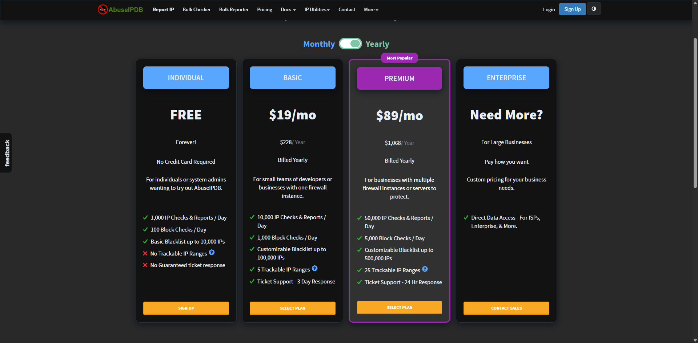
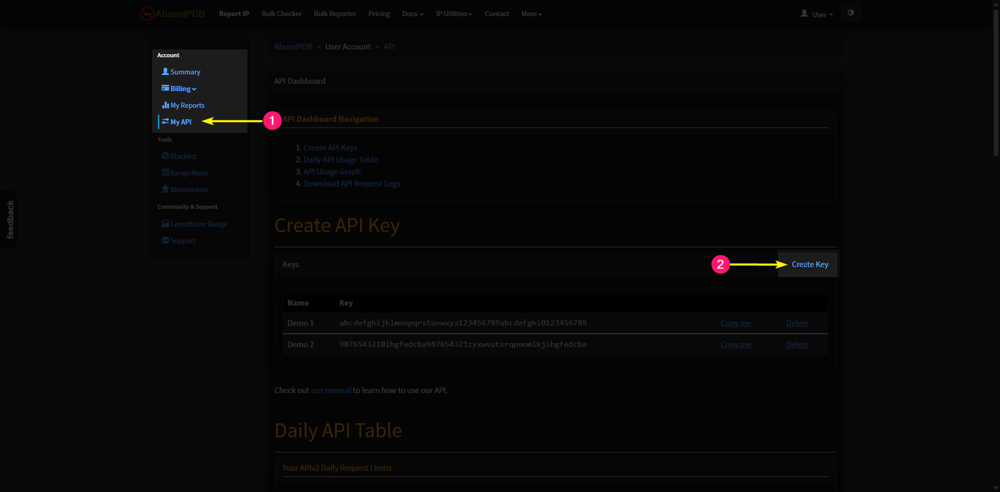
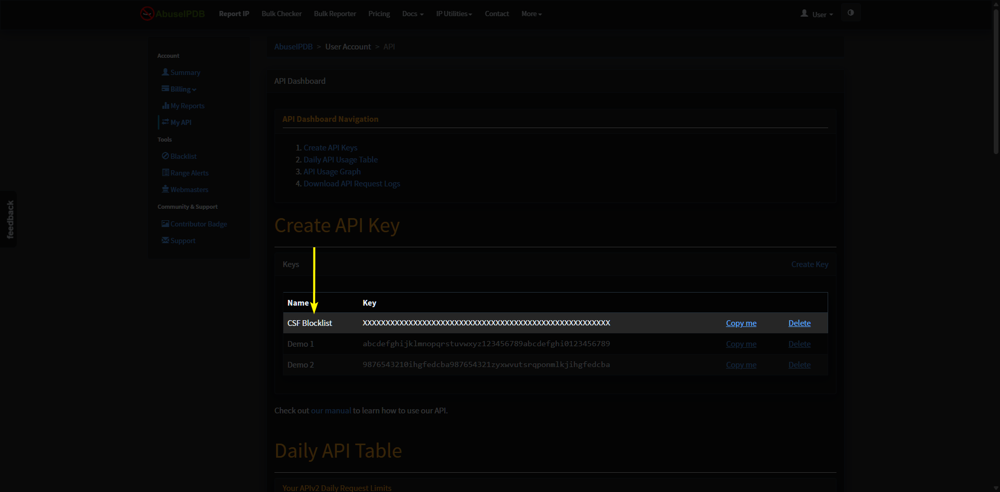
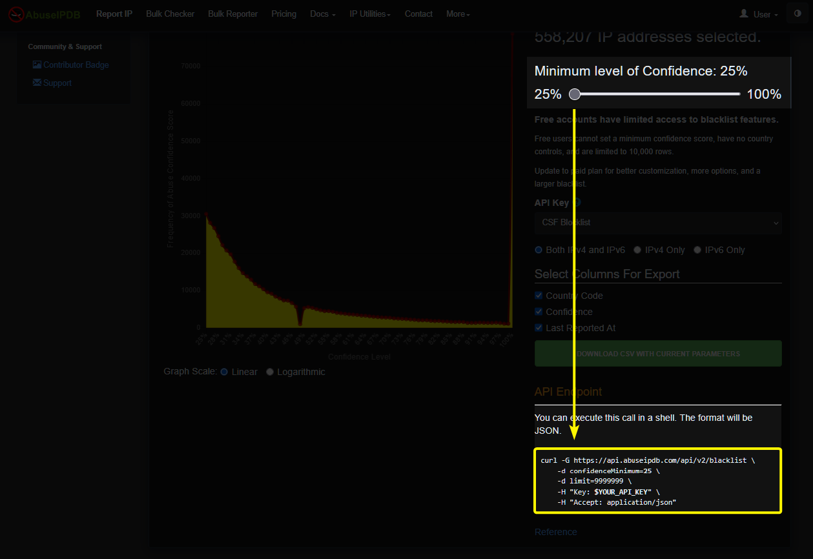
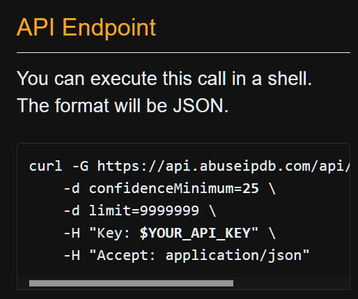

# AbuseIPDB
<!-- md:version stable-15.09 -->

This section walks you through integrating [AbuseIPDB](https://abuseipdb.com) with your ConfigServer Security and Firewall setup.

Think of AbuseIPDB as the arcade game Asteroids; harmful attackers and malicious IPs are like asteroids hurtling toward your server. As soon as they get too close, you blast them away for a satisfying 100 points per hit. 

With this integration, you get real-time intelligence on abusive IPs, giving you the upper hand in the never-ending game of protecting your server from the digital cosmos.

<br />

## Useful Resources

The following are useful resources associated with this page.

<div class="grid cards" markdown>

-   :aetherx-axb-abuseipdb: &nbsp; __[AbuseIPDB: CSF Integration](https://abuseipdb.com/csf)__

    ---

    CSF Integration guide provided by AbuseIPDB.
    
-   :aetherx-axb-abuseipdb: &nbsp; __[AbuseIPDB: API Docs](https://docs.abuseipdb.com/#introduction)__

    ---

    Full API documentation for AbuseIPDB.

-   :aetherx-axb-abuseipdb: &nbsp; __[AbuseIPDB: Create API Key](https://abuseipdb.com/account/api)__

    ---

    Create an AbuseIPDB and generate an API key.

-   :aetherx-axs-block-brick-fire: &nbsp; __[CSF: Download & Install Guide](../../install/dependencies.md)__

    ---

    The starting point for our installation guide to get CSF installed on your server.

</div>

<br />

---

<br />

## What is AbuseIPDB?

[AbuseIPDB](https://abuseipdb.com/) is a community-driven project focused on tracking and sharing information about IP addresses involved in abusive or malicious activity across the internet. The service allows individuals to report IPs associated with behaviors such as brute-force attacks, spam, port scanning, DDoS attempts, and other forms of network abuse. Each report includes contextual details like the abuse category, a brief description explaining the cause for the report, and the time it was observed.

The platform aggregates reports from thousands of contributors worldwide and analyzes them to generate an **abuse confidence score** for each IP address. This score is calculated based on factors such as how frequently an IP is reported, the severity of the reported activity, and how recent the reports are. AbuseIPDB also maintains historical data, allowing users to see patterns over time and understand what types of abuse an IP has been associated with.

AbuseIPDB offers both a free tier and several [paid plans](https://abuseipdb.com/pricing) with expanded capabilities. 

The free plan includes:

- **1,000** IP checks and reports per day
- **100** bulk blocklist checks per day
- Access to a basic blacklist of up to **10,000 IPs**

Users can interact with AbuseIPDB through its web interface for manual lookups, or integrate it directly into scripts, firewalls (including CSF), and security tools using the official [AbuiseIPDB API](https://docs.abuseipdb.com/#introduction). This flexibility makes it valuable for individual server operators as well as large-scale infrastructure and security teams.

<br />

---

<br />

## Before You Begin

Before integrating AbuseIPDB with CSF, make sure that **ConfigServer Security & Firewall (CSF)** is already installed and working correctly on your server.

If CSF is not yet installed, begin with the [Installation](../../install/dependencies.md) guide. That section walks you through installing the required dependencies, downloading CSF, and completing the initial setup so your system is ready for AbuseIPDB integration.

<br />

---

<br />

## Setup Integration

Before continuing with the AbuseIPDB integration, make sure you have already completed the CSF installation by following our [Installation Guide](../../install/dependencies.md). This ensures that all required dependencies are in place and that CSF is properly installed on your system.

Once CSF is installed, visit the [AbuseIPDB website](https://abuseipdb.com/pricing) and **create an account**. Click the **Sign Up** button at the top of the page, which will take you to the tier selection screen where you can choose the plan that best fits your needs.

<br />

<figure markdown="span">
    { width="800" }
    <figcaption>AbuseIPDB › Select a Tier</figcaption>
</figure>

<br />

You may start with the **Free** tier if you simply want to evaluate the service. This plan allows up to **10,000 IP addresses** in your blocklist. 

If you require higher limits or additional features, paid plans are available, increasing the blocklist capacity to **100,000 IPs** and beyond.

Once you have selected the desired tier, the next page will ask you for your information.

Don't forget to confirm you are human at the bottom page the page. _(You are human, right?)_

<br />

<figure markdown="span">
    { width="800" }
    <figcaption>AbuseIPDB › Register</figcaption>
</figure>

<br />

After you complete the sign-up process, you should be re-directed to your [Account home page](https://www.abuseipdb.com/account). On the left-side navigation menu, select 

- **[Account](https://www.abuseipdb.com/account)** > **[My API](https://www.abuseipdb.com/account/api)** 

<br />

On the right-side of the **[My API](https://www.abuseipdb.com/account/api)** page, click the button:

<div class="valign-buttons" markdown>

[:aetherx-axb-abuseipdb: Create Key](https://www.abuseipdb.com/account/api){ .md-button .btn-aln-center-inline .buttons-fill target="_blank" }

</div>

<figure markdown="span">
    { width="800" }
    <figcaption>AbuseIPDB › Account › Nav Menu</figcaption>
</figure>

<br />

When clicking the **Create Key** button, a dialog box will appear and ask you to specify a **Name**. The name serves no purpose other than identifying what this API key is associated with:

<br />

<figure markdown="span">
    { width="800" }
    <figcaption>AbuseIPDB › Account › Nav Menu</figcaption>
</figure>

<br />

After saving the new name, the page should refresh and show you the new API key:

<br />

<figure markdown="span">
    { width="800" }
    <figcaption>AbuseIPDB › Account › API Key</figcaption>
</figure>

<br />

After getting your AbuseIPDB API key, we now need to integrate it into CSF. Open the file `/etc/csf/csf.blocklists` on your server with the desired editor:

=== ":aetherx-axs-square-terminal: Command"

    ```shell
    sudo nano /etc/csf/csf.blocklists
    ```

<br />

Scroll through its contents until you locate the code shown below. If this section does not already exist in your copy of CSF, add the following code:

=== ":material-file: /etc/csf/csf.blocklists"

    ```shell linenums="1" hl_lines="17"
    # #
    #   @blocklist              AbuseIPDB
    #   @details:               https://abuseipdb.com/account/api
    #   @notes:                 Requires you to create an account.
    #                           Requires you to generate an API key.
    #                           Add your generated API key in the URL below by 
    #                               replacing `YOUR_API_KEY`.
    #                           Change the 3rd field `10000` to a higher number
    #                               if you are on a paid plan.
    #                           Replace `&limit=10000` at the end of the URL with
    #                               the same limit value.
    #   
    #                           Full documentation at:
    #                               https://docs.configserver.dev/install/integrations/abuseipdb/
    # #

    #   ABUSEIPDB|86400|10000|https://api.abuseipdb.com/api/v2/blacklist?key=YOUR_API_KEY&plaintext&limit=10000
    ```

<br />

To enable the AbuseIPDB integration, start by removing the `#` character at the beginning of the line to uncomment it. Next, edit the URL and replace `YOUR_API_KEY` with the AbuseIPDB API key you generated earlier. 

When finished, the query string should look similar to `?key=abcdefghi0123456789`, using your actual API key in place of the example.

If you are subscribed to a [paid plan](https://abuseipdb.com/pricing), you can also increase the value `10000` to a higher number. This value defines the maximum number of IP addresses CSF is allowed to retrieve from the AbuseIPDB blocklist via the API. 

Free accounts are limited to **10,000 IPs**, while paid plans allow higher limits depending on your subscription tier.

| Plan          | Price             | Maximum Blocklist IPs         |
| ------------- | ----------------- | ----------------------------- |
| Individual    | Free              | `10,000`                      |
| Basic         | $25.00/month      | `100,000`                     |
| Premium       | $99.00/month      | `500,000`                     |
| Enterprise    | -                 | [Contact AbuseiPDB Sales](https://www.abuseipdb.com/contact/enterprise) |

<br />

Once you have enabled and configured AbuseIPDB, save the file and close it.

The final step is to restart the CSF services so that the changes take effect and the blocklists can be downloaded. Open your :aetherx-axs-square-terminal: terminal and run the following command:

=== ":aetherx-axs-square-terminal: Command"

    ```shell
    csf -ra
    ```

<br />

Open your lfd log file at `/var/log/lfd.log`

=== ":aetherx-axs-square-terminal: Command"

    ```shell
    cat /var/log/lfd.log
    ```

<br />

You should see the following in your log file:

=== ":material-file: /var/log/lfd.log"

    ```shell
    Dec 15 11:14:24 configserver lfd: Retrieved and blocking blocklist ABUSEIPDB IP address ranges
    Dec 15 11:14:24 configserver lfd: IPSET: loading set new_ABUSEIPDB with 10000 entries
    Dec 15 11:14:24 configserver lfd: IPSET: switching set new_ABUSEIPDB to bl_ABUSEIPDB
    ```

<br />

If you see an error in your log file such as the following:

=== ":material-file: /var/log/lfd.log"

    ```shell
    Dec 15 11:14:53 configserver lfd: Unable to retrieve blocklist ABUSEIPDB - Unable to download: Not Found
    ```

<br />

The error above means that you have configured something incorrectly. Ensure that the URL does not contain typos, and also make sure you copied your AbuseIPDB API key correctly.

<br />

---

<br />

## Paid Tiers

While the free tier of AbuseIPDB is a great way to get started, one of the most valuable advantages of becoming a paid supporter is access to the **[Blacklist](https://www.abuseipdb.com/account/blacklist)** customization tools.

This section outlines some of the best features associated with AbuseIPDB paid plans.

### Confidence Levels

<br />

<figure markdown="span">
    { width="640" }
    <figcaption>AbuseIPDB › Blacklist › Confidence</figcaption>
</figure>

<br />

The **confidence level** determines how strict AbuseIPDB is when deciding which IP addresses are included in your blocklist:

- **High Confidence level**
    - Only IPs with a strong history of abusive behavior are included.
    - **Pros:**  
        - Significantly reduces the chance of blocking legitimate users.  
        - Ideal for production servers where availability and user access are critical.
    - **Cons:**  
        - Some newer or less frequently reported malicious IPs may not be blocked.

- **Low confidence level**
    - Includes IPs with fewer or less severe abuse reports.
    - **Pros:**  
        - More aggressive protection against potential threats.  
        - Useful for high-risk environments or servers that are frequent attack targets.
    - **Cons:**  
        - Higher risk of false positives, which may block legitimate traffic.

Choosing the right confidence level depends on your server’s purpose and risk tolerance. [Paid tiers] give you the flexibility to strike the balance that best fits your environment.

With a free account, adjusting the confidence slider does not change the results you receive.

Paid plans unlock this feature, allowing you to fine-tune the generated blocklist so you can strike a better balance between security and legitimate access to your server.

Once you have selected your desired confidence level, scroll down to the right-hand side of the page and locate the **API Endpoint** section. Each time you adjust the confidence slider, the API URL will automatically update to reflect your current settings.

<br />

<figure markdown="span">
    { width="800" }
    <figcaption>AbuseIPDB › Blacklist › Confidence</figcaption>
</figure>

<br />

When you have the desired settings, scroll down the page and locate the right-side box labeled **API Endpoint**, and take note of the values within the generated URL:

<figure markdown="span">
    { width="350" }
    <figcaption>AbuseIPDB › Blacklist › Confidence</figcaption>
</figure>

<br />

You will need to apply these values to your AbuseIPDB blocklist entry inside of the file `/etc/csf/csf.blocklists`:

=== ":material-file: /etc/csf/csf.blocklists"

    ```shell linenums="1" hl_lines="17"
    # #
    #   @blocklist              AbuseIPDB
    #   @details:               https://abuseipdb.com/account/api
    #   @notes:                 Requires you to create an account.
    #                           Requires you to generate an API key.
    #                           Add your generated API key in the URL below by 
    #                               replacing `YOUR_API_KEY`.
    #                           Change the 3rd field `10000` to a higher number
    #                               if you are on a paid plan.
    #                           Replace `&limit=10000` at the end of the URL with
    #                               the same limit value.
    #   
    #                           Full documentation at:
    #                               https://docs.configserver.dev/install/integrations/abuseipdb/
    # #

     ABUSEIPDB|86400|9999999|https://api.abuseipdb.com/api/v2/blacklist?key=YOUR_API_KEY&plaintext&limit=9999999&confidenceMinimum=25
    ```

<br />

Once you have modified the values; give CSF a restart using the command:

=== ":aetherx-axs-square-terminal: Command"

    ```shell
    sudo csf -ra
    ```

<br />

You should now be using the parameters you picked from the [Blacklist](https://abuseipdb.com/account/blacklist) page.

<br />

---

<br />

## Contribute to AbuseIPDB

In addition to using AbuseIPDB to block malicious traffic, you can also help strengthen the platform by reporting abusive activity detected on your own server. By submitting reports for IP addresses that attempt to carry out malicious actions, you contribute to a shared reputation system that benefits the wider security community.

When CSF detects and blocks a malicious connection attempt, that event can be reported directly to AbuseIPDB. These reports become visible to other AbuseIPDB users, helping them identify and preemptively block the same abusive sources before they cause harm elsewhere.

To make this process easy, AbuseIPDB has provided multiple integration scripts that can be deployed alongside CSF. Since CSF itself is written in **Perl**, a native Perl reporting script is included.

However, they also offer **Bash** and **Python** versions of the integration script, allowing you to choose the language that best fits your environment or workflow.

Once configured, these scripts automatically submit reports to AbuseIPDB whenever CSF blocks a malicious IP, turning your firewall into an active contributor to the global abuse reporting network.

<br />

### Setup

To configure CSF to detect malicious access attempts and report them to **AbuseIPDB**, choose one of the scripts provided below, create a new file with the selected code, and save it to a location on your server. The file may reside anywhere, as you will specify its path in CSF shortly. 

The directory where you place this file determines where the script will be executed whenever CSF starts and identifies a malicious attempt against your server. 

<br />

=== ":aetherx-axd-command: Perl"

    ``` perl title="abuseipdb_block.pl" linenums="1"
    --8<-- "https://gist.githubusercontent.com/Bsebring/f3dd52a99f8035303e89fdb681961a2d/raw/7575508c92446f1e1784810eee996980b93a0b03/abuseipdb_block.pl"
    ```

=== ":aetherx-axd-command: Bash"

    ``` bash title="abuseipdb_block.sh" linenums="1"
    --8<-- "https://gist.githubusercontent.com/hemoglobin/f4d52c1c17aa77f89564ffd8f65f5f37/raw/0289a12b8e4336c1e47ec98cd064b7ad562aa58c/abuseipdb_block.sh"
    ```

=== ":aetherx-axd-command: Python"

    ``` python title="abuseipdb_block.py" linenums="1"
    --8<-- "https://gist.githubusercontent.com/Bsebring/afcd0ab2c42d5fd603582c7ded2e9368/raw/2b415c9d46730d0c35ff78ccf4942c690dc981b7/abuseipdb_block.py"
    ```

<br />

Ensure the script is executable by applying `+x` execute permissions using one of the commands below:

=== ":aetherx-axd-command: Perl"

    ```shell
    sudo chmod +x abuseipdb_block.pl
    ```

=== ":aetherx-axd-command: Bash"

    ```shell
    sudo chmod +x abuseipdb_block.sh
    ```

=== ":aetherx-axd-command: Python"

    ```shell
    sudo chmod +x abuseipdb_block.py
    ```

<br />

Once the permissions have been updated, you can enable reporting for the script. Open the CSF configuration file at `/etc/csf/csf.conf` and modify the following setting. Chnage `/path/to` to the location where you placed one of the scripts provided above:

=== ":material-file: /etc/csf/csf.conf"

    ```shell
    BLOCK_REPORT = "/path/to/abuseipdb_report.pl"
    ```

??? note "Blocklist Reporting Process"

    When triggered, **LFD** executes the script specified by the `BLOCK_REPORT` setting as a
    forked process. If the script does not complete within **10 seconds**, it is automatically
    terminated.

    Because this script runs with **root** privileges, extreme caution should be taken to
    ensure the security and integrity of the `BLOCK_REPORT` script.

<br />

After you have configured CSF to utilize the new AbuseIPDB reporting script, give CSF a restart:

=== ":aetherx-axs-square-terminal: Command"

    ```shell
    sudo csf -ra
    ```

<br />

### Notes

Take note of the following pieces of information if you have issues with AbuiseIPDB integration and malicious IP reporting:

<br />

#### Testing Mode

If CSF or AbuseIPDB fails to start or does not behave as expected, verify that **Testing Mode** is disabled.  
To do this, edit the CSF configuration file located at `/etc/csf/csf.conf` and ensure the `TESTING` option is set to `0`.

<br />

<!-- md:option TESTING -->
<!-- md:flag setting --> <!-- md:flag required --> <!-- md:default `1` --> <!-- md:requires /etc/csf/csf.conf -->

Defines how often the cron job runs, in minutes. This timing is based on the
system clock, not when you manually start the firewall.

For example, if the interval is set to 5 minutes, the job will trigger at
regular 5-minute marks past the hour — meaning the firewall could reset
anywhere between 0 and 5 minutes after startup.

<br />

#### CSF Restarts Slow

If CSF takes too long to restart, modify CSF's `FASTSTART` setting in the file `/etc/csf/csf.conf` and set the value to `0`. 

<br />

<!-- md:option FASTSTART -->
<!-- md:flag setting --> <!-- md:flag required --> <!-- md:default `1` --> <!-- md:requires /etc/csf/csf.conf -->

This option uses IPTABLES_SAVE, IPTABLES_RESTORE and IP6TABLES_SAVE, IP6TABLES_RESTORE in two ways:

1. On a clean server reboot the entire csf iptables configuration is saved
and then restored where possible to provide a near instant firewall
startup

1. On csf restart or lfd reloading tables, CC_* as well as SPAMHAUS, DSHIELD,
BOGON, TOR are loaded using this method in a fraction of the time than if
this setting is disabled

Set to `0` to disable this functionality

<br />

#### Logs

All activity performed by **CSF** and **lfd** is recorded in `/var/log/lfd.log`. Review this log to identify blocked or locked access attempts against your server.

<br />

---

<br />

## Conclusion

By completing this guide, you have successfully integrated **AbuseIPDB** into CSF as an active blocklist provider. This integration adds an additional layer of protection by automatically blocking IP addresses with a known history of abusive behavior, significantly reducing unwanted traffic before it ever reaches your services.

The primary advantage of AbuseIPDB is its community-driven intelligence. Reports submitted by thousands of administrators and security professionals worldwide allow CSF to proactively defend against threats such as port scanning, brute-force attacks, spam attempts, and other malicious activity. Rather than reacting after an incident occurs, your server can now deny access to repeat offenders in advance.

Combined with CSF’s existing firewall and security features, AbuseIPDB helps harden your system, lowers log noise, and reduces the load caused by automated bots; allowing you to focus on legitimate traffic and server management with greater confidence.

<br />

---

<br />

## Next Steps <!-- omit from toc -->

{==

Select what documentation you would like to proceed with next ...

==}

<div class="grid cards" markdown>

-   :aetherx-axd-earth-europe: &nbsp; __[Geographical IP Block Integration](../usage/geoip.md)__

    ---

    Geographical IP blocking allows you to control access to your server based on
    the country or region an IP address originates from, rather than individual
    IP reputation or blocklist entries.

    This section explains what geographical IP blocks are, how they differ from
    blocklists and IPSETs, and when it makes sense to use country-based filtering.

    You’ll also learn how to integrate CSF with GeoIP data providers to apply
    regional access rules safely and efficiently.

</div>

<br />
<br />

  [Paid tiers]: #paid-tiers