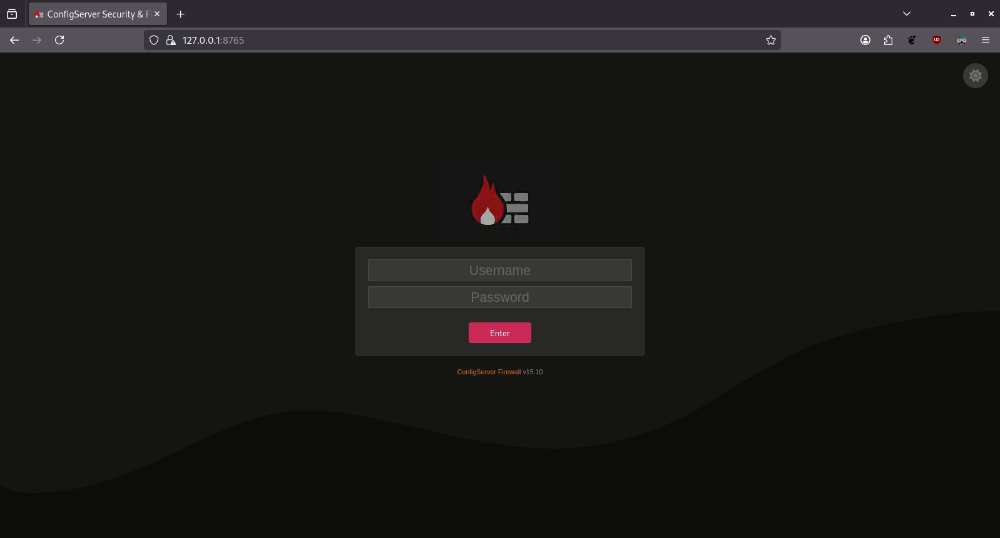

# Quickstart <!-- omit from toc -->

This page explains how to download and install ConfigServer Security & Firewall in very minimal detail. This guide is good for:

- [x] Users migrating from CSF v14.x or older, to this repository.
- [x] Users who need a clean install
- [x] Users who have not enabled the web interface.

<br />

Instructions on this page will cover:

- Download
- Install 
- Basic Configuration
- Whitelist User IPs
- Access Web Interface

<br />

If you need detailed instructions, please view the [full installation guide](download.md).

<br />

---

<br />

## Setup

The instructions below are a very minimized version of our [full installation guide](download.md). If you want a very quick setup
and installation for CSF; follow the instructions below.

<br />
<br />

### Download

Download the latest version of CSF with one of the following commands:

=== ":aetherx-axs-file-zipper: .tgz"

    ```shell
    # Using wget (tgz)
    wget https://download.configserver.dev/csf.tgz

    # Using curl (tgz)
    curl -O https://download.configserver.dev/csf.tgz
    ```

=== ":aetherx-axs-file-zip: .zip"

    ```shell
    # Using wget (zip)
    wget https://download.configserver.dev/csf.zip

    # Using curl (zip)
    curl -O https://download.configserver.dev/csf.zip
    ```

<br />

Extract the contents from the .zip or .tgz archive to your machine:

=== ":aetherx-axs-file-zipper: .tgz"

    ```bash
    tar -xzf csf.tgz -C /usr/src/
    ```

=== ":aetherx-axs-file-zip: .zip"

    ```bash
    unzip csf.zip -d /usr/src/
    ```

<br />
<br />

### Install

Once CSF is extracted, run the installation script:

=== ":aetherx-axd-command: Command"

      ```bash
      sudo sh /usr/src/csf/install.sh
      ```

<br />
<br />

### Basic Configuration

Next, we need to edit a few settings in the CSF configuration file. These are the bare minimum to get the CSF and LFD services running, however, you can edit any other settings along the way that you deem appropriate to change. Open the file `/etc/csf/csf.conf` in a text editor; and edit the following:

<br />

==`Required`==: You must set `TESTING` mode to `0` or LFD will not start:

=== ":aetherx-axs-file: /etc/csf/csf.conf"

    ``` bash title="Disable CSF Testing Mode"
    TESTING = "0"
    ```

<br />

==`Optional`==: If you have a CSF license key from our [Sponsor Program](../insiders/join.md), enter it here.

=== ":aetherx-axs-file: /etc/csf/csf.conf"

    ``` bash title="Enable CSF Web Interface"
    SPONSOR_LICENSE = "XXXXXXX-XXXX-XXXX-XXXX-XXXXXXX"
    ```

<br />

==`Required`==: Enable the CSF web interface:

=== ":aetherx-axs-file: /etc/csf/csf.conf"

    ``` bash title="Enable CSF Web Interface"
    UI = "1"
    ```

<br />

==`Optional`==: To change the default **web interface port**, modify the following:

=== ":aetherx-axs-file: /etc/csf/csf.conf"

    ``` bash title="Change Web Interface Port"
    UI_PORT = "6666"
    ```

<br />

==`Optional`==: This setting tells CSF which network adapter / IP to bind to. If you leave this **blank**, 
it will bind to **all**, which is the equivilent of using `0.0.0.0`.  

If you wish to place CSF behind a reverse proxy such as **Traefuk**, and are using Docker for your setup, 
you can bind to the Docker bridge. Pick **ONE** of the suggested values below:

=== ":aetherx-axs-file: /etc/csf/csf.conf"

    ``` bash title="Define Network Adapter Bind"
    UI_IP = ""                              # bind to all IPs
    UI_IP = "127.0.0.1"                     # bind to localhost only
    UI_IP = "::ffff:172.17.0.1"             # bind to docker bridge
    ```

<br />

==`Optional`==: This setting is not required, but is worth mentioning. Out-of-box, CSF does not allow external access to your install of CSF for good reason.
If you are unable to access the CSF web interface, you can temporarily disable this to **debug ONLY** by setting this value to `0`. Do not leave the value set to `0`. 

=== ":aetherx-axs-file: /etc/csf/csf.conf"

    ``` bash title="Allow Public Access"
    UI_BLOCK_PRIVATE_NET = "1"
    ```

<br />


==`Required`==: Set an admin **username** and **password**. If you keep the default values, **LFD will not start**.

=== ":aetherx-axs-file: /etc/csf/csf.conf"

    ``` bash title="Set Admin Username & Password"
    UI_USER = "admin"
    UI_PASS = "password"
    ```

<br />
<br />

### Whitelist User IPs

Next, we need to whitelist the IP address you will be using to access the CSF web interface. This can be both WAN and LAN IPs, 
depending on your network structure. If you do not whitelist your IP, you will be unable to access the CSF Web Interface.

Open `/etc/csf/ui/ui.allow`, and add one IP address per line:

=== ":aetherx-axs-file: /etc/csf/ui/csf.allow"

    ``` bash title="Whitelist IP in Web Interface"
    127.0.0.1       # localhost / loopback
    172.17.0.1      # For Docker users behind a bridge
    ```

<br />
<br />

### Restart CSF & LFD

Once everything configured, restart the **CSF** and **LFD** services:

=== ":aetherx-axd-command: Command"

      ```shell
      sudo csf -ra
      ```

<br />

Confirm there are no errors by viewing the file `/var/log/lfd.log`. If you see any errors similar to the following, this means you have not whitelisted the correct
IP address within `/etc/csf/ui/csf.allow`:

=== ":aetherx-axs-file: /var/log/lfd.log"

    ``` bash title="Check for Errors"
    lfd[5001]: UI: Access attempt from an IP not in /etc/csf/ui/ui.allow - denied [127.0.0.1]
    ```

<br />
<br />

### Access Web Interface

To access the CSF web interface, open your browser and navigate to the local IP address associated with the machine that CSF 
is installed to. In our guide above, we changed the default port to `8765`, so we will navigate there:

```
https://127.0.0.1:8765
```

<br />

If you are unable to view the CSF web interface, visit our [Troubleshooting](#troubleshooting) section below.

<figure markdown="span">
    { width="800" }
    <figcaption>CSF Web Interface</figcaption>
</figure>

<br />

Enter the **username** and **password** you defined in your `/etc/csf/csf.conf` as:

=== ":aetherx-axs-file: /etc/csf/csf.conf"

    ``` bash title="Set Admin Username & Password"
    UI_USER = "admin"
    UI_PASS = "password"
    ```


<br />
<br />

---

<br />
<br />

## Troubleshooting

The following is a list of questions a user may have regarding updates to CSF, and information about certain 
issues that may arise:

<br />


??? faq "LFD: Cannot Start Service"

    <div class="details-content">

    Confirm if LFD service is running:

    === ":aetherx-axd-command: Command"

        ```shell
        sudo systemctl status lfd
        ```

    <br />

    If the service says **Stopped** or **Failed**, run the following `tail` command to look at the LFD logs located in `/var/log/lfd.log`:

    === ":aetherx-axd-command: Command"

        ```shell
        sudo tail -n 50 /var/log/lfd.log
        ```

    === ":aetherx-axs-square-terminal: Output"

        ```shell
        lfd[99819]: *Error* lfd will not run with TESTING enabled in /etc/csf/csf.conf, at line 98
        lfd[99819]: daemon stopped
        ```

    <br />

    If you see the output above, you must disable `TESTING`. Open the file `/etc/csf/csf.config`:

    === ":aetherx-axs-file-magnifying-glass: Find"

        ``` bash title="/etc/csf/csf.conf"
        TESTING = "1"
        ```

    === ":aetherx-axs-file-pen: Change To"

        ``` bash title="/etc/csf/csf.conf"
        TESTING = "0"
        ```

    <br />

    Also ensure that you have changed the default **username** and **password** in your `/etc/csf/csf.conf`. You cannot use the
    default values.

    === ":aetherx-axs-file: /etc/csf/csf.conf"

        ``` bash title="Set Admin Username & Password"
        UI_USER = "admin"
        UI_PASS = "password"
        ```

    <br />

    Finally, make sure you have **whitelisted** the IP address you will use to access the CSF web interface. Open `/etc/csf/ui/csf.allow` and add your
    IP to the file, one IP-per-line:

    === ":aetherx-axs-file: /etc/csf/ui/csf.allow"

        ``` bash title="Whitelist IP in Web Interface"
        127.0.0.1       # localhost / loopback
        172.17.0.1      # For Docker users behind a bridge
        ```

    <br />

    Restart CSF and LFD services:

    === ":aetherx-axd-command: Command"

        ```shell
        sudo csf -ra
        sudo systemctl start lfd
        ```

    <br />

    Confirm the status of LFD again:

    === ":aetherx-axd-command: Command"

        ```shell
        sudo systemctl status lfd
        ```

    <br />

    If none of the above helps you solve it, you can also try to run LFD with `strace`:

    === ":aetherx-axd-command: Command"

        ```shell
        sudo strace -f /usr/sbin/lfd --check
        ```

    === ":aetherx-axs-square-terminal: Output"

        ```shell
        rt_sigaction(SIGRT_25, NULL, {sa_handler=SIG_DFL, sa_mask=[], sa_flags=0}, 8) = 0
        rt_sigaction(SIGRT_26, NULL, {sa_handler=SIG_DFL, sa_mask=[], sa_flags=0}, 8) = 0
        rt_sigaction(SIGRT_27, NULL, {sa_handler=SIG_DFL, sa_mask=[], sa_flags=0}, 8) = 0
        rt_sigaction(SIGRT_28, NULL, {sa_handler=SIG_DFL, sa_mask=[], sa_flags=0}, 8) = 0
        rt_sigaction(SIGRT_29, NULL, {sa_handler=SIG_DFL, sa_mask=[], sa_flags=0}, 8) = 0
        rt_sigaction(SIGRT_30, NULL, {sa_handler=SIG_DFL, sa_mask=[], sa_flags=0}, 8) = 0
        rt_sigaction(SIGRT_31, NULL, {sa_handler=SIG_DFL, sa_mask=[], sa_flags=0}, 8) = 0
        rt_sigaction(SIGRT_32, NULL, {sa_handler=SIG_DFL, sa_mask=[], sa_flags=0}, 8) = 0
        rt_sigaction(SIGABRT, NULL, {sa_handler=SIG_DFL, sa_mask=[], sa_flags=0}, 8) = 0
        rt_sigaction(SIGCHLD, NULL, {sa_handler=SIG_DFL, sa_mask=[], sa_flags=0}, 8) = 0
        rt_sigaction(SIGIO, NULL, {sa_handler=SIG_DFL, sa_mask=[], sa_flags=0}, 8) = 0
        exit_group(0)                           = ?
        +++ exited with 0 +++
        ```

    <br />

    Using `strace` will give you hints of any issues or errors. In the example above, lfd exits with `error code 0`, 
    which means “success / no error”. The program is choosing to shut itself down and telling the OS “I finished cleanly”.

    This tells us that it's not due to something failing. When a daemon exits cleanly (exit code 0), you usually have to 
    look inside lfd's own logs, not just systemd’s.

    In the examples above, we see in `/var/log/lfd.log` that it was due to us having `TESTING` enabled.

    Another option for checking failure reasons is to run:

    === ":aetherx-axd-command: Command"

        ```shell
        sudo dmesg -T | tail -n 20
        ```

    <br />

    You can also check `journalctl` for any errors:

    === ":aetherx-axd-command: Command"

        ```shell
        sudo journalctl -xeu lfd.service
        ```

    <br />

    All of the listed methods above will help you narrow down exactly why LFD or CSF are not starting properly.

    </div>


??? faq "Web Interface: Browser says **access restricted** using default port `6666`"

    <div class="details-content">

    Out-of-box, Firefox and Chromium-based browsers block access to port `6666`. To access the CSF web 
    interface, must do ONE of the following:
    
    - Cconfigure your browser to allow access to port `6666`; OR
    - Change the default port assigned to the CSF web interface within `/etc/csf/csf.conf`

    To allow port `6666` in your browser, follow the instructions on the page 
    [Troubleshooting › Address Restricted](../../usage/troubleshooting/webui.md#browser-this-address-is-restricted)

    To change the port used for the CSF web interface, follow the instructions outlined on the page
    [Install › Web Interface › Setup](../../install/webui.md#step-2-enable-web-ui).

    </div>

<br />

---

<br />

## Next Steps <!-- omit from toc -->

{==

Select what documentation you would like to proceed with next ...

==}

<div class="grid cards" markdown>

-   :aetherx-axs-box-open: &nbsp; __[Full Installation Guide](../dependencies.md)__

    ---

    If the quickstart guide doesn’t work for your setup, the full installation
    guide provides clear, step-by-step instructions to install CSF properly.

    The guide is split into multiple pages, with each page covering a single
    stage of the setup process in detail.

    The full instructions will start on the [Install: Dependencies](../dependencies.md) page.

-   :aetherx-axs-browser: &nbsp; __[Enable Web Interface](../install/webui.md)__

    ---

    The web interface lets you manage your firewall through a browser instead
    of a command line.  

    This chapter covers installation of dependencies, enabling the interface,
    and whitelisting your IP for security.  

</div>

<br />

<br />
