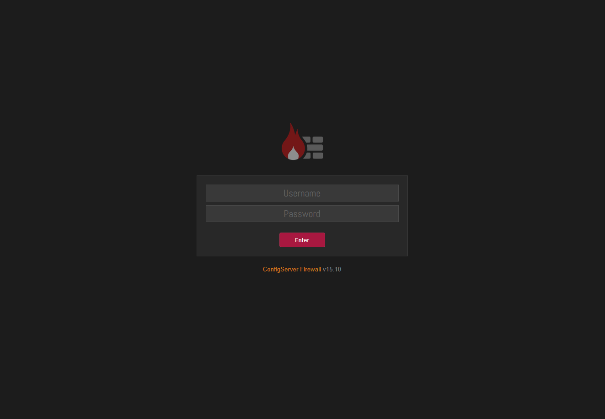

This page describes the steps required to update CSF from an older version maintained by us to the most 
recent release.

If your system is currently running CSF **v15.00** originally developed by **Way to the Web**, you must 
first perform a one-time **manual update** by following the instructions in the chapter 
[Update: v15.00 to Newer](../../install/update/v1500-to-newer.md). This initial update is mandatory before 
you can use the built-in automatic update system.

<br />
<br />

---

<br />
<br />

## About Versioning <!-- omit from toc -->

These docs break CSF up into **two** distinct development eras:

| Version Range                                                                                             | Codename              | Developer           | Description             | This Page Covers            |
| --------------------------------------------------------------------------------------------------------- | --------------------- | ------------------- | ----------------------- | --------------------------- |
| :aetherx-axb-csf-fill-stable:{ .csf-logo } [v15.01 & Newer](#perform-update)                              | Modern                | Aetherinox          | After August 2025       | :aetherx-axs-square-check:  |
| :aetherx-axb-csf-legacy-02:{ .csf-logo } [v15.00 & Older](../../install/update/v1500-to-newer.md)         | Legacy                | Way to the Web      | Before August 2025      | :aetherx-axd-square:        |

<br />

The final release of CSF **v15.00** by *Way to the Web Ltd.* removed all automatic update functionality. After this 
release, the company shut down their website, rendering all versions of CSF prior to August 2025 (_v15.00 and older_) 
unable to perform automatic updates.

[CSF **v15.01**](https://github.com/Aetherinox/csf-firewall/releases/tag/15.01) is the first version maintained by 
[:aetherx-axb-github: our repository](https://github.com/Aetherinox/csf-firewall/releases/), which restores automatic update 
functionality by introducing new servers.

Any server using CSF **v15.00 and older**, should be migrated to this repository’s maintained version of 
[CSF **v15.01**](https://github.com/Aetherinox/csf-firewall/releases/tag/15.01) and newer, if you want automatic updates to 
function again.

<br />

## Perform Update <!-- omit from toc -->

??? Notes "Before You Update ..."

    Make sure to back up any important configuration files located in :aetherx-axd-folder: `/etc/csf/`.

    Although existing files are never overwritten during the update process, it is strongly recommended
    to create backups before proceeding, as a general best practice.

If you are already running on an existing version of CSF from our 
[:aetherx-axb-github: repository](https://github.com/Aetherinox/csf-firewall/releases/), the update process is simple. 

These instructions assume that you currently have **CSF v15.01 or newer** installed on your server, and are looking to 
update to the latest version.

There are a few methods you can use for updating CSF, pick one:

- [Using Command Line](#using-command-line)
- [Using install.sh script](#using-installsh-script)
- [Using Web Interface](#using-web-interface)

<br />
<br />

### Using Command Line

To update CSF automatically, you can run the terminal command to check for updates:

=== ":aetherx-axs-square-terminal: Terminal `-c`"

    ```shell
    sudo csf -c
    ```

=== ":aetherx-axs-square-terminal: Terminal `--check`"

    ```shell
    sudo csf --check
    ```

<br />

You should see one of the following, if an update is available or not:

=== ":aetherx-axs-square-terminal: Terminal (Update Available)"

    ```console
    A newer version of csf is available - Current:v15.09 New:v15.10
    ```

=== ":aetherx-axs-square-terminal: Terminal (No Update Available)"

    ```console
    csf is already at the latest version: v15.10
    ```

<br />

If you want CSF to update automatically without performing a check first, use the command below. If a 
newer version is available, it will install immediately without any prior notification.

=== ":aetherx-axs-square-terminal: Terminal `-u`"

    ```shell
    sudo csf -u
    ```

=== ":aetherx-axs-square-terminal: Terminal `--update`"

    ```shell
    sudo csf --update
    ```

<br />

You can also run a forced update, which installs the latest version of CSF available regardless of whether 
an update is found. This command will overwrite the current installation files even if you already have
the latest version.

=== ":aetherx-axs-square-terminal: Terminal"

    ```shell
    sudo csf -uf
    ```

<br />

The update process is automatically completed by the command you execute. Afterward,
the CSF and LFD services will restart and you can now use CSF as normal.

<br />
<br />

### Using install.sh script

To update CSF manually, verify the current version with the command below:

=== ":aetherx-axd-command: Command"

      ```shell
      sudo csf -v
      ```

=== ":aetherx-axs-square-terminal: Output"

      ```shell
      csf: v15.09 (generic)
      ```

<br />

Once you have established the current running version, you can check our official 
[:aetherx-axb-github: repository](https://github.com/Aetherinox/csf-firewall/releases/) releases page for 
the latest version available.

To download the latest version, grab it using one of the commands below:

=== ":aetherx-axs-file-zipper: .tgz"

    ```shell
    # Using wget (tgz)
    wget https://download.configserver.dev/csf.tgz

    # Using curl (tgz)
    curl -O https://download.configserver.dev/csf.tgz
    ```

=== ":aetherx-axs-file-zip: .zip"

    ```shell
    # Using wget (zip)
    wget https://download.configserver.dev/csf.zip

    # Using curl (zip)
    curl -O https://download.configserver.dev/csf.zip
    ```

<br />

Decompress / unzip the downloaded archive file:

=== ":aetherx-axs-file-zipper: .tgz"

    ```bash
    tar -xzf csf.tgz -C /tmp
    ```

=== ":aetherx-axs-file-zip: .zip"

    ```bash
    unzip csf.zip -d /tmp
    ```

<br />

Run the CSF installation script:

=== ":aetherx-axd-command: Command"

      ```bash
      sudo sh /tmp/csf/install.sh
      ```

<br />

Follow any instructions on-screen. If prompted for any additional information, enter it. Once the wizard 
completes, you can confirm if CSF is installed and functioning by accessing your server via SSH, and 
running the CSF version command:

=== ":aetherx-axd-command: Command"

      ```shell
      sudo csf -v
      ```

=== ":aetherx-axs-square-terminal: Output"

      ```shell
      csf: v15.10 (generic)
      ```

<br />

Confirm the status of `csf` by running:

=== ":aetherx-axd-command: Command"

      ```shell
      sudo systemctl status csf
      ```

=== ":aetherx-axs-square-terminal: Output"

      ```shell
      ● csf.service - ConfigServer Security & Firewall - csf
          Loaded: loaded (/lib/systemd/system/csf.service; enabled; vendor preset: enabled)
          Active: active (exited) since Mon 2025-11-19 23:45:04 UTC; 14 seconds ago
        Main PID: 597 (code=exited, status=0/SUCCESS)
              CPU: 0min 14.956s

      Notice: journal has been rotated since unit was started, output may be incomplete.
      ```

<br />
<br />

### Using Web Interface

If you have the CSF [web interface](../../install/webui.md) enabled, you can install updates directly from the interface.

??? Notes "Enabling The Web Interface"

    If you have not yet enabled the CSF web interface and want to, read the instructions on the page
     [Enable Web Interface](../../install/webui.md).

<br />

Open the CSF web interface in your browser using the IP address and port configured in 
:aetherx-axd-file:{ .icon-clr-tree-file } `/etc/csf/csf.conf`. By default, the interface listens on 
port :aetherx-axd-gear: `6666` [^1].

```shell
https://127.0.0.1:6666
```

<br />

<figure markdown="span">
    { width="700" }
    <figcaption>CSF Login Interface</figcaption>
</figure>

<br />

On the home page of CSF, you'll see one of two buttons:

1. **Manual Check**
    - Displays when the automated system has not yet detected a newer version available.
2. **Upgrade CSF**
    - Displays when the automated system has located a newer version of CSF available to install.

<br />

<div align="center" class="grid" markdown>

{ width="300" }
{ width="300" }

</div>

<br />

Performing a **Manual Check** will connect to the CSF servers and check for available updates.

<figure markdown="span">
    { width="700" }
    <figcaption>CSF Manual Update</figcaption>
</figure>

<br />

If updates are available; they will be downloaded and installed. The CSF & LFD services will be restarted.
Once the page refreshes, you will now be on the current version of CSF.


<br />
<br />

---

<br />
<br />

## Next Steps <!-- omit from toc -->

{==

Select what documentation you would like to proceed with next ...

==}

<div class="grid cards" markdown>

-   :aetherx-axs-gear-complex: &nbsp; __[Start System Services](../../install/services.md)__

    ---

    Starting CSF requires disabling testing mode and enabling the firewall so it
    runs normally.  

    This chapter explains how to start both CSF and LFD services and ensure they
    launch on boot.  

    You’ll also find troubleshooting tips for common startup errors and how to
    fix them quickly.  

-   :aetherx-axs-browser: &nbsp; __[Enable Web Interface](../../install/webui.md)__

    ---

    The web interface lets you manage your firewall through a browser instead
    of a command line.  

    This chapter covers installation of dependencies, enabling the interface,
    and whitelisting your IP for security.  

</div>

<br />

<br />
