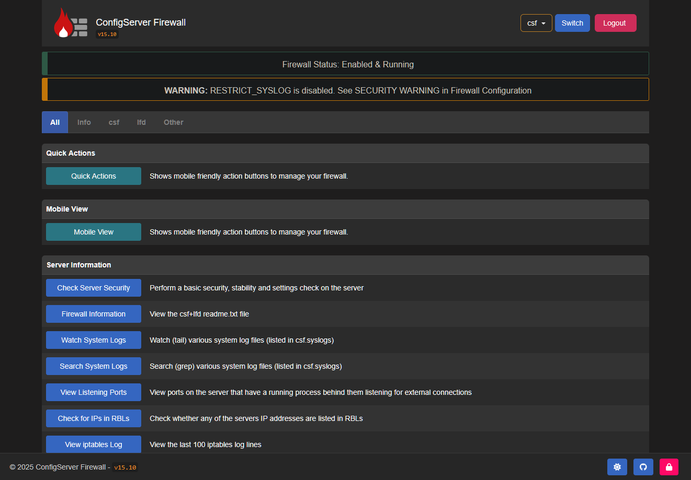

# Enable Web Interface <!-- omit from toc -->

ConfigServer Firewall provides an optional web-based interface that lets you manage CSF from your browser. With it, you can configure settings, and blacklist or whitelist IPs without using commands or editing configuration files manually. If you choose not to enable the interface, all management must be done directly through the CSF config files, or by running commands through your shell.

<br />

---

<br />

## Setup

This section covers the initial setup of the CSF web interface with only the essential requirements. Follow these steps to get the web interface up and running quickly.

<br />

### Step 1: Install Perl Modules

To get the CSF web interface functioning on your server, you must first ensure that you have a few perl modules installed. If you followed our [dependencies](./dependencies.md) guide, you should already have these [dependencies](./dependencies.md) satisfied. If you have not yet installed them, run one of the following commands in your server's terminal:

=== ":aetherx-axb-debian: Debian/Ubuntu (apt-get)"

    ```bash
    apt-get update
    apt-get install -y perl \
      libio-socket-ssl-perl \
      libwww-perl \
      libjson-perl \
      libnet-ssleay-perl \
      libcrypt-ssleay-perl \
      liblwp-protocol-https-perl \
      libgd-graph-perl \
      libio-socket-inet6-perl \
      libsocket6-perl \
      libnet-libidn-perl \
      libtime-hires-perl \
      sendmail-bin \
      dnsutils \
      unzip \
      wget
    ```

=== ":aetherx-axb-redhat: CentOS/RHEL (yum/dnf)"

    ```bash
    yum install -y perl \
      perl-libwww-perl \
      perl-IO-Socket-SSL.noarch \
      perl-JSON \
      perl-Net-SSLeay \
      perl-Net-LibIDN \
      perl-Crypt-SSLeay \
      perl-LWP-Protocol-https.noarch \
      perl-GDGraph \
      perl-Math-BigInt \
      perl-Time-HiRes \
      perl-Socket \
      perl-Socket6 \
      perl-IO-Socket-Inet6 \
      wget \
      unzip \
      net-tools \
      ipset \
      bind-utils
    ```

=== ":aetherx-axs-onion: Perl (CPAN)"

    ```bash
    perl -MCPAN -eshell
    cpan> install IO::Socket::SSL IO::Socket::INET6 Socket6 Net::LibIDN \
    LWP LWP::Protocol::https LWP::UserAgent JSON Net::SSLeay \
    Crypt::SSLeay Digest::MD5 Digest::SHA Email::Valid \
    GD::Graph Time::HiRes Socket
    ```

<br />
<br />

### Step 2: Enable Web UI

To enable CSF web interface, edit the file `/etc/csf/csf.conf` in your favorite text editor:

```shell
sudo nano /etc/csf/csf.conf
```

<br />

We need to update the following values. Click :material-plus-circle: to see information about each setting.

```ini title="<span>/etc/csf/csf.conf</span>"
# #
#   1 to enable, 0 to disable web ui 
# #

UI = "1" # (1)!

# #
#   Set port for web UI. The default port is 6666, but
#   I change this to 1025 to easy access. Default port create some issue
#   with popular chrome and firefox browser (in my case) 
# #

UI_PORT = "1025" # (2)!

# #
#   Leave blank to bind to all IP addresses on the server 
# #

UI_IP = "" # (3)!

# #
#   Set username for authetnication 
# #

UI_USER = "admin" # (4)!

# #
#   Set a strong password for authetnication 
# #

UI_PASS = "admin" # (5)!
```

1.  :aetherx-axdr-lightbulb:{ .pulsate .icon-clr-yellow } Defines if the CSF web interface is enabled or not. Will be
    accessible via your web browser.
    <div class='red right'><small>Required</small></div>
    <div class='yellow right'><small>Values: `0`, `1`</small></div>
2.  :aetherx-axdr-lightbulb:{ .pulsate .icon-clr-yellow } Defines the port to assign for the CSF web interface.
    This should be set to a value of `1023` or higher.
    <div class='red right'><small>Required</small></div>
    <div class='yellow right'><small>Values: `> 1023`</small></div>
3.  :aetherx-axdr-lightbulb:{ .pulsate .icon-clr-yellow } Defines the IP address to bind to the CSF web interface.
    If you plan to route this through Traefik, you should set this to your docker subnet such as `::ffff:172.17.0.1`.
    <div style='padding-top:15px'>Leave blank if you want to bind to all IP addresses on server.</div>
    <div class='red right'><small>Required</small></div>
    <div class='yellow right'><small>Values: `blank`, `::IPv6:IPv4`</small></div>
4.  :aetherx-axdr-lightbulb:{ .pulsate .icon-clr-yellow } Defines the username that will be required in order to
    sign into the CSF web interface. This should be alphabetic or numerical characters.
    <div class='red right'><small>Required</small></div>
    <div class='yellow right'><small>Values: `A-Z,a-z,0-9`</small></div>
5.  :aetherx-axdr-lightbulb:{ .pulsate .icon-clr-yellow } Defines the password that will be required in order to
    sign into the CSF web interface. This should alphabetic, numerical, or special characters.
    <div class='red right'><small>Required</small></div>
    <div class='yellow right'><small'>Values: `A-Z,a-z,0-9`</small></div>

<br />

Once you have edited the file, save and exit. Next, open the file `/etc/csf/ui/ui.allow` and add your public IP to allow access to the CSF web interface. Ensure you only add one IP address per line:

=== ":material-file: /etc/csf/ui/ui.allow"

    ```shell
    10.10.0.6           # example LAN ip
    40.159.100.6        # example WAN ip
    ```

=== ":aetherx-axs-square-terminal: Command"

    ```shell
    sudo echo "YOUR_PUBLIC_IP_ADDRESS" >>  /etc/csf/ui/ui.allow
    ```


<br />

The CSF web interface works under the `lfd daemon _LFD_`. We need to restart the LFD on your system using the following command:

```shell
sudo service lfd restart
```

<br />

In order to gain access to the online admin panel; you must ensure LFD and CSF are running. You can check by running the commands:

```shell
sudo service lfd status
```

<br />

You should see the following:

```console
● lfd.service - ConfigServer Firewall & Security - lfd
     Loaded: loaded (/lib/systemd/system/lfd.service; enabled; preset: enabled)
     Active: active (running) since Mon 2025-19-21 11:59:38 UTC; 1s ago
    Process: 46393 ExecStart=/usr/sbin/lfd (code=exited, status=0/SUCCESS)
   Main PID: 46407 (lfd - sleeping)
      Tasks: 8 (limit: 4613)
     Memory: 121.7M
        CPU: 2.180s
     CGroup: /system.slice/lfd.service
```

<br />

Next, confirm CSF service is also running:

```shell
sudo service csf status
```

<br />

Check the output for any errors; which there should be none.

```console
● csf.service - ConfigServer Firewall & Security - csf
     Loaded: loaded (/lib/systemd/system/csf.service; enabled; preset: enabled)
     Active: active (exited) since Mon 2024-08-05 12:04:09 MST; 1s ago
    Process: 46916 ExecStart=/usr/sbin/csf --initup (code=exited, status=0/SUCCESS)
   Main PID: 46916 (code=exited, status=0/SUCCESS)
        CPU: 12.692s
```

<br />

If you see the following error; you must install `ipset` on your system:

```shell
csf[46313]: open3: exec of /sbin/ipset flush failed: No such file or directory at /usr/sbin/csf line 5650.
```

<br />

=== ":aetherx-axb-debian: Debian/Ubuntu (apt-get)"

    ```bash
    sudo apt-get update 
    sudo apt-get install -y ipset
    ```

=== ":aetherx-axb-redhat: CentOS/RHEL (yum/dnf)"

    ```bash
    sudo yum makecache
    sudo yum install -y ipset
    ```

<br />

Alternatively, you can restart `CSF` and `LFD` at the same time by running:

```shell
sudo csf -ra
```

<br />
<br />

### Step 3: Access Web UI

Now, access the CSF interface in your browser with the specified port. For this tutorial; we used 1025 port and accessed the CSF admin panel by opening our browser and going to:

```shell
http://127.0.0.1:1025
```

<br />

??? danger "Default Username & Password"

    If you did not change the default username and password in `/etc/csf/csf.conf`, you will get an error about the default credentials not being changed. You need to go back to the `/etc/csf/csf.conf` 
    set `UI_USER` and `UI_PASS`

<br />

<figure markdown="span">
    { width="700" }
    <figcaption>CSF Login Interface</figcaption>
</figure>

<br />

After successful login, you will find the screen like below.

<figure markdown="span">
    { width="700" }
    <figcaption>CSF Main Dashboard</figcaption>
</figure>

<br />

We will cover how to actually use the CSF web interface in another section. As of right now you should at least be able to access the web interface by going to `http://127.0.0.1:1025` in your browser. Or whatever IP and port you assigned within the `/etc/csf/csf.conf`.

<br />

---

<br />

## Traefik Integration

This section of the guide explains how to set up CSF along with Traefik reverse proxy integration.

<br />

### Domain Name

Before you begin, you’ll need to decide how you want to access Traefik and CSF from your browser. There are three main options:

1. **Use the server’s IP address**  
   Access services directly by memorizing and entering their IP addresses.  

2. **Purchase a valid domain name**  
   Register a real TLD (e.g., `.com`, `.org`, `.net`, `.io`) for public access.  

3. **Use a local domain**  
   Configure a `.local` or `.lan` domain for internal access only.  
   ⚠️ These domains cannot be reached from outside your local network.

The main reason for choosing how you will access Traefik will determine how you generate the correct **SSL certificate**. SSL certificates allow you to securely access Traefik and the CSF web interface over the `https` protocol. Without a valid certificate, you would be limited to using the insecure `http` protocol.

We will outline the differences in the options below:

<br />
<br />

#### Purchase Domain

This option involves you buying your own TLD / domain name from a valid domain regisrar online.

<br />

##### How To Obtain

If you plan to go the route of purchasing a valid TLD / domain, you can find a relatively cheap domain through registrars online. We've listed a few recommendations, but you can pick whichever company you want to go with:

??? note "Our Recommendation"
    
    We make no money from this recommendation, and there is no affiliate link included.  

    That said, we personally recommend [Porkbun](https://porkbun.com) as a reliable domain registrar. They offer competitive pricing and include free WHOIS privacy with any domain purchase.  

    We have interacted with their support in the past and have been impressed with their professionalism. Of course, you are free to choose whichever registrar you prefer. We only
    recommend them because we have been an actual customer for over six years, and have never had a negative experience.

    Plus, the comedy on their website is fun to read.

- [Porkbun](https://porkbun.com)
- [Cloudflare](https://cloudflare.com/products/registrar/)
- [NameSilo](https://www.namesilo.com/)

Once you get your domain purchased, you'll need to set up the domain name to point to your server. You could also decide to set up your domain name to run through [Cloudflare](https://cloudflare.com) _(optional)_.

<br />
<br />

##### SSL Certificate

Generating an SSL certificate for a purchased domain is extremely simple, and you have a few options:

1. You can create a [Cloudflare](https://cloudflare.com) account, link your domain with Cloudflare, and get a free SSL certificate
2. Your domain name may include a free 1-year SSL certificate
3. When you set up your domain to run with Traefik, there are settings which allow you to have Traefik automatically generate an SSL certificate free of charge.

<br />
<br />

##### Setup

After you have purchased a valid TLD, you will need to associate that domain with the IP address or nameservers that are assigned to your server where Traefik and CSF will be hosted. There are a multitude of tutorials online about configuring your domain, so we won't go into great detail. The process however, is simple.

We do recommend setting your domain up with [Cloudflare](https://cloudflare.com). This allows you to configure your domain name with your server, and also receive free services such as DNS management, SSL certificates, firewall rules, and DDoS protection. No extra cost.

<br />
<br />
<br />

#### Local Domain

This option allows you to use a free local domain such as `.lan` or `.local` to generate a self-signed certificate and access services such as CSF and Traefik, however, on a local network only.

<br />

##### How To Obtain

If you decide not to [purchase a domain](#purchase-domain), another option is to configure your server so it can be accessed through a **local domain** (such as `.lan` or `.local`).  

- **`.local`** is an officially reserved *special-use domain name* defined in [RFC 6762](https://www.rfc-editor.org/rfc/rfc6762).  
  It is typically used with **Multicast DNS (mDNS)** and is only accessible within your **local network**.  
- **`.lan`** (and similar names like `.home` or `.internal`) are **unofficial pseudo-domains**.  
  They are commonly used for private networks but are not recognized or reserved by ICANN.  

Unlike a registered domain (e.g., `.com`, `.net`, `.org`), a local domain:

- Will not resolve on the public internet.
- Can only be accessed within your own LAN.
- May cause conflicts if the pseudo-domain is ever assigned as a real TLD in the future.

This setup works well if you only need access to CSF and Traefik on your **internal network**. However, if you need **external access** from an outside network, you’ll need to [purchase a domain](#purchase-domain).

<br />
<br />

##### SSL Certificate

Obtaining an SSL certificate for a local domain involves more work. You have the following options:

1. Self-generate your own SSL certificate using an app such as [OpenSSL](https://slproweb.com/products/Win32OpenSSL.html)
      - :aetherx-axb-windows: [Windows](https://slproweb.com/products/Win32OpenSSL.html)
      - :aetherx-axb-linux: [Linux](https://docs.openiam.com/docs-4.2.1.3/appendix/2-openssl)
2. Find an SSL Certificate authority which allows you to generate certificates for a public IP address.
      - Let's Encrypt [announced](https://letsencrypt.org/2025/07/01/issuing-our-first-ip-address-certificate) that IP based SSL certificates would be available in Q4 of 2025
3. Use an online self-signed certificate generator instead of OpenSSL.
      - One example: https://www.devglan.com/online-tools/generate-self-signed-cert
4. Traefik also provides quick documentation on how to generate your own self-signed certificate; follow that [tutorial here](https://doc.traefik.io/traefik/setup/docker/#create-a-selfsigned-certificate)

<br />
<br />

##### Setup

If you have decide to go with a `.local` or `.lan` self-hosted domain, you will need to tell your network / computers what domain you want to use, and where the domain / subdomains should go when you type it into your browser.

To configure local domain access, you’ll need to edit your operating system’s **hosts file**. This ensures that when you type a local domain into your browser, your computer redirects it to the IP address of your **Traefik Docker container**.  

Before you can do this, make sure Traefik is installed and running so you know which IP address has been assigned to the container. Once you have the container’s IP, open your OS hosts file and create entries like the following examples. For ours, Traefik is assigned the docker ip `172.18.0.2`:

=== ":aetherx-axb-windows: C:\Windows\system32\drivers\etc\hosts"

    ```shell
    172.18.0.2 myserver.local
    172.18.0.2 traefik.myserver.local
    ::1 myserver.local localhost
    ```

=== ":aetherx-axb-linux: /etc/hosts"

    ```shell
    172.18.0.2 myserver.local
    172.18.0.2 traefik.myserver.local
    ::1 myserver.local localhost
    ```

<br />

The host file changes above means that any time you go to `myserver.local` in your browser, the local domain will automatically try to establish a connection with your Traefik container via the IP `172.18.0.2`.

<br />
<br />
<br />

### Setup Traefik

Now that we have all of the domain information out of the way, we can now install [Traefik Reverse Proxy](https://doc.traefik.io/traefik/setup/docker/) on your server. Traefik allows you to install their software on a few different platforms:

1. [Binary Distribution](https://doc.traefik.io/traefik/getting-started/install-traefik/#use-the-binary-distribution)
2. [Docker](https://doc.traefik.io/traefik/setup/docker/)
3. [Docker Swarm](https://doc.traefik.io/traefik/setup/swarm/)
4. [Kubernetes](https://doc.traefik.io/traefik/setup/kubernetes/)

<br />

We are not going to provide detailed instructions on installing Traefik since that is outside the scope of this documentation, but there are many tutorials online, and we have linked several above next to each installation option.

If you opted to use a [local domain](#local-domain) that you did not purchase, you will need to generate a self-signed certificate and install it in Traefik. This allows you to access your server securely over `https` rather than the insecure `http` protocol.  

For guidance on generating a self-signed SSL certificate, refer to Traefik’s documentation [creating a self-signed certificate](https://doc.traefik.io/traefik/expose/docker/#create-a-self-signed-certificate).

<br />
<br />

### Setup Traefik with CSF

By this point in the guide, you should have:

- A registered domain or a local/LAN domain name
- A Let's Encrypt or self-signed SSL certificate
- A running installation of Traefik Reverse Proxy
- An installed copy of ConfigServer Firewall & Security (CSF)

<br />

Next, we’ll configure CSF so it can be accessed through Traefik.  

Open `/etc/csf/csf.conf` and update the `UI_IP` setting. This defines the IP address that the CSF web interface will bind to.  By default, the value is empty, which means CSF’s web interface binds to all IPs on the server.

When setting `UI_IP`, we will use the IP address of our docker network, which is formatted as `::ffff:172.17.0.1`. This is an **IPv6-mapped IPv4 address** which consists of:

| Value | Description |
| --- | --- |
| `::` | shorthand for “all zeros” in IPv6. |
| `ffff:` | a marker that indicates the address is an IPv4-mapped address |
| `172.17.0.1` | the actual IPv4 address being represented (in this case, the Docker bridge gateway) |

In short, `::ffff:172.17.0.1` is just another way of writing the IPv4 address `172.17.0.1`, but inside the IPv6 address space.  

```
UI_IP = "::ffff:172.17.0.1"
```

The above change will ensure that your CSF web interface is not accessible via your public IP address. We're going to allow access to it through our docker network and domain name.

<br />
<br />

Next, we need to edit the Traefik config files to add a few things:

  - Middleware
  - Routers
  - Entrypoints
  - Services

<br />

We will also define **Middleware**, which adds an extra layer of security to the CSF web interface.  Users must pass through this middleware before they can successfully access the CSf web interface.

??? note "What Is Middleware?"

    **Middleware** allow you to adjust or filter requests before they reach your service, or to modify responses before they are sent back to the client.  

    Traefik provides a wide range of middleware: some modify requests or headers, others handle redirections, add authentication, apply access controls, and more.  

    Adding middleware for Traefik is completely optional. The middleware listed below offer additional security to help ensure that nobody can access your CSF web interface.

    - `authentik:` middleware requires that you have [Authentik](https://docs.goauthentik.io/install-config/install/docker-compose/) installed on your server. If you do not wish to use this app for authentication, you can skip implementing this.
    - `geoblock:` middleware requires that you install the Traefik plugin [Geoblock](https://plugins.traefik.io/plugins/62d6ce04832ba9805374d62c/geo-block) before it will function properly.
    - `whitelist:` middleware is built into [Traefik](https://doc.traefik.io/traefik/getting-started/install-traefik/) and does not require any additional plugins. It works out-of-the-box.

    <br />

    :aetherx-axs-link: [Full Traefik documentation for middleware can be found here](https://doc.traefik.io/traefik/middlewares/overview/).

<br />

In the two code block tabs below, we give the code that you should add to two important Traefik config files:

- `dynamic.yml`: Traefik's dynamic configuration file
- `traefik.yml`: Traefik's static configuration file

<br />

=== ":aetherx-axs-file: dynamic.yml (Traefik Dynamic File)"

    The code contained within this codeblock should go inside your Traefik dynamic file, usually named `dynamic.yml`.

    ```yaml

    # #
    #   Protocol › http
    # #

    http:

        # #
        #   http › Middleware
        # #

        middlewares:

            # #
            #   Middleware › Http redirect
            #   Redirect http to https
            # #

            https-redirect:
                redirectScheme:
                    scheme: "https"
                    permanent: true

            # #
            #   Middleware › Authentik
            # #

            authentik:
                forwardauth:
                    address: http://authentik-server:9000/outpost.goauthentik.io/auth/traefik
                    trustForwardHeader: true
                    authResponseHeaders:
                        - X-authentik-username
                        - X-authentik-groups
                        - X-authentik-email
                        - X-authentik-name
                        - X-authentik-uid
                        - X-authentik-jwt
                        - X-authentik-meta-jwks
                        - X-authentik-meta-outpost
                        - X-authentik-meta-provider
                        - X-authentik-meta-app
                        - X-authentik-meta-version

            # #
            #   Middleware › Geoblock
            # #

            geoblock:
                plugin:
                    GeoBlock:
                        allowLocalRequests: "true"
                        allowUnknownCountries: "false"
                        blackListMode: "false"
                        api: https://get.geojs.io/v1/ip/country/{ip}
                        ipGeolocationHttpHeaderField: "Cf-Ipcountry"
                        xForwardedFor: "X-Forwarded-For"
                        apiTimeoutMs: "150"
                        cacheSize: "15"
                        addCountryHeader: "true"
                        forceMonthlyUpdate: "true"
                        logAllowedRequests: "true"
                        logApiRequests: "true"
                        logLocalRequests: "true"
                        silentStartUp: "false"
                        unknownCountryApiResponse: nil
                        countries:
                            - US

            # #
            #   Middleware › IP White/Allow List
            # #

            whitelist:
                ipAllowList:
                    sourceRange:
                        - "127.0.0.0/8"
                    ipStrategy:
                        excludedIPs:
                            # Cloudflare IP List
                            # These will be ignored and the next IP in line will be checked
                            - 173.245.48.0/20
                            - 103.21.244.0/22
                            - 103.22.200.0/22
                            - 103.31.4.0/22
                            - 141.101.64.0/18
                            - 108.162.192.0/18
                            - 190.93.240.0/20
                            - 188.114.96.0/20
                            - 197.234.240.0/22
                            - 198.41.128.0/17
                            - 162.158.0.0/15
                            - 104.16.0.0/13
                            - 104.24.0.0/14
                            - 172.64.0.0/13
                            - 131.0.72.0/22
                            - 2400:cb00::/32
                            - 2606:4700::/32
                            - 2803:f800::/32
                            - 2405:b500::/32
                            - 2405:8100::/32
                            - 2a06:98c0::/29
                            - 2c0f:f248::/32

        # #
        #   http › Routers
        # #

        routers:
            csf-http:
                service: "csf"
                rule: "Host(`csf.domain.com`)" # (1)!
                entryPoints:
                    - "http" # (2)!
                middlewares:
                    - https-redirect@file # (3)!

            csf-https:
                service: "csf"
                rule: "Host(`csf.domain.com`)" # (4)!
                entryPoints:
                    - "https" # (5)!
                middlewares:
                    - authentik@file # (6)!
                    - whitelist@file # (7)!
                    - geoblock@file # (8)!
                tls:
                    certResolver: cloudflare # (9)!
                    domains:
                        - main: "domain.com"
                          sans:
                              - "*.domain.com"

        # #
        #   http › Services
        # #

        services:
            csf:
                loadBalancer:
                    servers:
                        - url: "https://172.17.0.1:1025/" # (10)!
    ```

    1.  :aetherx-axdr-lightbulb:{ .pulsate .icon-clr-yellow } The `subdomain.domain.ext` you will use to access the 
        CSF web interface over the insecure `http` protocol.  
        <div class='red right para'><small>Required</small></div>
    2.  :aetherx-axdr-lightbulb:{ .pulsate .icon-clr-yellow } Defines the Traefik **entrypoint** that this Docker 
        container will use for the insecure `http` protocol routed through `csf-http`. 
        <div class="para">This entrypoint is defined in the Traefik  `traefik.yml` static file.</div>
        <div class="para">:aetherx-axs-link: [Traefik **entrypoints** docs](https://doc.traefik.io/traefik/reference/install-configuration/entrypoints/)</div>
        <div class='red right para'><small>Required</small></div>
    3.  :aetherx-axdr-lightbulb:{ .pulsate .icon-clr-yellow } This **middleware** ensures that any connections made over 
        the insecure `http` protocol to the router `csf-http` are automatically redirected to the secure `https` (SSL) protocol
        router `csf-https`. 
        <div class="para">This middleware is defined in the Traefik `dynamic.yml` dynamic file.</div>
        <div class='red right para'><small>Required</small></div>
    4.  :aetherx-axdr-lightbulb:{ .pulsate .icon-clr-yellow } The `subdomain.domain.ext` you will use to access the CSF 
        web interface over the secure `https` protocol.  
        <div class='red right para'><small>Required</small></div>
    5.  :aetherx-axdr-lightbulb:{ .pulsate .icon-clr-yellow } Defines the Traefik **entrypoint** that this Docker 
        container will use for the secure `https` protocol.
        <div class="para">This entrypoint is defined in the Traefik  `traefik.yml` static file.</div>
        <div class="para">:aetherx-axs-link: [Traefik **entrypoints** docs](https://doc.traefik.io/traefik/reference/install-configuration/entrypoints/)</div>
        <div class='red right para'><small>Required</small></div>
    6.  :aetherx-axdr-lightbulb:{ .pulsate .icon-clr-yellow } Specifies the **middleware** `Authentik` when a user attempts 
        to access the CSF web interface over the secure `https` protocol.  
        <div class="para">With this middleware, the user must authenticate through `Authentik` before proceeding and gaining access to 
        the web interface.</div>
        <div class="para">This middleware is defined in the Traefik `dynamic.yml` dynamic file.</div>
        <div class="para">:aetherx-axs-link: [Traefik **middleware** `Authentik` docs](https://docs.goauthentik.io/add-secure-apps/providers/proxy/server_traefik/)</div>
        <div class='blue right para'><small>Optional</small></div>
    7.  :aetherx-axdr-lightbulb:{ .pulsate .icon-clr-yellow } Specifies the **middleware** `IP Whitelist` when a user 
        attempts to access the CSF web interface over the secure `https` protocol.  
        <div class="para">With this middleware, only users connecting from whitelisted IP addresses are allowed to access the web interface.</div>
        <div class="para">This middleware is defined in the Traefik `dynamic.yml` dynamic file.</div>
        <div class="para">:aetherx-axs-link: [Traefik **middleware** `IPAllowList` docs](https://doc.traefik.io/traefik/reference/routing-configuration/http/middlewares/ipallowlist/)</div>
        <div class='blue right para'><small>Optional</small></div>
    8.  :aetherx-axdr-lightbulb:{ .pulsate .icon-clr-yellow } Specifies the **middleware** `Geo-block` when a user 
        attempts to access the CSF web interface over the secure `https` protocol.  
        <div class="para">With this middleware, users from blacklisted geographical locations are denied access to the web interface.</div>
        <div class="para">This middleware is defined in the Traefik `dynamic.yml` dynamic file.</div>
        <div class="para">:aetherx-axs-link: [Traefik **middleware** `Geoblock Plugin` docs](https://plugins.traefik.io/plugins/62d6ce04832ba9805374d62c/geo-block)</div>
        <div class='blue right para'><small>Optional</small></div>
    9.  :aetherx-axdr-lightbulb:{ .pulsate .icon-clr-yellow } If you purchased a domain name, you can configure which
        certificate resolver you generate SSL certificate from.
        <div class="para">:aetherx-axs-link: [view `certResolver` docs](https://doc.traefik.io/traefik/reference/install-configuration/entrypoints/#http-tls-certResolver)</div>
        <div class='blue right para'><small>Optional</small></div>
    10. :aetherx-axdr-lightbulb:{ .pulsate .icon-clr-yellow } This line defines the Traefik `service` / `loadbalancer` rules. 
        <div class="para">`ip` is the IP address assigned to your Traefik container through your Docker network. In our example, Traefik is assigned to 
        `172.17.0.1`. You can also use the Traefik container name instead of the IP.</div>
        <div class="para">`port` should be set to the port assigned to the ConfigServer Firewall web interface. This is defined by the `UI_PORT` 
        setting in `/etc/csf/csf.conf`. In our example, we use `1025`.</div>
        <div class="para">:aetherx-axs-link: [view `loadbalancer` docs](https://doc.traefik.io/traefik/reference/routing-configuration/http/load-balancing/service/)</div>
        <div class='red right para'><small>Required</small></div>
  
    After adding the above lines to your Traefik `dynamic.yml`, you will also need to update the Traefik static configuration file, usually named `traefik.yml`.  

    The **static file** defines key settings such as the **file provider**, the **entrypoints** used to access your web service, and any **plugins** that Traefik should load.

=== ":aetherx-axs-file: traefik.yml (Traefik Static File)"

    The code contained within this codeblock should go inside your Traefik static file, usually named `traefik.yml`.

    ```yaml
    # #
    #   Global
    # #

    global:
        checkNewVersion: false
        sendAnonymousUsage: false

    # #
    #   Logs
    #   
    #   filePath must match volume mounted in docker-compose.yml
    # #

    log:
        level: DEBUG
        format: "common"

    # #
    #   Access Logs
    #   
    #   filePath must match volume mounted in docker-compose.yml
    # #

    accessLog:
        filePath: "/var/log/traefik/access.log"

    # #
    #   Api
    # #

    api:
        dashboard: true
        insecure: true
        debug: true

    # #
    #   Entry Points
    # #

    entryPoints:

        # #
        #   Port › HTTP
        #   
        #   *trustedIps     : List of Cloudflare Trusted IP's above for HTTPS requests
        # #

        http:
            address: :80
            forwardedHeaders:
                trustedIPs: &trustedIps
                    # Cloudlare Public IP List > Start > for HTTP requests, remove this if you don't use it; https://cloudflare.com/de-de/ips/
                    - 103.21.244.0/22
                    - 103.22.200.0/22
                    - 103.31.4.0/22
                    - 104.16.0.0/13
                    - 104.24.0.0/14
                    - 108.162.192.0/18
                    - 131.0.72.0/22
                    - 141.101.64.0/18
                    - 162.158.0.0/15
                    - 172.64.0.0/13
                    - 173.245.48.0/20
                    - 188.114.96.0/20
                    - 190.93.240.0/20
                    - 197.234.240.0/22
                    - 198.41.128.0/17
                    - 2400:cb00::/32
                    - 2606:4700::/32
                    - 2803:f800::/32
                    - 2405:b500::/32
                    - 2405:8100::/32
                    - 2a06:98c0::/29
                    - 2c0f:f248::/32
            http:
                redirections:
                    entryPoint:
                        to: https
                        scheme: https

        # #
        #   Port › HTTPS
        #   
        #   *trustedIps     : List of Cloudflare Trusted IP's above for HTTPS requests
        # #

        https:
            address: :443
            http3: {}
            forwardedHeaders:
                trustedIPs: *trustedIps
            transport:
                keepAliveMaxRequests: 0
                keepAliveMaxTime: 0s
                lifeCycle:
                  requestAcceptGraceTimeout: 0
                  graceTimeOut: 120s
                respondingTimeouts:
                  readTimeout: 0
                  writeTimeout: 0
                  idleTimeout: 0

    # #
    #   Plugins
    # #

    experimental:
        plugins:
            GeoBlock:
                moduleName: "github.com/PascalMinder/geoblock"
                version: "v0.2.8"

    # #
    #   Providers
    #   
    #   file:
    #       filename: must match volume mounted in docker-compose.yml
    #   
    #   docker:
    #       exposedByDefault = true
    #       all docker-compose.yml files will automatically create a new traefik provider. 
    #   
    #       this means if you are using file provider in dynamic file, each container 
    #       will show up twice. x1 @docker and x1 @file
    #   
    #       if exposedByDefault = false, you must manually add `trafik.enable=true` to each container in the docker-compose.yml
    # #

    providers:
        docker:
            endpoint: "unix:///var/run/docker.sock"
            exposedByDefault: false
            network: traefik
            watch: true
        file:
            filename: "/etc/traefik/dynamic.yml"
            watch: true
    ```

<br />

In the code blocks above, we attached multiple Traefik **middlewares** to `routers`:  

- [Authentik Middleware](https://docs.goauthentik.io/add-secure-apps/providers/proxy/server_traefik/)
    - Require authentication through Authentik before allowing access.  
- [IP AllowList](https://doc.traefik.io/traefik/reference/routing-configuration/http/middlewares/ipallowlist/)
    - Restrict access to the CSF web interface by whitelisted IP addresses.  
- [Geoblocking](https://plugins.traefik.io/plugins/62d6ce04832ba9805374d62c/geo-block)
    - Restrict access based on Geographical location

<br />
<br />

### Restart Traefik

Once you configure these changes in Traefik, you can restart your Traefik docker container. The command for that depends on how you set up the container. If you used docker-compose.yml, you can cd into the folder with the `docker-compose.yml` file and then execute:

```shell
docker compose down && docker compose up -d
```

<br />
<br />

### Restart Traefik

Once you configure these changes in Traefik, you can restart your Traefik docker container. The command for that depends on how you set up the container. If you used docker-compose.yml, you can cd into the folder with the `docker-compose.yml` file and then execute:

```shell
docker compose down && docker compose up -d
```

<br />

---

<br />

## Next Steps <!-- omit from toc -->

{==

Select what documentation you would like to proceed with next ...

==}

<div class="grid cards" markdown>

-   :material-file: &nbsp; __[Usage Getting Started](../usage/getting-started.md)__

    ---

    Select this option if you would like to start 
    using CSF to manage your server. This section
    will introduce you to the basic features and
    how you can configure the CSF and LFD services.

</div>


<div style="opacity: 0.5" markdown>

</div>


<br />
<br />
