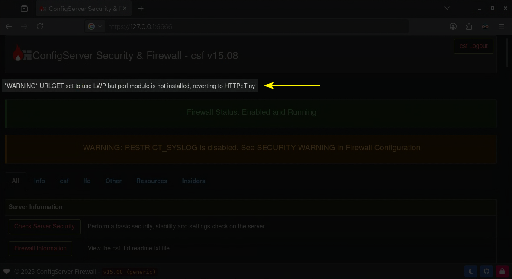

# Troubleshooting › Dependencies

This page provides an overview of common dependency-related errors and issues that may occur during the installation or use of ConfigServer Firewall.

<br />

## Introduction

By default, when ConfigServer Firewall starts, it automatically checks that the following dependencies are installed on your system:

=== ":aetherx-axs-file-code: /usr/sbin/csf"

    ```perl
    my @binaries = (
        "IPTABLES",
        "IPTABLES_SAVE",
        "IPTABLES_RESTORE",
        "MODPROBE",
        "SENDMAIL",
        "PS",
        "VMSTAT",
        "LS",
        "MD5SUM",
        "TAR",
        "CHATTR",
        "UNZIP",
        "GUNZIP",
        "DD",
        "TAIL",
        "GREP",
        "HOST"
    );
    ```

<br />

!!! note "Note: Sendmail Binary"

    The dependency `SENDMAIL` will be **skipped** if you have the setting `LF_ALERT_SMTP` enabled in 
    your `/etc/csf/csf.conf`.

<br />

If you have enabled the setting `IPV6` in your `/etc/csf/csf.conf`, the following dependencies will be loaded:

- :aetherx-axd-box-open:{ .icon-clr-yellow } IP6TABLES
- :aetherx-axd-box-open:{ .icon-clr-yellow } IP6TABLES_SAVE
- :aetherx-axd-box-open:{ .icon-clr-yellow } IP6TABLES_RESTORE

<br />

If you have enabled the setting `LF_IPSET` in your `/etc/csf/csf.conf`, the following dependencies will be loaded:

- :aetherx-axd-box-open:{ .icon-clr-yellow } IPSET

<br />

If you have enabled the settings `IP` or `IFCONFIG` in your `/etc/csf/csf.conf`, the following dependencies will be loaded:

- :aetherx-axd-box-open:{ .icon-clr-yellow } IP
- :aetherx-axd-box-open:{ .icon-clr-yellow } IFCONFIG

<br />

Most dependencies are automatically installed with the majority of Linux distributions. However, certain packages, such as `sendmail`, may require manual installation. The exact requirements can vary depending on the type of installation performed for your distribution. For example, a "Minimal" installation of AlmaLinux includes only the core system components and does not install additional dependencies.

<br />

---

<br />

## :aetherx-axs-triangle-exclamation:{ .icon-clr-red-l } *WARNING* URLGET set to use LWP but perl module is not installed, reverting to HTTP::Tiny

### Problem

When accessing the [Web Interface](../../install/webui.md), the following error may appear at the top of the page:

<figure markdown="span">
    { width="700" }
    <figcaption>CSF Web Interface › Perl `GETURL` Dependency Error</figcaption>
</figure>

<br />

You may also receive a slightly different version of this error in :aetherx-axd-rectangle-terminal:{ .icon-clr-yellow } terminal when running `sudo csf -ra`

=== ":aetherx-axs-square-terminal: Terminal"

    ```shell
    *WARNING* URLGET set to use LWP but perl module is not installed, fallback to using CURL/WGET
    ```

<br />

This error triggers when your workstation has not satisfied all of the perl dependencies required for CSF to run.

<br />

### Solution

Open your workstation's :aetherx-axd-rectangle-terminal:{ .icon-clr-yellow } terminal, and run one of the following commands:

=== ":aetherx-axb-debian: Debian/Ubuntu (apt-get)"

    ``` shell
    sudo apt-get update && sudo apt-get install -y \
       libwww-perl
    ```

=== ":aetherx-axb-redhat: CentOS/RHEL (yum/dnf)"

    ``` shell
    sudo yum makecache && sudo yum install -y \
       perl-libwww-perl
    ```

<br />

Refresh the CSF web interface and the error should be gone.

<br />

---

<br />

## :aetherx-axs-triangle-exclamation:{ .icon-clr-red-l }  *WARNING* Binary location for [SENDMAIL] [/usr/sbin/sendmail] in /etc/csf/csf.conf is either incorrect, is not installed or is not executable

### Problem

When starting up CSF, you may receive the following error in your terminal related to `SENDMAIL`:

=== ":aetherx-axs-square-terminal: Terminal"

    ```shell
    *WARNING* Binary location for [SENDMAIL] [/usr/sbin/sendmail] in /etc/csf/csf.conf is either incorrect, is not installed or is not executable
    ```

<br />

This error triggers when you do not have the binary `SENDMAIL` installed, and nothing defined for the setting `LF_ALERT_SMTP` in your `/etc/csf/csf.conf`.

<br />

### Solution

Open your workstation's :aetherx-axd-rectangle-terminal:{ .icon-clr-yellow } terminal, and run one of the following commands:

=== ":aetherx-axb-debian: Debian/Ubuntu (apt-get)"

    ``` shell
    sudo apt-get update && sudo apt-get install -y \
       sendmail
    ```

=== ":aetherx-axb-redhat: CentOS/RHEL (yum/dnf)"

    ``` shell
    sudo yum makecache && sudo yum install -y \
       sendmail sendmail-cf

    sudo systemctl enable --now sendmail
    ```

<br />

Refresh the CSF web interface and the error should be gone.

<br />
<br />
